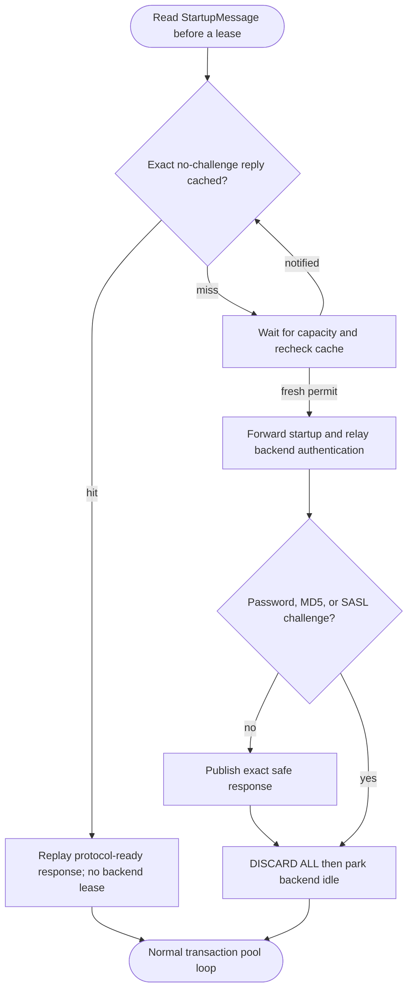

## Logic
<!-- type: logic lang: mermaid -->



### Admission contract

`TransactionHandler` reads a `StartupMessage` before it asks the pool for a backend. The shared `BackendPool` holds at most one replay entry per exact ordered startup message. On every admission loop iteration, it first checks this entry; a cache hit yields a reply-only admission and does not consume a backend permit, dial a socket, or retain a lease. When capacity is unavailable, waiters subscribe to the existing pool notification and re-check the cache before retrying capacity.

The first fresh handshake stays byte/protocol equivalent to the existing pass-through path. `relay_until_ready` captures the backend messages only if no frontend authentication response was required: `AuthenticationOk`, all `ParameterStatus` frames, a non-routable synthetic `BackendKeyData`, notices, and the terminal `ReadyForQuery`. Cleartext, MD5, and every SASL challenge mark the handshake non-replayable; their client response is forwarded and neither their partial nor complete reply can populate the cache.

The cached reply is an optimization for the existing unsupported-cancel surface, not cancellation routing. Replayed `BackendKeyData` is synthetic zero data so it cannot direct a later client at a pooled physical backend. A cache hit remains limited to the exact trust/no-challenge startup identity; new credential identities, TLS, IAM, password/SCRAM verification, and cancel routing are intentionally outside this P0.
## Changes
<!-- type: changes lang: yaml -->

```yaml
coverage_kind: semantic
changes:
  - path: apps/pgpool/src/pool/backend_pool.rs
    action: update
    section: logic
    impl_mode: hand-written
    reason: Add exact-startup replay storage and admission that rechecks a safe reply while waiting for backend capacity.
  - path: apps/pgpool/src/pool/transaction.rs
    action: update
    section: logic
    impl_mode: hand-written
    reason: Perform startup selection before leasing and replay a safe cached ready response before ordinary transaction pooling.
  - path: apps/pgpool/src/proxy/relay.rs
    action: update
    section: logic
    impl_mode: hand-written
    reason: Classify challenge-bearing startup handshakes and capture only a complete safe no-challenge reply.
  - path: apps/pgpool/tests/trust_startup_replay.rs
    action: create
    section: unit-test
    impl_mode: hand-written
    reason: Verify exact match, synthetic cancellation key, challenge exclusion, and concurrent capped trust startup.
  - path: apps/pgpool/benchmarks/pgbouncer-transaction-pooling/run.sh
    action: update
    section: unit-test
    impl_mode: hand-written
    reason: Fail when either pgbench target cannot establish all requested clients, preserving benchmark comparability.
```
## Unit Test

```mermaid
---
id: pgpool-trust-startup-replay-verification
requirements:
  ac1_capped_trust_clients_complete_without_startup_rejection:
    id: AC1
    text: "With a local trust-auth PostgreSQL backend, 64 same-startup simple-protocol clients complete transactions through a 16-backend transaction pool without startup-cap rejection, and the benchmark rejects a partial-client result."
    kind: integration
    risk: high
    verify: trust_startup_replay::capped_trust_clients_complete_without_startup_rejection
  r1_exact_no_challenge_startup_replays_without_a_backend_lease:
    id: R1
    text: "A complete no-challenge AuthenticationOk-to-ReadyForQuery reply is replayed only to a client whose ordered StartupMessage exactly matches the captured startup, has a synthetic zero BackendKeyData, and can issue a simple query without increasing active backend leases."
    kind: functional
    risk: high
    verify: trust_startup_replay::exact_no_challenge_startup_replays_without_a_backend_lease
  r2_startup_mismatch_and_auth_challenges_never_replay:
    id: R2
    text: "A startup parameter mismatch, cleartext-password challenge, MD5 challenge, or SASL challenge cannot consume or publish a cached reply and instead remains on fresh authentication passthrough."
    kind: security
    risk: high
    verify: trust_startup_replay::startup_mismatch_and_auth_challenges_never_replay
---
flowchart TD
    ac1[AC1 ac1 capped trust clients complete without startup rejection] --> trust_startup_replay_capped_trust_clients_complete_without_startup_rejection[trust_startup_replay::capped_trust_clients_complete_without_startup_rejection]
    r1[R1 r1 exact no challenge startup replays without a backend lease] --> trust_startup_replay_exact_no_challenge_startup_replays_without_a_backend_lease[trust_startup_replay::exact_no_challenge_startup_replays_without_a_backend_lease]
    r2[R2 r2 startup mismatch and auth challenges never replay] --> trust_startup_replay_startup_mismatch_and_auth_challenges_never_replay[trust_startup_replay::startup_mismatch_and_auth_challenges_never_replay]
```

<!-- type: unit-test lang: mermaid -->


