## Logic
<!-- type: logic lang: mermaid -->


### Safety boundary

A cache key is the complete ordered `StartupMessage`, not merely user or database. A cached reply is publishable only when the backend handshake reaches `ReadyForQuery` without any client-response authentication challenge. Cleartext-password, MD5, and SASL paths stay on the existing pass-through flow and never populate or consume this cache.

A replay hit sends the cached protocol-ready frames to the matching client and starts the ordinary transaction loop with no retained backend lease. The first successful trust/no-challenge handshake returns its backend through the existing `DISCARD ALL` reset path before any later transaction is acquired.

## Changes
<!-- type: changes lang: yaml -->

```yaml
coverage_kind: semantic
changes:
  - path: apps/pgpool/src/pool/backend_pool.rs
    action: update
    section: logic
    impl_mode: hand-written
    reason: Store and select exact safe startup replies while waiters re-check the cache before consuming backend capacity.
  - path: apps/pgpool/src/pool/transaction.rs
    action: update
    section: logic
    impl_mode: hand-written
    reason: Read startup before admission and branch between cached reply replay and the fresh handshake path.
  - path: apps/pgpool/src/proxy/relay.rs
    action: update
    section: logic
    impl_mode: hand-written
    reason: Capture only complete no-challenge backend startup replies for safe replay.
  - path: apps/pgpool/tests/trust_startup_replay.rs
    action: create
    section: unit-test
    impl_mode: hand-written
    reason: Exercise exact-match replay, challenge exclusion, and capped concurrent trust startup behavior.
  - path: apps/pgpool/benchmarks/pgbouncer-transaction-pooling/run.sh
    action: update
    section: unit-test
    impl_mode: hand-written
    reason: Assert the fixed 64-client capped benchmark detects startup-cap rejection instead of silently reporting a partial run.
```

## Unit Test

```mermaid
---
id: pgpool-trust-startup-replay-verification
requirements:
  ac1_capped_trust_clients_complete_without_startup_rejection:
    id: AC1
    text: "With a local trust-auth PostgreSQL backend, 64 same-startup simple-protocol clients complete transactions through a 16-backend transaction pool without startup-cap rejection, and the benchmark rejects a partial-client result."
    kind: integration
    risk: high
    verify: trust_startup_replay::capped_trust_clients_complete_without_startup_rejection
  r1_exact_no_challenge_startup_replays_without_a_backend_lease:
    id: R1
    text: "A complete no-challenge AuthenticationOk-to-ReadyForQuery reply is replayed only to a client whose ordered StartupMessage exactly matches the captured startup, has a synthetic zero BackendKeyData, and can issue a simple query without increasing active backend leases."
    kind: functional
    risk: high
    verify: trust_startup_replay::exact_no_challenge_startup_replays_without_a_backend_lease
  r2_startup_mismatch_and_auth_challenges_never_replay:
    id: R2
    text: "A startup parameter mismatch, cleartext-password challenge, MD5 challenge, or SASL challenge cannot consume or publish a cached reply and instead remains on fresh authentication passthrough."
    kind: security
    risk: high
    verify: trust_startup_replay::startup_mismatch_and_auth_challenges_never_replay
---
flowchart TD
    ac1[AC1 ac1 capped trust clients complete without startup rejection] --> trust_startup_replay_capped_trust_clients_complete_without_startup_rejection[trust_startup_replay::capped_trust_clients_complete_without_startup_rejection]
    r1[R1 r1 exact no challenge startup replays without a backend lease] --> trust_startup_replay_exact_no_challenge_startup_replays_without_a_backend_lease[trust_startup_replay::exact_no_challenge_startup_replays_without_a_backend_lease]
    r2[R2 r2 startup mismatch and auth challenges never replay] --> trust_startup_replay_startup_mismatch_and_auth_challenges_never_replay[trust_startup_replay::startup_mismatch_and_auth_challenges_never_replay]
```

<!-- type: unit-test lang: mermaid -->


