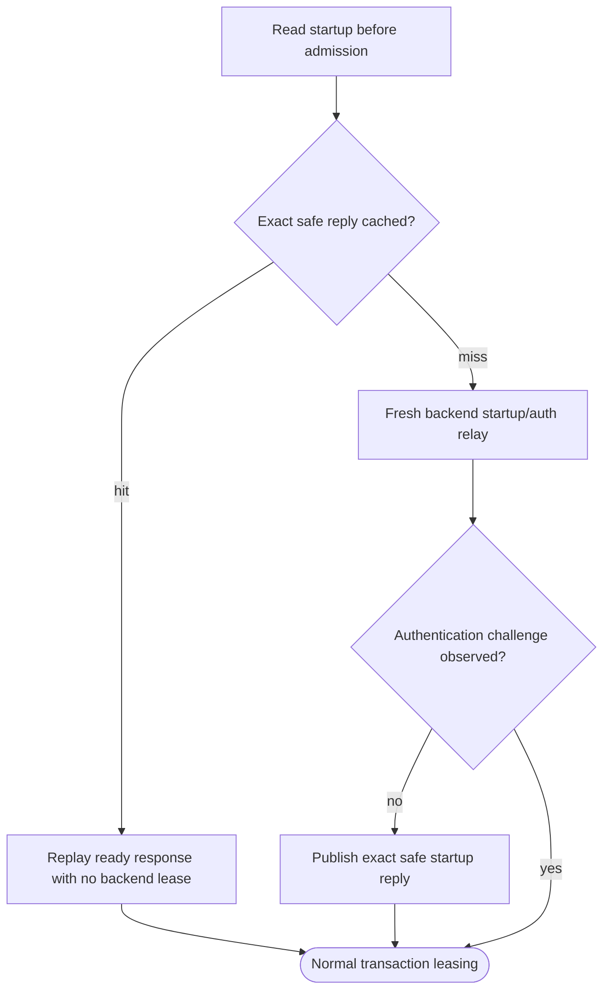

## Logic
<!-- type: logic lang: mermaid -->

### Safety boundary

A cache key is the complete ordered `StartupMessage`, not merely user or database. A cached reply is publishable only when the backend handshake reaches `ReadyForQuery` without any client-response authentication challenge. Cleartext-password, MD5, and SASL paths stay on the existing pass-through flow and never populate or consume this cache.

A replay hit sends the cached protocol-ready frames to the matching client and starts the ordinary transaction loop with no retained backend lease. The first successful trust/no-challenge handshake returns its backend through the existing `DISCARD ALL` reset path before any later transaction is acquired.
