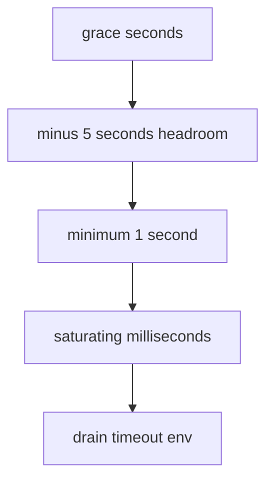
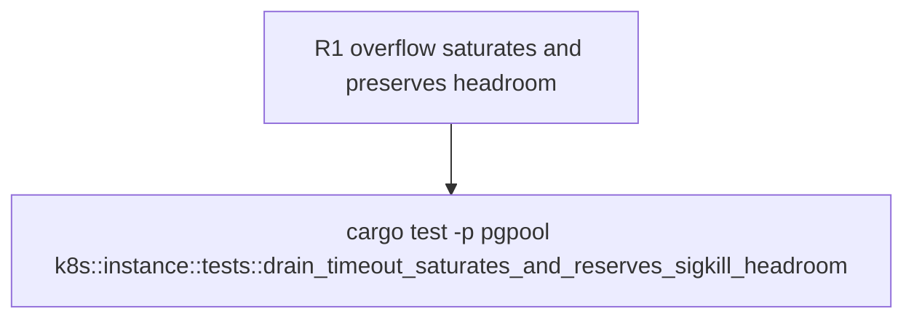

## Logic
<!-- type: logic lang: mermaid -->


## Changes
<!-- type: changes lang: yaml -->

```yaml
changes:
  - path: apps/pgpool/src/k8s/instance.rs
    action: modify
    section: logic
    impl_mode: hand-written
    anchor: render_manifests
```
## Unit Test
<!-- type: unit-test lang: mermaid -->



## Changes
<!-- type: changes lang: yaml -->

```yaml
changes:
  - path: apps/pgpool/src/k8s/instance.rs
    action: modify
    section: logic
    impl_mode: hand-written
    anchor: render_manifests
```
