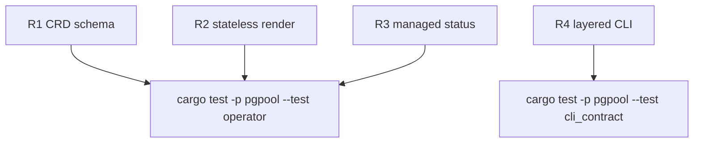

## Logic
<!-- type: logic lang: mermaid -->

```mermaid
---
id: pgpool-crd-operator-control-plane
entry: custom_resource
nodes:
  custom_resource: { kind: start, label: "Pgpool CR image replicas backend endpoint budgets" }
  reconcile: { kind: process, label: "Shared ManagedService reconcile" }
  render: { kind: process, label: "Render ServiceAccount Deployment ClusterIP Service and PDB" }
  readiness: { kind: process, label: "Read Deployment ReadyFacts" }
  discovery: { kind: process, label: "Discover runtime endpoint connection facts" }
  admission: { kind: decision, label: "Atomically admit desired and rollout Pod quotas" }
  limit: { kind: process, label: "Set per-Pod PGPOOL_MAX_BACKEND_CONNECTIONS" }
  drain: { kind: process, label: "Remove readiness drain and retain quota" }
  status: { kind: terminal, label: "Patch Pgpool readiness and endpoint budget status" }
edges:
  - { from: custom_resource, to: reconcile }
  - { from: reconcile, to: render }
  - { from: render, to: readiness }
  - { from: custom_resource, to: discovery }
  - { from: discovery, to: admission }
  - { from: admission, to: limit, label: "capacity available" }
  - { from: limit, to: drain }
  - { from: readiness, to: status }
  - { from: admission, to: status, label: "blocked" }
  - { from: drain, to: status }
---
```

## Unit Test
<!-- type: unit-test lang: mermaid -->



## Changes
<!-- type: changes lang: yaml -->

```yaml
changes:
  - path: apps/pgpool/Cargo.toml
    action: modify
    section: logic
    impl_mode: hand-written
    description: "Add direct kube and schemars dependencies required by the typed Pgpool CustomResource and shared ManagedService implementation."
  - path: apps/pgpool/src/lib.rs
    action: modify
    section: logic
    impl_mode: hand-written
    anchor: RuntimePlan
    description: "Export the Pgpool operator module alongside the existing platform and Kubernetes control-plane modules."
  - path: apps/pgpool/src/operator/mod.rs
    action: create
    section: logic
    impl_mode: hand-written
    anchor: crd_yaml
    description: "Export Pgpool CRD, render, reconcile, CRD YAML normalization, and operator deployment-manifest rendering."
  - path: apps/pgpool/src/operator/crd.rs
    action: create
    section: logic
    impl_mode: hand-written
    anchor: PgpoolSpec
    description: "Define the namespaced Pgpool custom resource, provider/role endpoint budgets, optional database/user/password Secret discovery credentials, and readiness plus connection-budget status schema."
  - path: apps/pgpool/src/operator/render.rs
    action: create
    section: logic
    impl_mode: hand-written
    anchor: render
    description: "Purely render a Pgpool CR through the shared stateless Deployment/common Service modules and attach owner references."
  - path: apps/pgpool/src/operator/reconcile.rs
    action: create
    section: logic
    impl_mode: hand-written
    anchor: "impl ManagedService for Pgpool"
    description: "Implement the async ManagedService plan: inspect current Deployment/Pods, query every live endpoint, reserve desired quotas before scale-out, retain quota for terminating Pods on scale-in, render only admitted replicas, and project contextual status; expose the shared operator run loop."
  - path: apps/pgpool/src/bin/pgpool.rs
    action: modify
    section: logic
    impl_mode: hand-written
    anchor: main
    description: "Add layered k8s crd render and operator render/run commands while keeping instance render as the app-namespace layer."
  - path: apps/pgpool/tests/operator.rs
    action: create
    section: unit-test
    impl_mode: hand-written
    anchor: crd_is_namespaced_and_carries_endpoint_budget_status
    description: "Verify CRD schema, stateless owned rendering, ManagedService readiness, and rich control-plane status projection."
```
