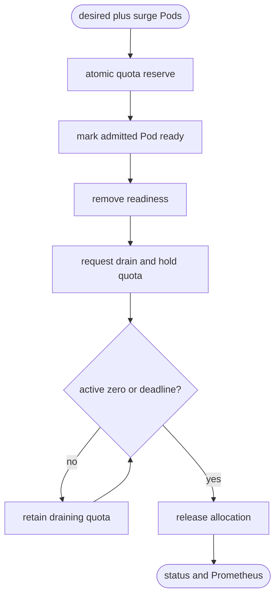
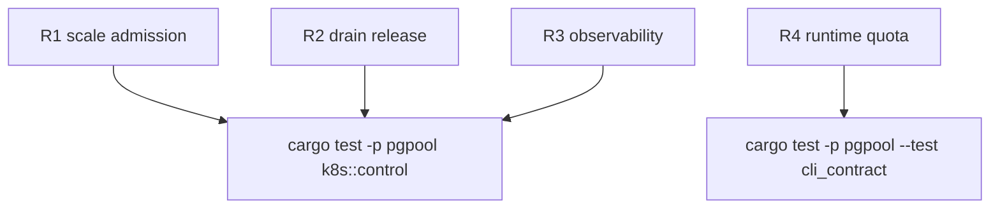

## Logic
<!-- type: logic lang: mermaid -->



## Unit Test
<!-- type: unit-test lang: mermaid -->



## Changes
<!-- type: changes lang: yaml -->

```yaml
changes:
  - path: apps/pgpool/src/k8s/mod.rs
    action: modify
    impl_mode: hand-written
    section: logic
    description: Export control-plane reconciliation and status models.
  - path: apps/pgpool/src/k8s/budget.rs
    action: modify
    impl_mode: hand-written
    section: logic
    description: Expose endpoint iteration for status projection.
  - path: apps/pgpool/src/k8s/control.rs
    action: create
    impl_mode: hand-written
    section: logic
    description: Implement scale admission, drain-before-release, status, and metrics.
  - path: apps/pgpool/src/bin/pgpool.rs
    action: modify
    impl_mode: hand-written
    section: logic
    description: Consume the admitted per-Pod backend quota from environment or CLI.
  - path: apps/pgpool/tests/cli_contract.rs
    action: modify
    impl_mode: hand-written
    section: unit-test
    description: Verify the runtime quota flag is present and parseable.
```
