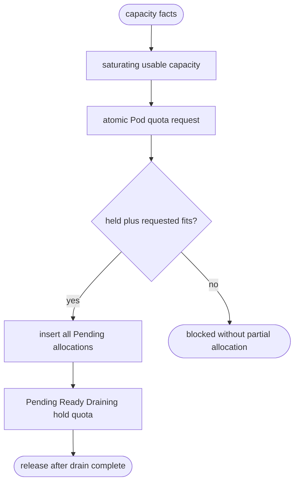
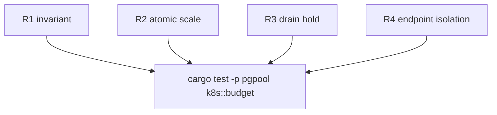

## Logic
<!-- type: logic lang: mermaid -->



## Unit Test
<!-- type: unit-test lang: mermaid -->



## Changes
<!-- type: changes lang: yaml -->

```yaml
changes:
  - path: apps/pgpool/src/k8s/budget.rs
    action: create
    impl_mode: hand-written
    section: logic
    anchor: EndpointAllocator
    description: Implement atomic endpoint reservation and drain-safe release transitions.
```
