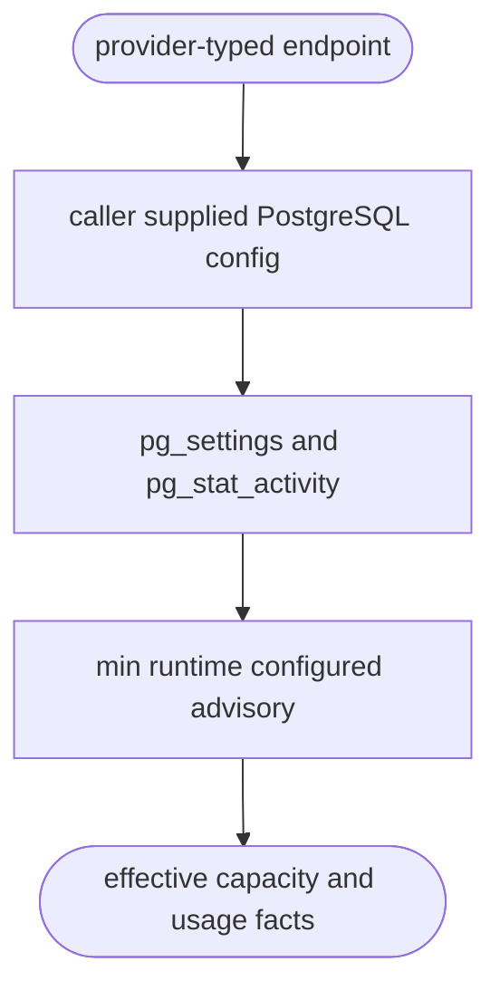
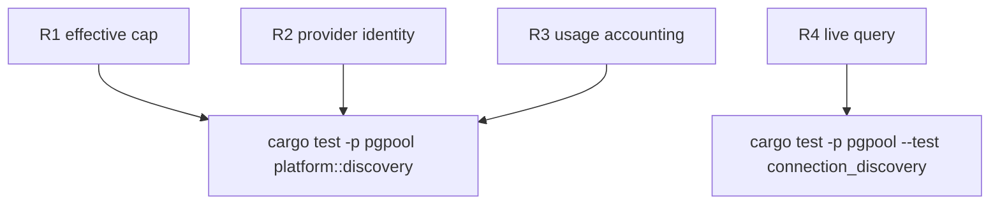

## Logic
<!-- type: logic lang: mermaid -->

### Runtime accounting invariants

Discovery counts only `pg_stat_activity` rows whose `backend_type` is
`client backend`. A data-plane pgpool process replaces every client-provided
startup `application_name` with `pgpool-<pod>`, so its held remote sessions
are attributed to pgpool rather than foreign usage. The effective capacity is
the lowest runtime/configured/advisory ceiling minus
`superuser_reserved_connections`; PostgreSQL background workers are neither
allocatable capacity nor client demand.



## Unit Test
<!-- type: unit-test lang: mermaid -->



## Changes
<!-- type: changes lang: yaml -->

```yaml
changes:
  - path: apps/pgpool/Cargo.toml
    action: modify
    impl_mode: hand-written
    section: logic
    description: Promote tokio-postgres to a runtime dependency for live endpoint discovery.
  - path: apps/pgpool/src/lib.rs
    action: modify
    impl_mode: hand-written
    section: logic
    description: Export the provider adapter boundary.
  - path: apps/pgpool/src/platform/mod.rs
    action: create
    impl_mode: hand-written
    section: logic
    description: Publish remote endpoint discovery models.
  - path: apps/pgpool/src/platform/discovery.rs
    action: create
    impl_mode: hand-written
    section: logic
    description: Query runtime connection facts and apply advisory caps.
  - path: apps/pgpool/tests/connection_discovery.rs
    action: create
    impl_mode: hand-written
    section: unit-test
    description: Exercise the real PostgreSQL discovery path when available.
```
