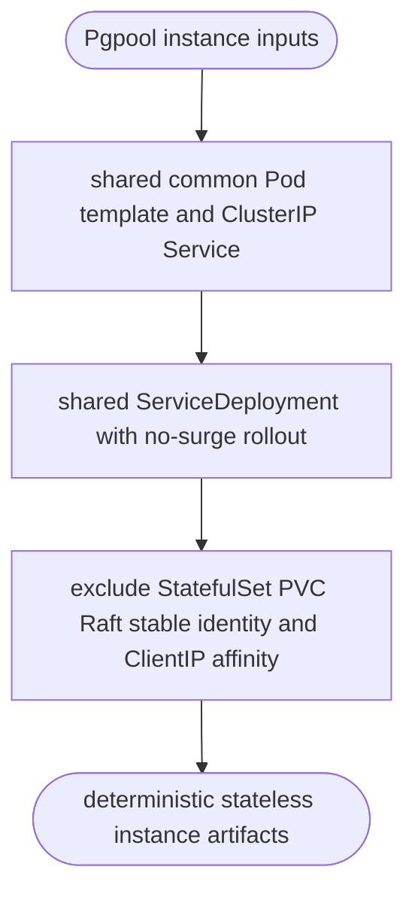
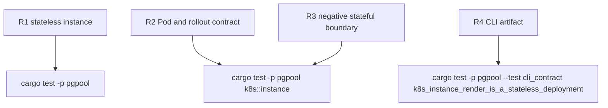

## Logic
<!-- type: logic lang: mermaid -->



## Unit Test
<!-- type: unit-test lang: mermaid -->



## Changes
<!-- type: changes lang: yaml -->

```yaml
changes:
  - path: apps/pgpool/Cargo.toml
    action: modify
    impl_mode: hand-written
    section: logic
    description: Depend on the shared operator renderer crate.
  - path: apps/pgpool/src/lib.rs
    action: modify
    impl_mode: hand-written
    section: logic
    description: Export the Pgpool Kubernetes composition module.
  - path: apps/pgpool/src/k8s/mod.rs
    action: create
    impl_mode: hand-written
    section: logic
    description: Publish typed Pgpool Kubernetes instance rendering.
  - path: apps/pgpool/src/k8s/instance.rs
    action: create
    impl_mode: hand-written
    section: logic
    description: Compose common Service and Deployment primitives with the stateless Pgpool Pod contract.
  - path: apps/pgpool/src/bin/pgpool.rs
    action: modify
    impl_mode: hand-written
    section: logic
    description: Add pgpool k8s instance render profile and output handling.
  - path: apps/pgpool/tests/cli_contract.rs
    action: modify
    impl_mode: hand-written
    section: unit-test
    description: Verify the CLI emits Deployment artifacts without stateful or sticky-session fields.
```
