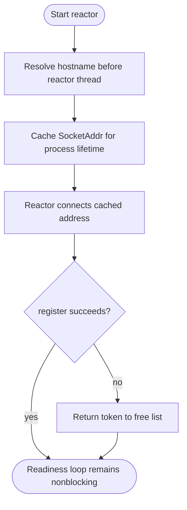

## Logic
<!-- type: logic lang: mermaid -->



Backend DNS is resolved once by `TransactionReactor::start` before its dedicated readiness thread is spawned. The address is cached for that reactor lifetime; a new handler/reactor creation refreshes it, while routine DNS TTL refresh is intentionally deferred. `open_backend` only dials the cached `SocketAddr`. If Mio registration fails after token allocation, the token is immediately returned to `free_tokens` because no readiness event could retain it.

## Changes
<!-- type: changes lang: yaml -->

```yaml
coverage_kind: semantic
changes:
  - path: apps/pgpool/src/pool/reactor/runtime.rs
    action: modify
    section: logic
    impl_mode: hand-written
    anchor: start
    reason: Resolve the backend endpoint before spawning the readiness thread, cache its SocketAddr, and recycle tokens after failed Mio registration.
```
