## Logic

```mermaid
---
id: pgpool-contiguous-validated-relay-prefix
entry: read
nodes:
  read: { kind: start, label: "Read backend bytes into FrameReader buffer" }
  scan: { kind: process, label: "Non-consumingly validate contiguous complete relay frames" }
  first_invalid: { kind: terminal, label: "Malformed first frame: send nothing and end backend leg" }
  incomplete: { kind: process, label: "Keep incomplete suffix buffered; select validated prefix only" }
  ready: { kind: process, label: "Stop selected prefix at first ReadyForQuery" }
  write: { kind: process, label: "write_all the borrowed contiguous prefix" }
  consume: { kind: process, label: "Advance reader exactly after successful write" }
  close_suffix: { kind: terminal, label: "After valid prefix before malformed suffix, end backend leg" }
  await_more: { kind: terminal, label: "Await more backend bytes" }
edges:
  - { from: read, to: scan }
  - { from: scan, to: first_invalid, label: "first frame malformed" }
  - { from: scan, to: incomplete, label: "valid prefix then incomplete suffix" }
  - { from: scan, to: ready, label: "valid prefix reaches ReadyForQuery" }
  - { from: scan, to: write, label: "valid complete prefix" }
  - { from: incomplete, to: write }
  - { from: ready, to: write }
  - { from: write, to: consume, label: "write succeeds" }
  - { from: consume, to: close_suffix, label: "malformed suffix recorded" }
  - { from: consume, to: await_more, label: "no ReadyForQuery" }
---
flowchart LR
  read([backend read]) --> scan[validate contiguous frames\nwithout consuming]
  scan -->|malformed first| reject([send nothing; close])
  scan -->|valid prefix| write[write_all borrowed prefix]
  write -->|success| consume[advance exactly prefix length]
  consume -->|incomplete suffix| wait([await next backend bytes])
  consume -->|ReadyForQuery| boundary([apply lease boundary])
  consume -->|malformed suffix| close([close after valid prefix])
```

<!-- type: logic lang: mermaid -->



### Invariants

- The scan uses the same declared-length bounds and frame-specific structural validation as `FrameReader::next_relay_frame_with_raw`; no buffer bytes are exposed to the writer until every frame in the selected prefix has been accepted.
- The selected prefix begins at the current reader offset, ends at the first incomplete frame, first `ReadyForQuery`, or before malformed input, and is written by the existing single contiguous `write_all` path. It never performs an additional read to enlarge a batch.
- During the asynchronous write, the prefix is borrowed immutably from the reader and the reader cannot be read, mutated, or scanned again. A successful write is followed by exactly one advance of the selected byte count; a failed write consumes nothing and ends the leg.
- A malformed first frame has a zero-length validated prefix and fails before any client write. A malformed suffix after a nonempty valid prefix preserves existing ordering: write and consume that prefix once, then terminate without forwarding the invalid bytes.
- `ReadyForQuery` status is committed with the successful consume, before the transaction handler observes the batch result. Therefore lease return/reset decisions remain after the exact response bytes have reached the client.
- This design does not use scatter-gather `writev` (#1637) and does not alter `TcpStream` split/reunite ownership (#1663).

### Error handling

I/O and zero-write failures retain the existing relay outcome: the transaction backend leg ends and the pool closes rather than reuses the stream. Parser errors on an empty prefix produce no client output. Parser errors after a valid prefix are represented in the scan result so the caller forwards only that validated prefix, consumes it after success, then closes. Incomplete suffixes are neither consumed nor written and are completed by the next backend read.

## Changes
<!-- type: changes lang: yaml -->

```yaml
changes:
  - path: apps/pgpool/src/wire/reader.rs
    action: modify
    section: pgpool-contiguous-validated-relay-prefix
    impl_mode: hand-written
    reason: Add a bounded non-consuming backend relay-prefix scan plus an explicit post-write consume operation while preserving the existing owned-frame APIs for all other callers.
  - path: apps/pgpool/src/proxy/relay.rs
    action: modify
    section: pgpool-contiguous-validated-relay-prefix
    impl_mode: hand-written
    reason: Replace the copied BackendRelayBatch handoff with a validated prefix descriptor and a direct contiguous reader-buffer write seam.
  - path: apps/pgpool/src/pool/transaction.rs
    action: modify
    section: pgpool-contiguous-validated-relay-prefix
    impl_mode: hand-written
    reason: Consume a backend reader prefix only after its client write completes, then preserve existing ReadyForQuery and terminal-error outcomes.
  - path: apps/pgpool/tests/wire_codec.rs
    action: modify
    section: pgpool-contiguous-validated-relay-prefix
    impl_mode: hand-written
    reason: Cover direct validated prefixes, incomplete retention, malformed-first and malformed-suffix ordering, and ReadyForQuery consume timing.
```

## Unit Test

```mermaid
---
id: pgpool-contiguous-validated-relay-prefix-verification
requirements:
  direct_validated_prefix:
    id: R1
    text: "A complete backend prefix, including multiple contiguous frames, is structurally validated in place and advances only after explicit successful-write consumption."
    kind: regression
    risk: high
    verify: wire_codec::backend_relay_prefix_validates_and_consumes_contiguous_frames
  peer_gate:
    id: R4
    text: "The unchanged competitor comparison is the sole retention gate: meter is diagnostic only, three clean unsampled release comparisons must match or exceed PgBouncer, and a first valid loss reverts production code."
    kind: e2e
    risk: high
    verify: apps/pgpool/benchmarks/pgbouncer-transaction-pooling/run.sh --pgpool-bin target/release/pgpool
  suffix_ordering:
    id: R2
    text: "An incomplete suffix remains buffered; malformed-first input produces no prefix, while a malformed suffix after a valid prefix preserves the valid-prefix-then-terminal order."
    kind: regression
    risk: high
    verify: wire_codec::backend_relay_prefix_preserves_incomplete_and_malformed_suffix_boundaries
  transaction_isolation:
    id: R3
    text: "Transaction mode keeps its ReadyForQuery ownership boundary, DISCARD ALL reset isolation, and configured backend cap while the backend response relay uses post-write prefix consumption."
    kind: integration
    risk: high
    verify: cargo test -p pgpool --test pool --test pool_modes --test trust_startup_replay --test proxy
---
flowchart TD
    r1[R1 direct validated prefix] --> wire_codec_backend_relay_prefix_validates_and_consumes_contiguous_frames[wire_codec::backend_relay_prefix_validates_and_consumes_contiguous_frames]
    r2[R2 suffix ordering] --> wire_codec_backend_relay_prefix_preserves_incomplete_and_malformed_suffix_boundaries[wire_codec::backend_relay_prefix_preserves_incomplete_and_malformed_suffix_boundaries]
    r3[R3 transaction isolation] --> cargo_test_p_pgpool_test_pool_test_pool_modes_test_trust_startup_replay_test_proxy[cargo test -p pgpool --test pool --test pool_modes --test trust_startup_replay --test proxy]
    r4[R4 peer gate] --> apps_pgpool_benchmarks_pgbouncer_transaction_pooling_run_sh_pgpool_bin_target_release_pgpool[apps/pgpool/benchmarks/pgbouncer-transaction-pooling/run.sh --pgpool-bin target/release/pgpool]
```

<!-- type: unit-test lang: mermaid -->


