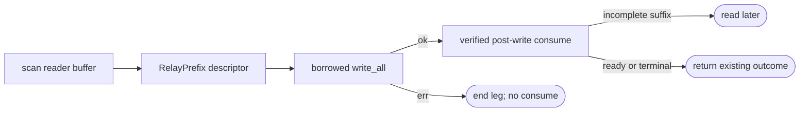

## Logic
<!-- type: logic lang: mermaid -->



### API contract

- `FrameReader` exposes an internal backend-only scan that returns no raw `Bytes`. Its descriptor contains the exact prefix length, the final validated `ReadyForQuery` status if present, and whether the next unselected bytes were malformed after a valid prefix. A zero-length descriptor is never forwarded.
- The scan parses frame headers by offset within the same `BytesMut`, applies the existing maximum-length and `validate_backend_relay` rules to borrowed frame slices, and stops before the first incomplete frame or after the first valid Ready frame. It does not mutate `buf` or `tx_status`.
- The relay obtains an immutable `&[u8]` prefix from the reader, completes `write_all`, drops that borrow, then calls the matching consume API. The consume API checks that its descriptor still matches the unmodified front of the buffer, advances exactly `len`, and commits the descriptor's Ready status.
- `relay_backend_batch` returns `Ok(Some(status))` only after the output write and post-write consume succeed. It returns `Err(())` for a malformed first frame, write failure, or a recorded malformed suffix after forwarding its valid prefix.
- Existing `next_frame*` and `next_relay_frame_with_raw` remain owned-frame APIs for frontend/startup and non-target paths. The contiguous backend prefix path never uses `write_vectored`, `BytesMut` concatenation, or backend TCP split/reunite changes.

### Failure contract

A descriptor cannot be consumed twice or after another reader mutation. Write failure retains its unconsumed buffer only until the caller terminates the connection; it is never reused as a new transport input. An incomplete suffix has no descriptor bytes and remains untouched. A parser error before any accepted frame is returned directly; a parser error after accepted frames is encoded as `terminal_error`, so only the known-valid prefix is sent before shutdown.
## Changes
<!-- type: changes lang: yaml -->

```yaml
changes:
  - path: apps/pgpool/src/wire/reader.rs
    action: modify
    section: pgpool-contiguous-validated-relay-prefix
    impl_mode: hand-written
    reason: Add a bounded non-consuming backend relay-prefix scan plus an explicit post-write consume operation while preserving the existing owned-frame APIs for all other callers.
  - path: apps/pgpool/src/proxy/relay.rs
    action: modify
    section: pgpool-contiguous-validated-relay-prefix
    impl_mode: hand-written
    reason: Replace the copied BackendRelayBatch handoff with a validated prefix descriptor and a direct contiguous reader-buffer write seam.
  - path: apps/pgpool/src/pool/transaction.rs
    action: modify
    section: pgpool-contiguous-validated-relay-prefix
    impl_mode: hand-written
    reason: Consume a backend reader prefix only after its client write completes, then preserve existing ReadyForQuery and terminal-error outcomes.
  - path: apps/pgpool/tests/wire_codec.rs
    action: modify
    section: pgpool-contiguous-validated-relay-prefix
    impl_mode: hand-written
    reason: Cover direct validated prefixes, incomplete retention, malformed-first and malformed-suffix ordering, and ReadyForQuery consume timing.
```

## Unit Test

```mermaid
---
id: pgpool-contiguous-validated-relay-prefix-verification
requirements:
  direct_validated_prefix:
    id: R1
    text: "A complete backend prefix, including multiple contiguous frames, is structurally validated in place and advances only after explicit successful-write consumption."
    kind: regression
    risk: high
    verify: wire_codec::backend_relay_prefix_validates_and_consumes_contiguous_frames
  peer_gate:
    id: R4
    text: "The unchanged competitor comparison is the sole retention gate: meter is diagnostic only, three clean unsampled release comparisons must match or exceed PgBouncer, and a first valid loss reverts production code."
    kind: e2e
    risk: high
    verify: apps/pgpool/benchmarks/pgbouncer-transaction-pooling/run.sh --pgpool-bin target/release/pgpool
  suffix_ordering:
    id: R2
    text: "An incomplete suffix remains buffered; malformed-first input produces no prefix, while a malformed suffix after a valid prefix preserves the valid-prefix-then-terminal order."
    kind: regression
    risk: high
    verify: wire_codec::backend_relay_prefix_preserves_incomplete_and_malformed_suffix_boundaries
  transaction_isolation:
    id: R3
    text: "Transaction mode keeps its ReadyForQuery ownership boundary, DISCARD ALL reset isolation, and configured backend cap while the backend response relay uses post-write prefix consumption."
    kind: integration
    risk: high
    verify: cargo test -p pgpool --test pool --test pool_modes --test trust_startup_replay --test proxy
---
flowchart TD
    r1[R1 direct validated prefix] --> wire_codec_backend_relay_prefix_validates_and_consumes_contiguous_frames[wire_codec::backend_relay_prefix_validates_and_consumes_contiguous_frames]
    r2[R2 suffix ordering] --> wire_codec_backend_relay_prefix_preserves_incomplete_and_malformed_suffix_boundaries[wire_codec::backend_relay_prefix_preserves_incomplete_and_malformed_suffix_boundaries]
    r3[R3 transaction isolation] --> cargo_test_p_pgpool_test_pool_test_pool_modes_test_trust_startup_replay_test_proxy[cargo test -p pgpool --test pool --test pool_modes --test trust_startup_replay --test proxy]
    r4[R4 peer gate] --> apps_pgpool_benchmarks_pgbouncer_transaction_pooling_run_sh_pgpool_bin_target_release_pgpool[apps/pgpool/benchmarks/pgbouncer-transaction-pooling/run.sh --pgpool-bin target/release/pgpool]
```

<!-- type: unit-test lang: mermaid -->


