## Logic
<!-- type: logic lang: mermaid -->


### API contract

- `FrameReader` exposes an internal backend-only scan that returns no raw `Bytes`. Its descriptor contains the exact prefix length, the final validated `ReadyForQuery` status if present, and whether the next unselected bytes were malformed after a valid prefix. A zero-length descriptor is never forwarded.
- The scan parses frame headers by offset within the same `BytesMut`, applies the existing maximum-length and `validate_backend_relay` rules to borrowed frame slices, and stops before the first incomplete frame or after the first valid Ready frame. It does not mutate `buf` or `tx_status`.
- The relay obtains an immutable `&[u8]` prefix from the reader, completes `write_all`, drops that borrow, then calls the matching consume API. The consume API checks that its descriptor still matches the unmodified front of the buffer, advances exactly `len`, and commits the descriptor's Ready status.
- `relay_backend_batch` returns `Ok(Some(status))` only after the output write and post-write consume succeed. It returns `Err(())` for a malformed first frame, write failure, or a recorded malformed suffix after forwarding its valid prefix.
- Existing `next_frame*` and `next_relay_frame_with_raw` remain owned-frame APIs for frontend/startup and non-target paths. The contiguous backend prefix path never uses `write_vectored`, `BytesMut` concatenation, or backend TCP split/reunite changes.

### Failure contract

A descriptor cannot be consumed twice or after another reader mutation. Write failure retains its unconsumed buffer only until the caller terminates the connection; it is never reused as a new transport input. An incomplete suffix has no descriptor bytes and remains untouched. A parser error before any accepted frame is returned directly; a parser error after accepted frames is encoded as `terminal_error`, so only the known-valid prefix is sent before shutdown.
## Changes
<!-- type: changes lang: yaml -->

```yaml
changes:
  - path: apps/pgpool/src/wire/reader.rs
    action: modify
    section: pgpool-contiguous-validated-relay-prefix-contract
    impl_mode: hand-written
    reason: Define an internal descriptor that scans backend frames without consuming buffer bytes and a guarded consume operation that commits Ready status only after output success.
  - path: apps/pgpool/src/proxy/relay.rs
    action: modify
    section: pgpool-contiguous-validated-relay-prefix-contract
    impl_mode: hand-written
    reason: Make backend relay obtain a prefix descriptor, borrow the contiguous bytes for the existing single write_all, and request post-write consumption without retaining a copied batch.
  - path: apps/pgpool/src/pool/transaction.rs
    action: modify
    section: pgpool-contiguous-validated-relay-prefix-contract
    impl_mode: hand-written
    reason: Preserve existing transaction outcome handling while receiving Ready or terminal facts only after direct-prefix output and consumption.
  - path: apps/pgpool/tests/wire_codec.rs
    action: modify
    section: pgpool-contiguous-validated-relay-prefix-contract
    impl_mode: hand-written
    reason: Assert descriptor bounds, exactly-once consumption, Ready timing, incomplete retention, and malformed-prefix ordering at the parser boundary.
```
## Unit Test

```mermaid
---
id: pgpool-contiguous-validated-relay-prefix-contract-verification
requirements:
  boundary_failures:
    id: R2
    text: "A first malformed frame has no sendable descriptor, an incomplete suffix remains buffered, and a malformed suffix after a valid descriptor is terminal only after that descriptor is consumed."
    kind: regression
    risk: high
    verify: wire_codec::backend_relay_prefix_preserves_incomplete_and_malformed_suffix_boundaries
  competitor_proof:
    id: R4
    text: "Retention requires three clean unsampled unchanged release comparisons matching or exceeding contemporaneous PgBouncer; meter sampling is diagnostic, and the first valid loss reverts the production candidate."
    kind: e2e
    risk: high
    verify: apps/pgpool/benchmarks/pgbouncer-transaction-pooling/run.sh --pgpool-bin target/release/pgpool
  pool_behavior:
    id: R3
    text: "Transaction pooling retains exact ReadyForQuery ownership, reset isolation, and bounded backend capacity with the direct backend-prefix relay."
    kind: integration
    risk: high
    verify: cargo test -p pgpool --test pool --test pool_modes --test trust_startup_replay --test proxy
  post_write_consume:
    id: R1
    text: "The backend relay-prefix descriptor exposes only validated contiguous bytes; a successful explicit consume advances exactly once and commits its Ready status, while no output failure can consume it."
    kind: regression
    risk: high
    verify: wire_codec::backend_relay_prefix_validates_and_consumes_contiguous_frames
---
flowchart TD
    r1[R1 post write consume] --> wire_codec_backend_relay_prefix_validates_and_consumes_contiguous_frames[wire_codec::backend_relay_prefix_validates_and_consumes_contiguous_frames]
    r2[R2 boundary failures] --> wire_codec_backend_relay_prefix_preserves_incomplete_and_malformed_suffix_boundaries[wire_codec::backend_relay_prefix_preserves_incomplete_and_malformed_suffix_boundaries]
    r3[R3 pool behavior] --> cargo_test_p_pgpool_test_pool_test_pool_modes_test_trust_startup_replay_test_proxy[cargo test -p pgpool --test pool --test pool_modes --test trust_startup_replay --test proxy]
    r4[R4 competitor proof] --> apps_pgpool_benchmarks_pgbouncer_transaction_pooling_run_sh_pgpool_bin_target_release_pgpool[apps/pgpool/benchmarks/pgbouncer-transaction-pooling/run.sh --pgpool-bin target/release/pgpool]
```

<!-- type: unit-test lang: mermaid -->


