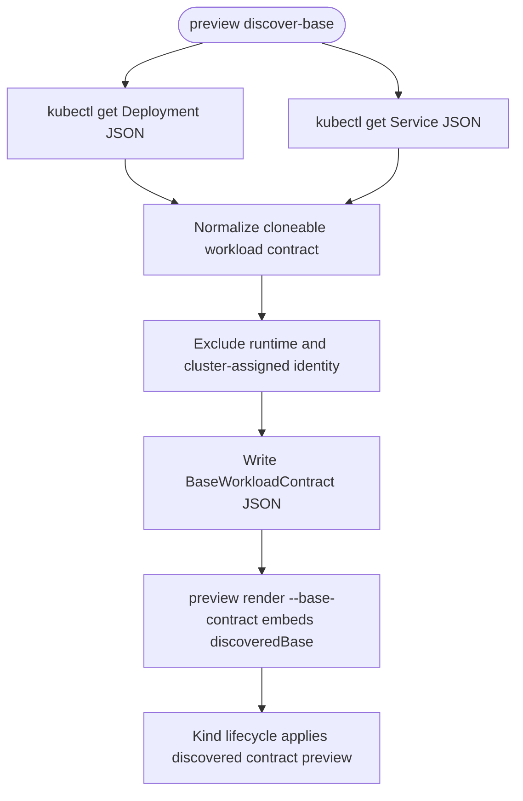
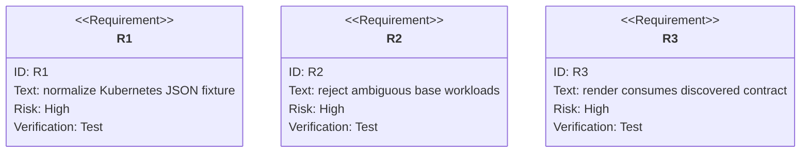

# TD: Preview Base Workload Discovery

## Logic
<!-- type: logic lang: mermaid -->



## Schema
<!-- type: schema lang: yaml -->

```yaml
types:
  BaseWorkloadContract:
    fields:
      namespace: string
      app: string
      deployment: string
      service: string
      selector: map<string,string>
      podLabels: map<string,string>
      container: BaseContainerContract
      servicePorts: list<BaseServicePort>
      excludedRuntimeFields: list<string>
  BaseContainerContract:
    fields:
      name: string
      image: string
      ports: list<BaseContainerPort>
      env: list<BaseEnvVar>
      resources: json
      readinessPath: string?
      livenessPath: string?
  BaseEnvVar:
    fields:
      name: string
      value: string?
      valueFromKind: string?
normalization_rules:
  include:
    - deployment selector and pod labels
    - selected container name/image/ports/env/resources/probe paths
    - service ports and target ports
  exclude:
    - metadata.uid
    - metadata.resourceVersion
    - metadata.generation
    - metadata.managedFields
    - metadata.ownerReferences
    - status
    - spec.clusterIP
    - spec.clusterIPs
    - spec.ports[].nodePort
    - status.loadBalancer
    - secrets by default
failure_modes:
  ambiguous_container: "more than one container and none named like --app"
  selector_mismatch: "Deployment selector is not present in pod labels"
  identity_mismatch: "Deployment/Service namespace or name does not match request"
```

## CLI
<!-- type: cli lang: yaml -->

```yaml
commands:
  - name: preview discover-base
    args:
      --namespace: "base namespace to inspect"
      --app: "base Deployment and Service name"
      --context: "optional kubectl context"
      --out: "optional JSON output path; stdout when omitted"
    behavior:
      - reads Deployment and Service JSON using kubectl
      - normalizes to BaseWorkloadContract
      - writes actionable kubectl errors when discovery fails
  - name: preview render
    added_args:
      --base-contract: "optional BaseWorkloadContract JSON emitted by discover-base"
    behavior:
      - embeds discoveredBase into plans/workload-clone.json
      - preserves existing manual base namespace path when omitted
```

## Unit Test
<!-- type: unit-test lang: mermaid -->



## E2E Test
<!-- type: e2e-test lang: yaml -->

```yaml
e2e_tests:
  - id: preview-kind-base-discovery
    command: "PREVIEW_KIND_E2E=1 cargo test -p preview --test kind_lifecycle -- --nocapture"
    assertions:
      - "kind creates a uat-base Deployment and Service fixture."
      - "`preview discover-base --namespace uat-base --app checkout --out base-contract.json` reads the fixture through kubectl."
      - "The discovered contract drives preview render before preview apply/rollout."
      - "The test cleans the preview, control, and test-created base namespaces."
```

## Changes
<!-- type: changes lang: yaml -->

```yaml
changes:
  - path: "apps/preview/src/discover.rs"
    action: add
    section: logic
    description: "Implement the discovery flow from kubectl JSON fetch through normalization and discovered contract output."
    impl_mode: hand-written
  - path: "apps/preview/src/discover.rs"
    action: add
    section: schema
    description: "Add BaseWorkloadContract data model plus kubectl discovery and normalization helpers."
    impl_mode: hand-written
    replaces:
      - "<handwrite-tracker:projects-preview-src-discover-rs>"
  - path: "apps/preview/src/lib.rs"
    action: modify
    section: schema
    description: "Export discovery models and helpers."
    impl_mode: hand-written
  - path: "apps/preview/src/render.rs"
    action: modify
    section: schema
    description: "Allow RenderInput to carry an optional discovered base contract and embed it in the workload clone plan."
    impl_mode: hand-written
  - path: "apps/preview/src/main.rs"
    action: modify
    section: cli
    description: "Add preview discover-base and render --base-contract CLI surfaces."
    impl_mode: hand-written
  - path: "apps/preview/tests/base_discovery_contract.rs"
    action: add
    section: unit-test
    description: "Cover no-cluster Kubernetes JSON fixture normalization, runtime field exclusion, and ambiguous workload rejection."
    impl_mode: hand-written
    replaces:
      - "<handwrite-tracker:projects-preview-tests-base-discovery-contract-rs>"
  - path: "apps/preview/tests/local_cicd_contract.rs"
    action: modify
    section: unit-test
    description: "Cover preview render --base-contract in the local CI lifecycle lane."
    impl_mode: hand-written
  - path: "apps/preview/tests/kind_lifecycle.rs"
    action: modify
    section: e2e-test
    description: "Create a base Deployment/Service fixture and run preview discover-base before rendering the preview lifecycle."
    impl_mode: hand-written
```
