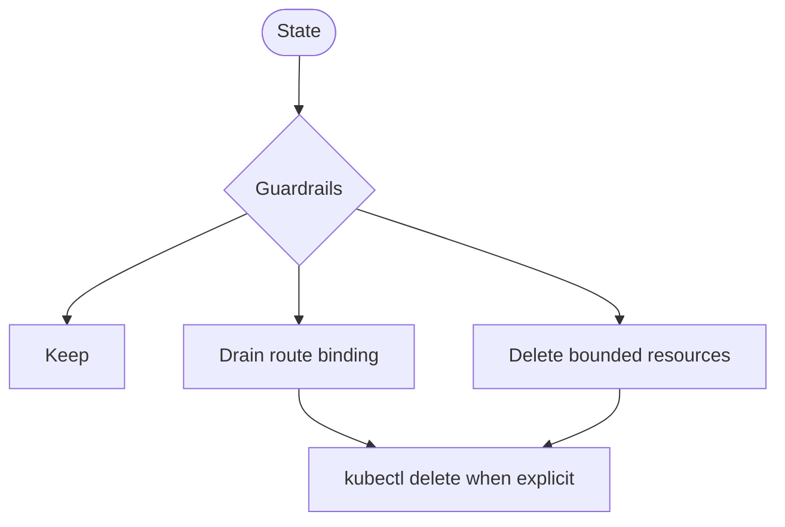
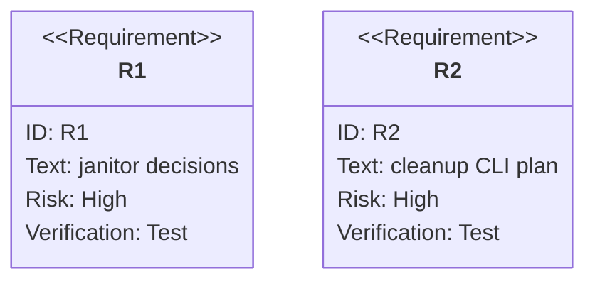

# TD: Preview Guarded Cleanup Janitor

## Logic
<!-- type: logic lang: mermaid -->



## Schema
<!-- type: schema lang: yaml -->

```yaml
types:
  JanitorPlan:
    fields:
      mr: u32
      namespace: string
      routeTarget: string
      controlNamespace: string
      protectedNamespaces: list<string>
      action: keep | drain | delete
      reason: string
      deleteNamespace: bool
      deleteRouteBinding: bool
      skipped: list<string>
rules:
  protected: "base/control namespaces are never deleted"
  selector: "namespace deletion requires uat-mr-*"
  closed_mr: "delete namespace and route binding when present"
  ttl_expired: "drain route binding before namespace deletion"
  orphan_namespace: "delete preview namespace without matching route target"
  orphan_route: "delete route binding without preview namespace"
```

## CLI
<!-- type: cli lang: yaml -->

```yaml
commands:
  - name: preview cleanup plan
    behavior:
      - emits audit-friendly JanitorPlan JSON
      - reports protected/broad namespaces in skipped
  - name: preview cleanup apply
    behavior:
      - reads a JanitorPlan JSON file
      - refuses protected or non-preview namespace deletion
      - deletes route-binding ConfigMaps and uat-mr-* namespaces idempotently
```

## Unit Test
<!-- type: unit-test lang: mermaid -->



## E2E Test
<!-- type: e2e-test lang: yaml -->

```yaml
e2e_tests:
  - id: preview-kind-guarded-cleanup-janitor
    command: "PREVIEW_KIND_E2E=1 cargo test -p preview --test kind_lifecycle -- --nocapture"
    assertions:
      - "preview cleanup apply deletes only uat-mr-* namespace and route-binding ConfigMap."
      - "preview cleanup apply can be re-run idempotently."
      - "base and control namespaces remain protected from janitor namespace deletion."
```

## Changes
<!-- type: changes lang: yaml -->

```yaml
changes:
  - path: "apps/preview/src/cleanup.rs"
    action: add
    section: logic
    description: "Implement JanitorPlan, guarded cleanup planning, protected namespace validation, and kubectl delete apply."
    impl_mode: hand-written
    replaces:
      - "<handwrite-tracker:projects-preview-src-cleanup-rs>"
  - path: "apps/preview/src/main.rs"
    action: modify
    section: cli
    description: "Add preview cleanup plan/apply commands."
    impl_mode: hand-written
  - path: "apps/preview/src/lib.rs"
    action: modify
    section: schema
    description: "Export janitor cleanup types and helpers."
    impl_mode: hand-written
  - path: "apps/preview/tests/render_contract.rs"
    action: modify
    section: unit-test
    description: "Cover janitor keep/drain/delete/orphan/protected decisions."
    impl_mode: hand-written
  - path: "apps/preview/tests/local_cicd_contract.rs"
    action: modify
    section: unit-test
    description: "Cover preview cleanup plan CLI output."
    impl_mode: hand-written
  - path: "apps/preview/tests/kind_lifecycle.rs"
    action: modify
    section: e2e-test
    description: "Cover preview cleanup apply deleting only preview namespace and route-binding ConfigMap idempotently."
    impl_mode: hand-written
```
