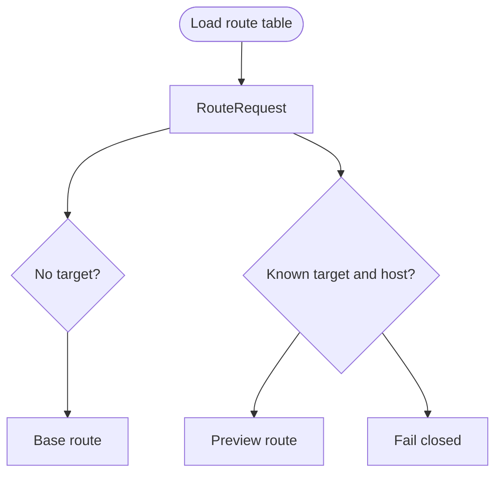
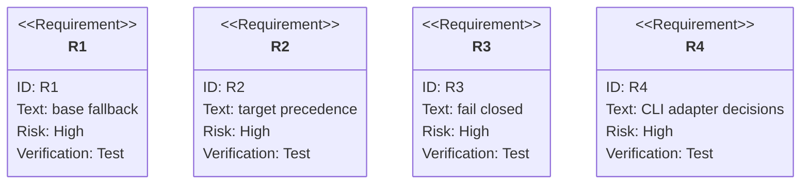

# TD: Preview Local Router Adapter

## Logic
<!-- type: logic lang: mermaid -->



## Schema
<!-- type: schema lang: yaml -->

```yaml
types:
  BaseRoute:
    fields:
      host: string
      namespace: string
      service: string
      servicePort: u16
  RouteDecision:
    fields:
      outcome: base | preview | not-found
      target: string?
      namespace: string?
      service: string?
      servicePort: u16?
      reason: string
rules:
  - "X-UAT-Target has precedence over uat_target cookie."
  - "No target routes to BaseRoute only when host matches."
  - "Known target with matching host routes to preview namespace/service."
  - "Unknown target or host mismatch returns not-found with no namespace/service."
sources:
  rendered_file: "router/route-binding.yaml"
  kind_configmaps: "ConfigMaps labeled preview.cclab.dev/kind=route-binding"
```

## CLI
<!-- type: cli lang: yaml -->

```yaml
commands:
  - name: preview router resolve
    args:
      --dir: "optional rendered preview directory; when omitted load ConfigMaps through kubectl"
      --context: "optional kubectl context"
      --control-namespace: "route-binding ConfigMap namespace"
      --host: "request host"
      --base-namespace: "base fallback namespace"
      --base-service: "base fallback service"
      --base-service-port: "base fallback service port"
      --header-target: "optional X-UAT-Target value"
      --cookie-target: "optional uat_target value"
    behavior:
      - returns JSON RouteDecision
      - proves base fallback without a live ingress
      - fails closed for invalid targets
```

## Unit Test
<!-- type: unit-test lang: mermaid -->



## E2E Test
<!-- type: e2e-test lang: yaml -->

```yaml
e2e_tests:
  - id: preview-kind-router-adapter
    command: "PREVIEW_KIND_E2E=1 cargo test -p preview --test kind_lifecycle -- --nocapture"
    assertions:
      - "kind applies the route-binding ConfigMap into the control namespace."
      - "load_route_table_from_kubectl reads route-binding ConfigMaps."
      - "resolve_route_with_base maps X-UAT-Target=mr-123 to uat-mr-123/checkout."
      - "cleanup still removes preview/control/base namespaces created by the test."
```

## Changes
<!-- type: changes lang: yaml -->

```yaml
changes:
  - path: "apps/preview/src/router.rs"
    action: modify
    section: logic
    description: "Add BaseRoute, RouteDecision, base fallback, fail-closed resolution, and route table loaders for rendered files and kubectl ConfigMaps."
    impl_mode: hand-written
  - path: "apps/preview/src/main.rs"
    action: modify
    section: cli
    description: "Add preview router resolve CLI outputting JSON route decisions."
    impl_mode: hand-written
  - path: "apps/preview/src/lib.rs"
    action: modify
    section: schema
    description: "Export router adapter types and loaders."
    impl_mode: hand-written
  - path: "apps/preview/tests/router_contract.rs"
    action: modify
    section: unit-test
    description: "Cover base fallback, header override, cookie routing, host mismatch, invalid-target fail-closed, and rendered-file route table loading."
    impl_mode: hand-written
  - path: "apps/preview/tests/local_cicd_contract.rs"
    action: modify
    section: unit-test
    description: "Cover preview router resolve CLI decisions from rendered files."
    impl_mode: hand-written
  - path: "apps/preview/tests/kind_lifecycle.rs"
    action: modify
    section: e2e-test
    description: "Load route-binding ConfigMaps from kind and resolve a preview target through the local adapter."
    impl_mode: hand-written
```
