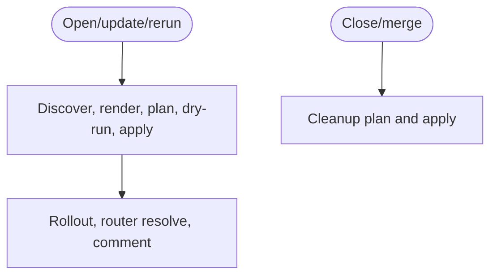
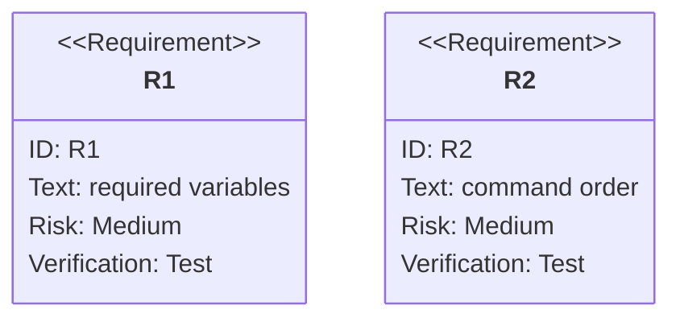

# TD: Preview CI Template Lifecycle

## Logic
<!-- type: logic lang: mermaid -->



## Schema
<!-- type: schema lang: yaml -->

```yaml
required_variables:
  - PREVIEW_MR
  - PREVIEW_SHA
  - PREVIEW_IMAGE
  - PREVIEW_APP
  - PREVIEW_HOST
  - PREVIEW_BASE_NAMESPACE
  - PREVIEW_CONTEXT
  - PREVIEW_TTL_HOURS
templates:
  - docs/ci-templates/github-actions-preview.yaml
  - docs/ci-templates/gitlab-ci-preview.yml
  - docs/ci-templates/local-kind-lifecycle.sh
```

## CLI
<!-- type: cli lang: yaml -->

```yaml
commands:
  open_update_rerun:
    - preview discover-base
    - preview render
    - preview apply --plan-only
    - preview apply --dry-run
    - preview apply
    - kubectl rollout status
    - preview router resolve
    - preview comment
  close_merge:
    - preview cleanup plan
    - preview cleanup apply
```

## Unit Test
<!-- type: unit-test lang: mermaid -->



## E2E Test
<!-- type: e2e-test lang: yaml -->

```yaml
e2e_tests:
  - id: preview-kind-template-path
    command: "PREVIEW_KIND_E2E=1 cargo test -p preview --test kind_lifecycle -- --nocapture"
    assertions:
      - "kind lifecycle covers the documented local sequence from base discovery through cleanup apply."
```

## Changes
<!-- type: changes lang: yaml -->

```yaml
changes:
  - path: "apps/preview/docs/ci-templates/README.md"
    action: add
    section: logic
    description: "Document the open/update/rerun and close cleanup lifecycle flow."
    impl_mode: hand-written
  - path: "apps/preview/docs/ci-templates/README.md"
    action: add
    section: schema
    description: "Document required variables and local-first lifecycle order."
    impl_mode: hand-written
  - path: "apps/preview/docs/ci-templates/github-actions-preview.yaml"
    action: add
    section: cli
    description: "Provide copyable GitHub Actions preview lifecycle."
    impl_mode: hand-written
  - path: "apps/preview/docs/ci-templates/gitlab-ci-preview.yml"
    action: add
    section: cli
    description: "Provide copyable GitLab CI preview lifecycle."
    impl_mode: hand-written
  - path: "apps/preview/docs/ci-templates/local-kind-lifecycle.sh"
    action: add
    section: cli
    description: "Provide local kind lifecycle script matching the tested path."
    impl_mode: hand-written
  - path: "apps/preview/tests/local_cicd_contract.rs"
    action: modify
    section: unit-test
    description: "Validate required variables and command order across templates."
    impl_mode: hand-written
```
