## Logic

```mermaid
---
id: relay-adopt-libs-operator-deploy-cli-flow
entry: main
nodes:
  main:
    kind: start
    label: "relay main: relay::tls::install_default_crypto_provider() FIRST (before clap parse — kube, raft-host peer, and online CLI paths link rustls; a no-op in builds without the private rustls-provider feature), then dispatch. New Command::K8s + Command::Dockerfile arms sit beside serve/llm/upgrade/issue on the single relay bin"
  verb:
    kind: decision
    label: "Which deploy verb? k8s crd render | k8s operator render|run | k8s instance render | dockerfile render. Every render path is OFFLINE and builds in the default (kube-free) build; only `k8s operator run` needs --features operator"
  crd:
    kind: process
    label: "k8s crd render [--out]: operator build — serde_json(Relay::crd()) -> normalize_kubernetes_schema_formats (uint32/uint64 formats are NOT in the structural-schema vocabulary: drop format, insert minimum: 0) -> serde_yaml. Default build — include_str of the committed k8s/operator/crd.yaml fixture (generated by the operator build; byte-identical by test)"
  opr:
    kind: process
    label: "k8s operator render [--namespace relay-system] [--out]: the controller control plane from the checked-in k8s/operator/rbac.yaml + deployment.yaml fixtures with the namespace substituted — Namespace, ServiceAccount, ClusterRole (relay.dev relays/status/finalizers, apps statefulsets, core services/serviceaccounts, policy PDBs, coordination leases), ClusterRoleBinding, and a Deployment running `relay k8s operator run` from the same relay image"
  oprun:
    kind: process
    label: "k8s operator run: feature-gated. tracing init then relay::operator::run() = operator::run::<Relay>() — the shared libs/operator controller: cluster-wide watch, leader-election Lease (MANAGER relay-operator), server-side apply of render() output, status_patch writeback. Without the feature: anyhow::bail with the rebuild hint"
  inst:
    kind: process
    label: "k8s instance render --profile dev|staging|prod|template [--name] [--namespace] [--image] [--out]: string-templated kind: Relay CR YAML (offline, no kube types). dev = 1 replica, 1Gi, debug, relay:latest; staging = prod-shaped single node, 20Gi, relay:<version>; prod = replicasPerShard 3, voterCount 3, 100Gi, imagePullPolicy Always, auth required + tokensSecret relay-token-registry; template = REPLACE_ME skeleton. HA peer DNS assumes the CR is named relay (serve passes prefix 'relay' to ClusterTopology::from_env)"
  dock:
    kind: process
    label: "dockerfile render --variant source|release [--version] [--out]: source = the committed apps/relay/Dockerfile byte-for-byte (include_str + ownership-marker strip, a no-op today); release = the new committed Dockerfile.release (fetch + sha256-verify a published relay@<version> tarball into distroless) with the ARG/tag lines substituted from --version (normalize `0.4.3` -> `relay@0.4.3`). The checked-in files are the fixtures; the CLI is the source of truth (keep #777)"
  crdspec:
    kind: process
    label: "src/operator/crd.rs (feature-gated): RelaySpec derives kube::CustomResource — group relay.dev, v1alpha1, kind Relay, namespaced, status RelayStatus. #[serde(flatten)] cluster: operator::ClusterSpec (image/imagePullPolicy/shardCount/replicasPerShard/voterCount/resources — shardCount defaults 1 and render PINS it to 1: relay is a single raft group) + relay knobs: storage (default 10Gi), storageClass, graceSecs (default 10, tracks terminationGracePeriodSeconds), logLevel (RUST_LOG), auth ('off'|'required' as a flat string — no divergent-variant enums in the CRD, keep #776 trap), tokensSecret (Secret name)"
  render:
    kind: process
    label: "src/operator/render.rs pure render (no I/O): RenderCtx { app relay, manager relay-operator, relay.dev/v1alpha1 Relay, name, ns, owner_ref } -> [ServiceAccount, StatefulSet, headless Service ({name}-headless, port 7000), client Service ({name}, ClusterIP 7000), PDB maxUnavailable 1] — every shared shape via operator::render helpers, never hand-built JSON"
  sts:
    kind: process
    label: "StatefulSet via render::sharded_statefulset: command [relay], port http 7000, shard_count PINNED 1, replicas = replicasPerShard, headless_env_key RELAY_PEER_SERVICE = {name}-headless (exactly what serve's --peer-service reads), volume_claim data -> /data mount + storageClass; extra_env RELAY_BIND 0.0.0.0:7000, RELAY_DATA_DIR /data, RELAY_GRACE_SECS, optional RUST_LOG; then harden(): RollingUpdate, revisionHistoryLimit 5, prometheus scrape annotations, nonroot pod+container securityContext (65532, readOnlyRootFilesystem, drop ALL), writable /tmp emptyDir, terminationGracePeriodSeconds = graceSecs, readiness /readyz + liveness /healthz + startup /healthz on port http — the exact probe contract service-http serves"
  auth:
    kind: decision
    label: "CR sets auth: required AND tokensSecret? — the lumen token-registry pattern, OFF by default: mount Secret item token-registry.json at /var/run/secrets/relay (readOnly) and inject RELAY_AUTH=required + RELAY_TOKEN_REGISTRY_FILE=/var/run/secrets/relay/token-registry.json. Otherwise render NO auth env (serve defaults to off; probes stay tokenless either way)"
  recon:
    kind: process
    label: "src/operator/reconcile.rs: impl ManagedService for Relay — MANAGER relay-operator (SSA field manager + Lease name), render() delegates to render::render, readiness_targets = [StatefulSet {name}], status_patch = phase Pending|Reconciling|Ready from readyReplicas vs desired (replicasPerShard; shard pinned 1) + observedGeneration + message. run() = operator::run::<Relay>()"
  tree:
    kind: process
    label: "k8s/ tree per the dogfood rules: base = SMALL direct install for kind/smoke — single-node StatefulSet (replicas 1, NO raft env: no REPLICAS_PER_SHARD/VOTER_COUNT — replica_mode() stays false; RELAY_BIND 0.0.0.0:7000, RELAY_DATA_DIR /data, 1Gi PVC, /readyz + /healthz probes) + service.yaml (headless for serviceName + ClusterIP client). pdb.yaml DELETED (a 1-replica PDB is noise; quorum PDBs come from the operator render). Production HA = apply crd render + operator render, then instance render --profile prod"
  smoke:
    kind: terminal
    label: "scripts/kind-failover-smoke.sh rewritten: build the single linux `relay` bin (cached cargo container) -> thin relay:dev runtime image -> kind load -> apply INLINE heredoc manifests carrying the standard downward-API quartet (SHARD_COUNT 1, REPLICAS_PER_SHARD 3, VOTER_COUNT 3, POD_NAME fieldRef, RELAY_PEER_SERVICE) on port 7000 -> leader election / publish / kill-leader / no-committed-loss assertions via /raftz + /v1/events/publish. Zero relay-raft references; bash -n clean; the heredoc manifests are YAML-parsed by a test"
edges:
  - { from: main, to: verb }
  - { from: verb, to: crd, label: "k8s crd render" }
  - { from: verb, to: opr, label: "k8s operator render" }
  - { from: verb, to: oprun, label: "k8s operator run" }
  - { from: verb, to: inst, label: "k8s instance render" }
  - { from: verb, to: dock, label: "dockerfile render" }
  - { from: crd, to: crdspec, label: "schema source" }
  - { from: crdspec, to: render }
  - { from: render, to: sts }
  - { from: sts, to: auth }
  - { from: auth, to: recon, label: "either way" }
  - { from: oprun, to: recon, label: "controller drives" }
  - { from: inst, to: tree, label: "prod profile replaces hand YAML" }
  - { from: recon, to: tree }
  - { from: tree, to: smoke }
  - { from: dock, to: smoke, label: "same image contract" }
---
flowchart TD
    main([relay main: install rustls provider then dispatch]) --> verb{deploy verb?}
    verb -->|k8s crd render| crd[operator build: Relay::crd + normalize uint32/uint64; default build: committed fixture]
    verb -->|k8s operator render| opr[rbac + deployment fixtures with namespace substituted]
    verb -->|k8s operator run| oprun[feature-gated operator::run::&lt;Relay&gt;]
    verb -->|k8s instance render| inst[profile-templated kind: Relay CR — dev/staging/prod/template]
    verb -->|dockerfile render| dock[source == committed Dockerfile; release == Dockerfile.release with relay@version substitution]
    crd --> crdspec[RelaySpec: flatten ClusterSpec, shardCount pinned 1, storage/graceSecs/logLevel/auth/tokensSecret]
    crdspec --> render[pure render via operator::render helpers: SA, StatefulSet, headless+client Service, PDB]
    render --> sts[sharded_statefulset: downward-API quartet + RELAY_PEER_SERVICE + RELAY_BIND/RELAY_DATA_DIR/RELAY_GRACE_SECS; harden probes /readyz + /healthz on 7000]
    sts --> auth{auth required + tokensSecret?}
    auth -->|yes| recon[mount token-registry Secret + RELAY_AUTH/RELAY_TOKEN_REGISTRY_FILE; ManagedService status_patch]
    auth -->|no| recon
    oprun --> recon
    inst --> tree[k8s base = single-node direct install; pdb.yaml deleted; prod HA via operator CR path]
    recon --> tree
    tree --> smoke([kind smoke: single relay image, auto-mode env, zero relay-raft refs])
    dock --> smoke
```

<!-- type: logic lang: mermaid -->


## Unit Test
<!-- type: unit-test lang: mermaid -->

```mermaid
---
id: relay-adopt-libs-operator-deploy-cli-verification
requirements:
  auth_secret_wiring_opt_in:
    id: R2
    text: "With --features operator: a CR with auth: required and tokensSecret set renders the token-registry Secret volume mounted read-only at /var/run/secrets/relay and injects RELAY_AUTH=required + RELAY_TOKEN_REGISTRY_FILE=/var/run/secrets/relay/token-registry.json; a CR without them (the default) renders NO RELAY_AUTH / RELAY_TOKEN_REGISTRY_FILE env and no such volume (lumen's pattern, off unless the CR asks)."
    kind: functional
    risk: high
    verify: tests/operator.rs::auth_secret_wiring_is_opt_in
  crd_fixture_matches_generated:
    id: R3
    text: "The rendered CRD YAML (the committed k8s/operator/crd.yaml fixture in the default build; the live-generated document in the operator build) contains no `format: uint32` or `format: uint64` (Kubernetes structural-schema rules reject them) and the normalized unsigned counts keep a `minimum: 0` floor; the fixture parses as YAML and declares kind Relay under group relay.dev."
    kind: functional
    risk: high
    verify: tests/deploy_cli.rs::crd_render_is_structural_schema_safe
  crd_flattens_cluster_spec:
    id: R2
    text: "With --features operator: the generated Relay CRD schema carries the flattened operator::ClusterSpec fields (image, imagePullPolicy, shardCount, replicasPerShard, voterCount, resources) directly under spec.properties (no nested `cluster` wrapper) plus relay's own knobs (storage, storageClass, graceSecs, logLevel, auth, tokensSecret)."
    kind: functional
    risk: medium
    verify: tests/operator.rs::crd_flattens_cluster_spec
  dockerfile_fixture_equality:
    id: R4
    text: "`relay dockerfile render --variant source` reproduces the committed apps/relay/Dockerfile byte-for-byte and `--variant release` reproduces the committed apps/relay/Dockerfile.release; an explicit `--version 9.9.9` substitutes the relay@9.9.9 ARG and the relay:9.9.9 image tag (the checked-in files are fixtures of the render — keep #777 pattern)."
    kind: functional
    risk: medium
    verify: tests/deploy_cli.rs::dockerfile_render_reproduces_committed_fixtures
  feature_builds_green:
    id: R1
    text: "cargo build -p relay --features operator compiles the controller (`relay k8s operator run` real path); cargo build -p relay --features self-update,issue stays green with the new rustls-provider gating; the default build links no kube-rs; the workspace lockfile stays single-versioned on kube 0.98 / k8s-openapi 0.24 / schemars 0.8."
    kind: regression
    risk: medium
    verify: cargo build -p relay --features operator (+ self-update,issue) — WI AC5 build gates
  llm_operations_topic_deploy_verbs:
    id: R7
    text: "The relay llm operations topic documents the deploy verbs (k8s crd/operator/instance render, k8s operator run, dockerfile render) so the outline stays honest about the CLI surface."
    kind: functional
    risk: low
    verify: tests/deploy_cli.rs::llm_operations_topic_names_deploy_verbs
  offline_render_verbs_default_build:
    id: R4
    text: "In the DEFAULT build (no operator feature), driving the compiled relay binary: `relay k8s crd render`, `relay k8s operator render`, and `relay k8s instance render` for all four profiles (dev/staging/prod/template) succeed offline and every emitted document round-trips through serde_yaml (multi-doc output split on `---`); `relay dockerfile render` succeeds for both variants. `relay k8s operator run` without the feature exits nonzero with the rebuild hint."
    kind: functional
    risk: high
    verify: tests/deploy_cli.rs::render_verbs_emit_parseable_yaml_offline
  rustls_provider_idempotent:
    id: R1
    text: "relay::tls::install_default_crypto_provider() is idempotent and safe to call repeatedly (main calls it before command parsing); it is a no-op in builds without the private rustls-provider feature and installs the aws-lc-rs default provider once in builds that link a rustls path (operator/self-update/issue)."
    kind: functional
    risk: low
    verify: tests/operator.rs::rustls_provider_install_is_idempotent
  smoke_script_single_bin:
    id: R6
    text: "scripts/kind-failover-smoke.sh contains zero relay-raft references, builds/loads the single `relay` image, and its embedded kubernetes manifests (extracted from the heredoc) parse as YAML and carry the auto-mode downward-API env (SHARD_COUNT=1, REPLICAS_PER_SHARD=3, VOTER_COUNT=3, POD_NAME fieldRef, RELAY_PEER_SERVICE) on port 7000; `bash -n` accepts the script."
    kind: regression
    risk: medium
    verify: tests/deploy_cli.rs::smoke_script_is_single_bin_auto_mode
  statefulset_env_probe_contract:
    id: R2
    text: "With --features operator: render() of a Relay CR emits, via the shared operator::render toolkit, a StatefulSet whose container env carries exactly the downward-API contract relay's serve reads — POD_NAME (fieldRef metadata.name), SHARD_COUNT pinned to 1, REPLICAS_PER_SHARD, VOTER_COUNT, RELAY_PEER_SERVICE={name}-headless — plus RELAY_BIND=0.0.0.0:7000, RELAY_DATA_DIR=/data and RELAY_GRACE_SECS; replicas == replicasPerShard (single group); readiness probe /readyz and liveness+startup probes /healthz on the http port; the ServiceAccount, headless + client Services and PDB are present; the /data PVC template carries the CR's storage size."
    kind: functional
    risk: high
    verify: tests/operator.rs::render_emits_downward_api_statefulset
  status_patch_phases:
    id: R2
    text: "With --features operator: ManagedService for Relay reports readiness_targets = the instance StatefulSet and status_patch phases Pending (0 ready) / Reconciling (partial) / Ready (readyReplicas >= replicasPerShard, shard count pinned 1), with observedGeneration and desired/ready replica counts."
    kind: functional
    risk: medium
    verify: tests/operator.rs::status_patch_reports_phases
---
flowchart TD
    r1[R1 feature builds green] --> cargo_build_p_relay_features_operator_self_update_issue_wi_ac5_build_gates[cargo build -p relay --features operator (+ self-update,issue) — WI AC5 build gates]
    r1[R1 rustls provider idempotent] --> tests_operator_rs_rustls_provider_install_is_idempotent[tests/operator.rs::rustls_provider_install_is_idempotent]
    r2[R2 auth secret wiring opt in] --> tests_operator_rs_auth_secret_wiring_is_opt_in[tests/operator.rs::auth_secret_wiring_is_opt_in]
    r2[R2 crd flattens cluster spec] --> tests_operator_rs_crd_flattens_cluster_spec[tests/operator.rs::crd_flattens_cluster_spec]
    r2[R2 statefulset env probe contract] --> tests_operator_rs_render_emits_downward_api_statefulset[tests/operator.rs::render_emits_downward_api_statefulset]
    r2[R2 status patch phases] --> tests_operator_rs_status_patch_reports_phases[tests/operator.rs::status_patch_reports_phases]
    r3[R3 crd fixture matches generated] --> tests_deploy_cli_rs_crd_render_is_structural_schema_safe[tests/deploy_cli.rs::crd_render_is_structural_schema_safe]
    r4[R4 dockerfile fixture equality] --> tests_deploy_cli_rs_dockerfile_render_reproduces_committed_fixtures[tests/deploy_cli.rs::dockerfile_render_reproduces_committed_fixtures]
    r4[R4 offline render verbs default build] --> tests_deploy_cli_rs_render_verbs_emit_parseable_yaml_offline[tests/deploy_cli.rs::render_verbs_emit_parseable_yaml_offline]
    r6[R6 smoke script single bin] --> tests_deploy_cli_rs_smoke_script_is_single_bin_auto_mode[tests/deploy_cli.rs::smoke_script_is_single_bin_auto_mode]
    r7[R7 llm operations topic deploy verbs] --> tests_deploy_cli_rs_llm_operations_topic_names_deploy_verbs[tests/deploy_cli.rs::llm_operations_topic_names_deploy_verbs]
```
## Changes
<!-- type: changes lang: yaml -->

```yaml
changes:
  - path: apps/relay/Cargo.toml
    action: modify
    section: logic
    impl_mode: hand-written
    description: "Add the operator feature mirroring keep's: [dep:kube, dep:k8s-openapi, dep:schemars, dep:operator, dep:serde_yaml, rustls-provider] with optional deps kube 0.98 (runtime/derive/client), k8s-openapi 0.24 (v1_32), schemars 0.8, operator (path ../../libs/operator), serde_yaml (workspace) — versions matching keep/lumen so the lockfile stays single-versioned; a private rustls-provider feature (dep:rustls 0.23) also enabled by self-update and issue; serde_yaml added to dev-dependencies for the render round-trip tests."
  - path: apps/relay/src/operator/mod.rs
    action: create
    section: logic
    impl_mode: hand-written
    description: "Feature-gated operator module root: crd/render/reconcile submodules, re-exports (Relay, RelaySpec, RelayStatus, run), crd_yaml() = serde_json(Relay::crd()) -> normalize_kubernetes_schema_formats (recursively rewrite format: uint32/uint64 to plain integer + minimum: 0 — Kubernetes structural-schema rules) -> serde_yaml string (keep's pattern)."
  - path: apps/relay/src/operator/crd.rs
    action: create
    section: logic
    impl_mode: hand-written
    description: "RelaySpec CustomResource (group relay.dev, v1alpha1, kind Relay, plural relays, namespaced, status RelayStatus, printcolumns Phase/Ready/Age): #[serde(flatten)] cluster: operator::ClusterSpec (shardCount defaults 1; relay is a single raft group — render pins it) + storage (default 10Gi), storageClass, graceSecs (default 10), logLevel (Option, RUST_LOG), auth (flat string off|required — no divergent-variant enums in the CRD), tokensSecret (Option<String> Secret name); RelayStatus { phase, observedGeneration, readyReplicas, desiredReplicas, message }."
  - path: apps/relay/src/operator/render.rs
    action: create
    section: logic
    impl_mode: hand-written
    description: "Pure render (no I/O), everything via the shared operator::render toolkit: RenderCtx (app relay, manager relay-operator, owner_ref from CR uid) -> ServiceAccount, StatefulSet via sharded_statefulset (command [relay], port http 7000, shard_count pinned 1, headless_env_key RELAY_PEER_SERVICE = {name}-headless, /data PVC with storage/storageClass, extra_env RELAY_BIND 0.0.0.0:7000 + RELAY_DATA_DIR /data + RELAY_GRACE_SECS + optional RUST_LOG + opt-in RELAY_AUTH/RELAY_TOKEN_REGISTRY_FILE with the token-registry Secret volume mounted read-only at /var/run/secrets/relay — lumen's pattern, off unless auth: required AND tokensSecret), then harden(): RollingUpdate + revisionHistoryLimit 5 + prometheus annotations + nonroot 65532 pod/container security contexts + readOnlyRootFilesystem + writable /tmp + terminationGracePeriodSeconds = graceSecs + readiness /readyz + liveness/startup /healthz probes; headless + client Services on 7000; PDB maxUnavailable 1."
  - path: apps/relay/src/operator/reconcile.rs
    action: create
    section: logic
    impl_mode: hand-written
    description: "impl ManagedService for Relay: MANAGER relay-operator (SSA field manager + leader-election Lease name); render() -> render::render; readiness_targets = [StatefulSet {name}]; status_patch = Pending|Reconciling|Ready from readyReplicas vs desiredReplicas (= replicasPerShard, shard pinned 1) + observedGeneration + message; pub async fn run() = operator::run::<Relay>()."
  - path: apps/relay/src/tls.rs
    action: create
    section: logic
    impl_mode: hand-written
    description: "install_default_crypto_provider(): behind the private rustls-provider feature install the aws-lc-rs rustls default provider once (std::sync::Once, ignore a pre-installed provider); a no-op otherwise. Called at the very top of main before clap parsing (keep's pattern — kube, raft-host peer transport and the online CLI ops all link rustls)."
  - path: apps/relay/src/lib.rs
    action: modify
    section: logic
    impl_mode: hand-written
    description: "Wire the new modules in the existing HANDWRITE region: pub mod tls; #[cfg(feature = \"operator\")] pub mod operator;."
  - path: apps/relay/src/bin/relay.rs
    action: modify
    section: logic
    impl_mode: hand-written
    description: "Add Command::K8s + Command::Dockerfile arms (keep's shapes): k8s crd render [--out], k8s operator render [--namespace relay-system] [--out], k8s operator run (feature-gated; bail with rebuild hint otherwise), k8s instance render --profile dev|staging|prod|template [--name] [--namespace] [--image] [--out] (string-templated Relay CR YAML), dockerfile render --variant source|release [--version] [--out] (include_str fixtures, marker strip, relay@version substitution); write_or_print --out handling (directory receives the default filename); call relay::tls::install_default_crypto_provider() first in main; extend the cli_parse_surface test with the new verbs."
  - path: apps/relay/src/llm.rs
    action: modify
    section: logic
    impl_mode: hand-written
    description: "Operations topic gains the deploy-verbs paragraph: relay k8s crd|operator|instance render + relay k8s operator run (--features operator; the CR path owns production HA topology) + relay dockerfile render --variant source|release; k8s/ base = single-node direct install for kind/smoke."
  - path: apps/relay/Dockerfile.release
    action: create
    section: logic
    impl_mode: hand-written
    description: "Release-image fixture (keep #777 pattern): stage 1 debian:bookworm-slim fetches + sha256-verifies the published relay@<version> linux tarball for TARGETARCH; stage 2 distroless/cc-debian12:nonroot carries only the binary; EXPOSE 7000; ENTRYPOINT /usr/local/bin/relay. Byte-for-byte reproducible by `relay dockerfile render --variant release`."
  - path: apps/relay/k8s/operator/crd.yaml
    action: create
    section: logic
    impl_mode: hand-written
    description: "The generated Relay CustomResourceDefinition fixture (output of `relay k8s crd render` from the operator build, structural-schema normalized) — backs the offline crd render path in the default (kube-free) build via include_str."
  - path: apps/relay/k8s/operator/rbac.yaml
    action: create
    section: logic
    impl_mode: hand-written
    description: "Operator control-plane RBAC fixture: Namespace relay-system, ServiceAccount relay-operator, ClusterRole (relay.dev relays/status/finalizers; apps statefulsets; core services/serviceaccounts; policy poddisruptionbudgets; coordination.k8s.io leases), ClusterRoleBinding — namespace-substituted by `relay k8s operator render --namespace`."
  - path: apps/relay/k8s/operator/deployment.yaml
    action: create
    section: logic
    impl_mode: hand-written
    description: "Operator Deployment fixture: runs `relay k8s operator run` from the relay image (built with --features operator), POD_NAME/POD_NAMESPACE downward env for the leader-election Lease, nonroot + readOnlyRootFilesystem hardening; replicas 1 (scale to 2+ safely — the Lease elects one active reconciler)."
  - path: apps/relay/k8s/statefulset.yaml
    action: modify
    section: logic
    impl_mode: hand-written
    description: "Base collapses to a SMALL single-node direct install for kind/smoke (dogfood rule): replicas 1, NO raft env (no REPLICAS_PER_SHARD/VOTER_COUNT — replica_mode() stays false), RELAY_BIND 0.0.0.0:7000, RELAY_DATA_DIR /data, 1Gi PVC, /readyz + /healthz probes on 7000, nonroot hardening. The hand-maintained 3-replica raft topology is dropped — that shape now comes from `relay k8s instance render --profile prod` through the operator."
  - path: apps/relay/k8s/service.yaml
    action: modify
    section: logic
    impl_mode: hand-written
    description: "Headless Service relay-headless (StatefulSet serviceName / peer DNS) + ClusterIP client Service relay, both on port 7000 targeting the http container port."
  - path: apps/relay/k8s/pdb.yaml
    action: delete
    section: logic
    impl_mode: hand-written
    description: "A PodDisruptionBudget over a 1-replica base is noise; quorum PDBs for HA topologies come from the operator render (maxUnavailable 1)."
  - path: apps/relay/scripts/kind-failover-smoke.sh
    action: modify
    section: logic
    impl_mode: hand-written
    description: "Rewritten against the single `relay` auto-mode image: build the linux relay bin in a cached cargo container, thin relay:dev runtime image, kind create + load, apply inline heredoc manifests (headless + client Service, 3-replica StatefulSet with POD_NAME fieldRef / SHARD_COUNT 1 / REPLICAS_PER_SHARD 3 / VOTER_COUNT 3 / RELAY_PEER_SERVICE, PDB maxUnavailable 1) on port 7000, then the existing failover proof (leader elect, publish, kill leader, re-elect, no committed loss) via /raftz + /v1/events/publish. Zero relay-raft references."
  - path: apps/relay/tests/deploy_cli.rs
    action: create
    section: unit-test
    impl_mode: hand-written
    description: "Offline deploy-CLI tests driving the COMPILED relay binary in the default build: every k8s/dockerfile render verb succeeds and round-trips serde_yaml; dockerfile source/release outputs equal the committed fixtures (+ --version substitution); the CRD render is structural-schema safe (no uint32/uint64, minimum floor, kind Relay); operator run without the feature exits nonzero with the rebuild hint; the smoke script has no relay-raft refs and its heredoc manifests parse and carry the auto-mode env; the llm operations topic names the deploy verbs."
  - path: apps/relay/tests/operator.rs
    action: create
    section: unit-test
    impl_mode: hand-written
    description: "Feature-gated (#![cfg(feature = \"operator\")]) render-shape tests: CRD flattens ClusterSpec + relay knobs (no nested cluster wrapper); render() emits the downward-API StatefulSet with the exact env/probe contract serve reads (POD_NAME/SHARD_COUNT=1/REPLICAS_PER_SHARD/VOTER_COUNT/RELAY_PEER_SERVICE + RELAY_BIND/RELAY_DATA_DIR/RELAY_GRACE_SECS, /readyz + /healthz probes, PVC storage) plus ServiceAccount/Services/PDB; auth Secret wiring is opt-in (env + volume only when auth: required + tokensSecret); status_patch phases Pending/Reconciling/Ready; rustls provider install is idempotent."
```
