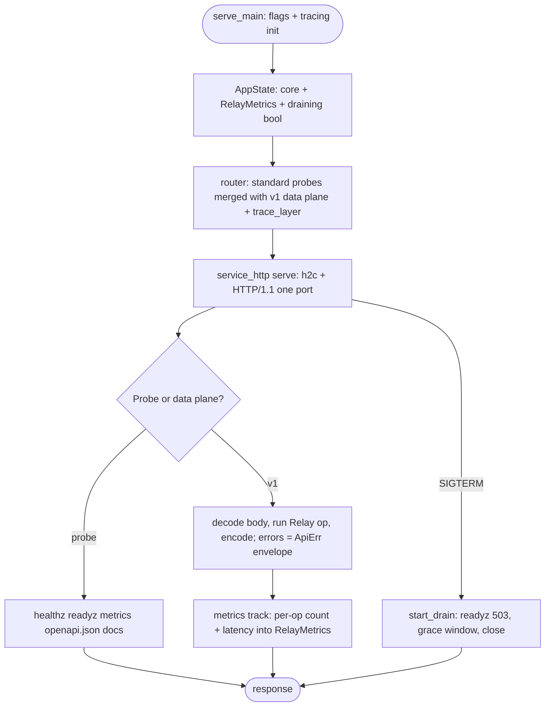

## Logic
<!-- type: logic lang: mermaid -->


## Unit Test

```mermaid
---
id: relay-service-http-shell-verification
requirements:
  drain_readyz:
    id: R2
    text: "AppState implements service_http::ReadinessHook over a draining AtomicBool; start_drain() flips /readyz from 200 ok to 503 draining (the SIGTERM path calls it via shutdown_with_drain)."
    kind: functional
    risk: medium
    verify: tests/http2_transport.rs::readyz_flips_to_503_on_drain
  error_envelope:
    id: R5
    text: "Handler error paths return the shared {error, message} ErrorEnvelope JSON (service_http::ApiErr) — decode failures 400 bad_request, engine/encode failures 500 internal, non-Subscribe first consume frame 400 — while success JSON/CBOR encodings are untouched."
    kind: functional
    risk: medium
    verify: tests/http2_transport.rs::errors_render_the_shared_envelope
  existing_transport_regression:
    id: R6
    text: "The /v1 route prefix and the existing publish/lease/ack JSON + CBOR fast-path behavior are unchanged under the new shell (regression over the pre-existing h2c transport tests)."
    kind: regression
    risk: medium
    verify: tests/http2_transport.rs::worker_leases_and_acks_over_h2c
  grace_flag:
    id: R1
    text: "The relay CLI gains --grace-secs (env RELAY_GRACE_SECS, default 10) feeding shutdown_with_drain's grace window; existing bare-serve flags keep parsing."
    kind: functional
    risk: low
    verify: src/bin/relay.rs::tests::cli_parse_surface
  h2c_and_h1_one_port:
    id: R1
    text: "service_http::serve serves HTTP/2 prior-knowledge (h2c, via libs/h2c h2c_client) AND HTTP/1.1 requests on the same port — replacing the HTTP/1-only axum::serve."
    kind: functional
    risk: high
    verify: tests/http2_transport.rs::h2c_and_http11_share_the_serve_port
  metrics_counters:
    id: R3
    text: "RelayMetrics (service-metrics Latency primitives, recorded by the metrics::track route_layer) renders per-op relay request counters + latency into the Prometheus text /metrics serves after traffic."
    kind: functional
    risk: medium
    verify: tests/http2_transport.rs::metrics_report_relay_request_counters_after_traffic
  probe_surface:
    id: R4
    text: "GET /healthz /readyz /metrics /openapi.json /docs all answer on the one serve port via service_http::standard_probe_routes merged with the /v1 data plane; the hand-rolled healthz/openapi_json handlers are deleted."
    kind: functional
    risk: medium
    verify: tests/http2_transport.rs::probe_surface_answers_on_serve_port
---
flowchart TD
    r1[R1 grace flag] --> src_bin_relay_rs_tests_cli_parse_surface[src/bin/relay.rs::tests::cli_parse_surface]
    r1[R1 h2c and h1 one port] --> tests_http2_transport_rs_h2c_and_http11_share_the_serve_port[tests/http2_transport.rs::h2c_and_http11_share_the_serve_port]
    r2[R2 drain readyz] --> tests_http2_transport_rs_readyz_flips_to_503_on_drain[tests/http2_transport.rs::readyz_flips_to_503_on_drain]
    r3[R3 metrics counters] --> tests_http2_transport_rs_metrics_report_relay_request_counters_after_traffic[tests/http2_transport.rs::metrics_report_relay_request_counters_after_traffic]
    r4[R4 probe surface] --> tests_http2_transport_rs_probe_surface_answers_on_serve_port[tests/http2_transport.rs::probe_surface_answers_on_serve_port]
    r5[R5 error envelope] --> tests_http2_transport_rs_errors_render_the_shared_envelope[tests/http2_transport.rs::errors_render_the_shared_envelope]
    r6[R6 existing transport regression] --> tests_http2_transport_rs_worker_leases_and_acks_over_h2c[tests/http2_transport.rs::worker_leases_and_acks_over_h2c]
```

<!-- type: unit-test lang: mermaid -->


## Changes
<!-- type: changes lang: yaml -->

```yaml
changes:
  - path: apps/relay/Cargo.toml
    action: modify
    section: logic
    impl_mode: hand-written
    description: "Add service-http + service-metrics path deps and tracing + tracing-subscriber (env-filter) for the shared shell and serve-path tracing init."
  - path: apps/relay/src/metrics.rs
    action: create
    section: logic
    impl_mode: hand-written
    description: "RelayMetrics on libs/service-metrics primitives (Latency = count + sum, render): publish / publish-batch / lease / ack / consume / other request counts + latency ms, plus the track route_layer middleware that maps the matched route pattern to its op family (mirrors keep's http/metrics.rs track)."
  - path: apps/relay/src/lib.rs
    action: modify
    section: logic
    impl_mode: hand-written
    description: "Register pub mod metrics in the crate root module wiring."
  - path: apps/relay/src/server.rs
    action: modify
    section: logic
    impl_mode: hand-written
    description: "AppState gains Arc<RelayMetrics> + draining AtomicBool with start_drain(); implements service_http::ReadinessHook and MetricsProvider; router() merges service_http::standard_probe_routes(state, Some(metrics), crate::openapi::openapi) with the /v1 data plane (route_layer metrics::track) under an outer service_http::trace_layer(); hand-rolled healthz + openapi_json handlers/routes deleted; bare (StatusCode, String) error returns become service_http::ApiErr (400 bad_request decode, 500 internal engine/encode); the /v1 prefix and CBOR success fast path are untouched."
  - path: apps/relay/src/consume.rs
    action: modify
    section: logic
    impl_mode: hand-written
    description: "Read the first up-frame before returning the response head: a non-Subscribe (or undecodable) first frame returns ApiErr 400 bad_request in the shared envelope instead of a silent empty 200 stream; drive() takes the primed prefetch/decoder."
  - path: apps/relay/src/openapi.rs
    action: modify
    section: logic
    impl_mode: hand-written
    description: "Add pub fn openapi() -> utoipa::openapi::OpenApi (the document accessor standard_probe_routes wants); api_doc_json() reuses it."
  - path: apps/relay/src/bin/relay.rs
    action: modify
    section: logic
    impl_mode: hand-written
    description: "serve_main serves via service_http::serve(listener, app, shutdown_with_drain(|| state.start_drain(), grace)) — h2c + HTTP/1.1 on one port; ServeArgs gains --grace-secs (env RELAY_GRACE_SECS, default 10); tracing init via EnvFilter (RUST_LOG wins, else info — keep's pattern)."
  - path: apps/relay/tests/http2_transport.rs
    action: modify
    section: unit-test
    impl_mode: hand-written
    description: "Serve the test app through service_http::serve; add probe_surface_answers_on_serve_port, readyz_flips_to_503_on_drain, h2c_and_http11_share_the_serve_port (libs/h2c h2c_client + plain HTTP/1.1 reqwest), metrics_report_relay_request_counters_after_traffic, and errors_render_the_shared_envelope; existing publish/lease/ack + CBOR tests stay as the regression net."
```
