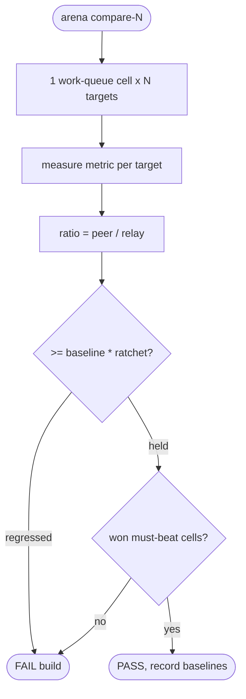
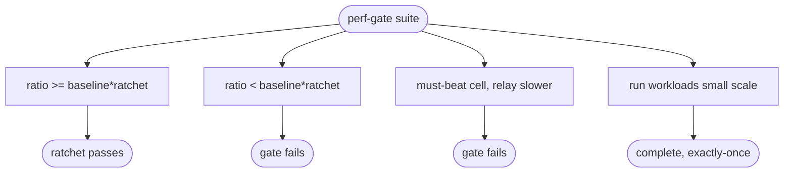

# relay competitor perf-gate — vs RabbitMQ / NATS JetStream / Redis Streams (work queue ratchet)

## Logic
<!-- type: logic lang: mermaid -->


## Config
<!-- type: config lang: yaml -->

```yaml
# relay perf-gate (arena compare-N + ratchet); mirrors lumen perf_gate_vs_db.
# The executable comparison is `cargo run -p relay --release --example
# bench_compare -- --backend <target>`, with one closed-loop workload and one
# measurement implementation. Every backend is durable-only: relay engine uses a
# disk-backed data dir and the default fsync policy; RabbitMQ uses durable queues
# + persistent messages + confirms; JetStream uses file storage; Redis/Dragonfly
# must have append-only persistence enabled or the harness fails fast. arena wraps
# those runs for normalized ratio + ratchet reporting; it is not the daily
# production EC gate.

base: relay            # ratios divide by relay
ratchet: 0.95          # relay may not drop below 95% of its recorded baseline ratio
primary_bar: rabbitmq  # the thing relay replaces; must-beat where claimed

cells:
  work_queue:
    competitors: [rabbitmq-quorum, nats-jetstream, redis-streams, dragonfly-streams]
    metrics: [publish_qps, lease_ack_qps]      # higher is better
    must_beat: [rabbitmq-quorum]
```
## Unit Test
<!-- type: unit-test lang: mermaid -->


## Changes
<!-- type: changes lang: yaml -->

```yaml
changes:
  - path: apps/relay/Cargo.toml
    action: modify
    section: config
    impl_mode: hand-written
    reason: "Add criterion, h2c, Redis, NATS, and RabbitMQ dev dependencies plus the relay_bench and bench_compare targets."
  - path: apps/relay/src/perf_gate.rs
    action: create
    section: logic
    impl_mode: hand-written
    reason: "The ratchet gate rule: evaluate per-cell ratios against the recorded baseline (no-regression) plus must-beat, returning a pass/fail verdict."
  - path: apps/relay/src/lib.rs
    action: modify
    section: logic
    impl_mode: hand-written
    reason: "Declare and re-export the perf_gate module."
  - path: apps/relay/benches/relay_bench.rs
    action: create
    section: unit-test
    impl_mode: hand-written
    reason: "criterion benchmarks for the relay-side publish and work-queue lease+ack cycle."
  - path: apps/relay/examples/bench_compare.rs
    action: create
    section: unit-test
    impl_mode: hand-written
    reason: "Closed-loop durable-only executable harness for engine, relay h2c, RabbitMQ, NATS JetStream, Redis Streams, and Dragonfly using the same publish then lease/ack workload."
  - path: apps/relay/tests/perf_gate.rs
    action: create
    section: unit-test
    impl_mode: hand-written
    reason: "Tests for the ratchet rule (holds / regresses / must-beat lost) and a small-scale smoke of the benched workloads."
```

# Reviews

### Review 1
**Verdict:** approved

- [logic] The gate is sound: per-cell ratio vs base, ratchet (no-regression vs recorded baseline), then must-beat on claimed cells; either failing condition fails the build. Mirrors lumen perf_gate_vs_db.
- [config] base/ratchet/primary_bar + one work-queue cell with competitors, metric direction, and must-beat, matching the single-cast work-queue broker (no broadcast or tape-style replay cell).
- [unit-test] Pure ratchet-rule cases (hold / regress / must-beat lost) are deterministic; the workload smoke keeps the benched cells honest in CI without competitors.
- [changes] relay-side benches + ratchet rule + tests + the bench_compare harness; external broker clients are dev-dependencies only. arena is the advisory ratio wrapper, keeping the production EC gate standalone.
