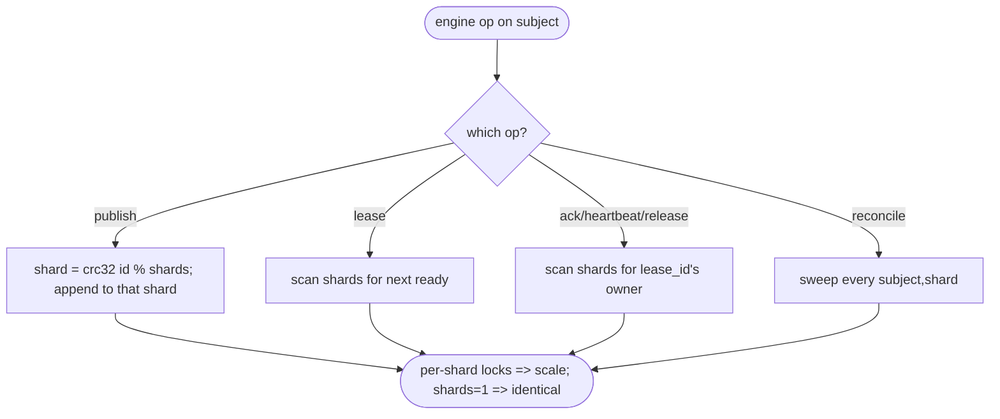
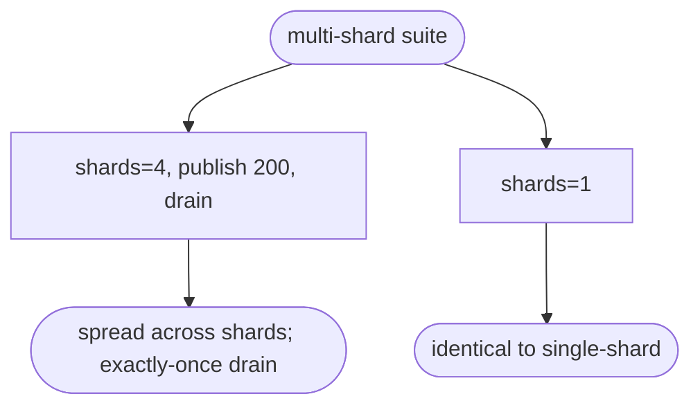

# relay multi-shard per subject (server-side sharding, horizontal scale)

## Logic
<!-- type: logic lang: mermaid -->


## Unit Test
<!-- type: unit-test lang: mermaid -->


## Changes
<!-- type: changes lang: yaml -->

```yaml
changes:
  - path: apps/relay/src/engine.rs
    action: modify
    section: logic
    impl_mode: hand-written
    reason: "Key subjects by (subject, shard); store shards = config.default_shards. publish/publish_batch route by crc32(message_id) % shards (reuse shard::shard_for); lease/lease_batch scan shards from a rotating start (whole subject drains exactly-once); ack/ack_batch/heartbeat/release route by scanning shards for the shard owning the lease_id; reconcile sweeps every (subject,shard) independently. committed_offset reads shard 0 (offsets are per-shard). default_shards=1 => shard 0 only => identical behavior."
  - path: apps/relay/tests/multi_shard.rs
    action: create
    section: unit-test
    impl_mode: hand-written
    reason: "Tests: publish spread across shards with whole-subject exactly-once drain through lease/ack, and default_shards=1 parity with single-shard semantics."
```

# Reviews

### Review 1
**Verdict:** approved

- [logic] (subject,shard) keying + crc32(message_id) routing gives independent per-shard logs/locks; lease scans shards, ack/heartbeat/release route by scanning shards for the lease_id's owner, reconcile sweeps all (subject,shard). default_shards=1 collapses to shard 0 -> identical. Coherent horizontal-scale model for a single-cast work queue.
- [unit-test] routing spread + exactly-once drain across shards, and shards=1 parity.
- [changes] engine.rs + a new test; reuses default_shards + shard::shard_for.
