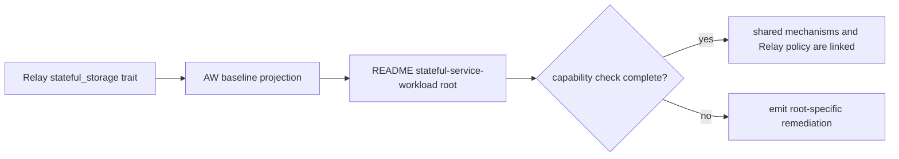

## Logic
<!-- type: logic lang: mermaid -->



## Changes
<!-- type: changes lang: yaml -->

```yaml
changes:
  - path: apps/relay/aw.toml
    action: modify
    section: logic
    impl_mode: hand-written
    description: Declare the stateful_storage trait so the shared stateful-service-workload baseline is required for Relay.
  - path: apps/relay/README.md
    action: modify
    section: logic
    impl_mode: hand-written
    description: Add the canonical stateful-service-workload capability root that links existing durable acknowledgement, stable StatefulSet identity, raft topology, backup and restore, peer security, and deployment evidence without copying the domain roots.
```
