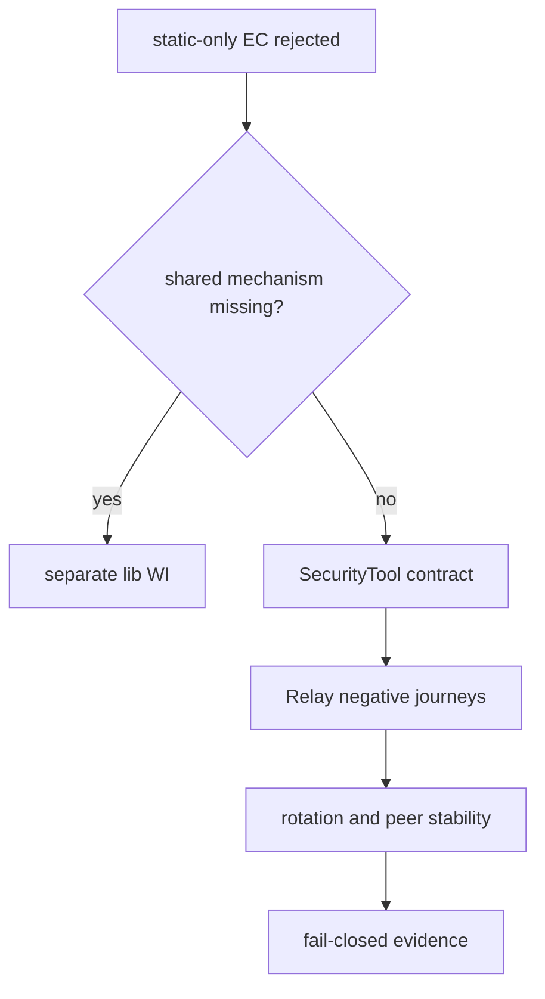
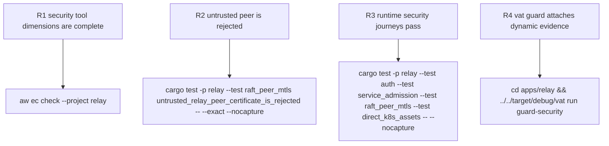

## Logic
<!-- type: logic lang: mermaid -->



## Changes
<!-- type: changes lang: yaml -->

```yaml
changes:
  - path: apps/relay/tests/raft_peer_mtls.rs
    action: modify
    section: unit-test
    impl_mode: hand-written
    anchor: trusted_relay_peers_replicate_messages_over_mtls
    description: Add a direct required-mTLS accept/connect journey whose client trusts the server CA but presents an identity signed by an untrusted CA; assert the server rejects it before HTTP/Raft handling.
  - path: apps/relay/README.md
    action: modify
    section: logic
    impl_mode: hand-written
    description: Align security-hardening with Lumen's SecurityTool classification and declare behavior, security, and stability dimensions.
  - path: apps/relay/external-contracts/security-hardening/security/security-evidence.md
    action: modify
    section: e2e-test
    impl_mode: hand-written
    description: Replace the advisory static-only case with executable behavior, negative-security, and last-known-good stability journeys while retaining guard as the static tool owner.
  - path: apps/relay/vat.toml
    action: modify
    section: config
    impl_mode: hand-written
    description: Make guard-security attach meter evidence from auth, admission, peer-mTLS, and direct K8s tests rather than relay_core.
```

## Unit Test
<!-- type: unit-test lang: mermaid -->


