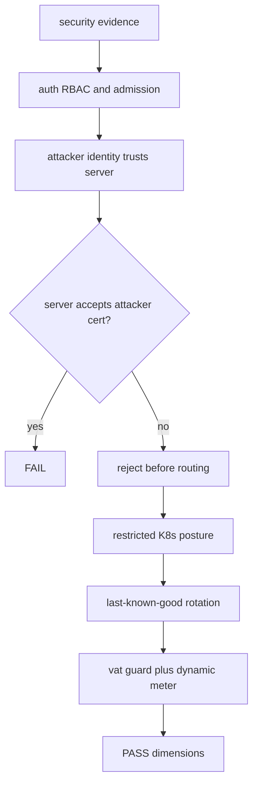

## Logic
<!-- type: logic lang: mermaid -->


## Changes
<!-- type: changes lang: yaml -->

```yaml
changes:
  - path: apps/relay/tests/raft_peer_mtls.rs
    action: modify
    section: unit-test
    impl_mode: hand-written
    anchor: trusted_relay_peers_replicate_messages_over_mtls
    description: Generalize the material fixture so identity and trust authorities can differ, then bind a required-mTLS server to an ephemeral listener and assert its accept seam rejects a client identity signed by a second CA even though that client trusts the real server CA.
  - path: apps/relay/README.md
    action: modify
    section: logic
    impl_mode: hand-written
    description: Set Type SecurityTool, list behavior/security/stability commands, root the remediation at 2175, and include auth, admission, untrusted peer, K8s, and last-known-good evidence.
  - path: apps/relay/external-contracts/security-hardening/security/security-evidence.md
    action: modify
    section: e2e-test
    impl_mode: hand-written
    description: Add behavior, security, and stability cases; the security case runs every Relay negative suite without filters, and the stability case runs shared reload tests plus Relay adapter and peer-TLS continuity.
  - path: apps/relay/vat.toml
    action: modify
    section: config
    impl_mode: hand-written
    description: Build auth, service_admission, raft_peer_mtls, and direct_k8s_assets and attach their full unfiltered cargo invocation to guard as meter evidence.
```
## Unit Test

```mermaid
---
id: relay-security-tool-contract-verification
requirements:
  agent_review_and_ec_verification_close:
    id: R6
    text: "AW structurally checks the revised SecurityTool dimensions, independent agent review accepts the digest, generated cases match sources, and every EC command verifies."
    kind: integration
    risk: high
    verify: aw ec check --project relay && aw ec gen --project relay --verify && aw ec verify --project relay
  bearer_and_admission_rejections_execute:
    id: R2
    text: "Missing and invalid tokens return 401, insufficient subject grants and streaming scope return 403, exhausted write admission returns 429 with Retry-After, and probes remain available."
    kind: negative
    risk: high
    verify: cargo test -p relay --test auth --test service_admission -- --nocapture
  deployment_security_posture_executes:
    id: R3
    text: "The direct and production Kubernetes assets prove restricted containers, persistent state, read-only projected credentials, opt-in NetworkPolicy, and no unsafe voter HPA."
    kind: security
    risk: high
    verify: cargo test -p relay --test direct_k8s_assets -- --nocapture
  guard_dispatch_includes_dynamic_suite:
    id: R5
    text: "Vat guard scans Relay and meter executes the unfiltered auth, admission, peer-mTLS, and K8s test binaries, so a missing or zero-case security surface cannot pass."
    kind: integration
    risk: high
    verify: cd apps/relay && ../../target/debug/vat run guard-security
  rotation_and_peer_stability_execute:
    id: R4
    text: "Shared invalid registry reload retains the last-known-good snapshot, Relay valid rotation is live without restart, and trusted peer replication remains usable alongside the rejection path."
    kind: stability
    risk: high
    verify: cargo test -p service-auth reload::tests -- --nocapture && cargo test -p relay --test auth relay_auth_adapter_rotates_the_shared_registry_without_restart -- --exact --nocapture && cargo test -p relay --test raft_peer_mtls -- --nocapture
  untrusted_identity_fails_server_handshake:
    id: R1
    text: "The peer server rejects an attacker-CA client identity even when the client trusts the legitimate server, and the test observes a server-side TLS handshake error before routing."
    kind: negative
    risk: high
    verify: cargo test -p relay --test raft_peer_mtls untrusted_relay_peer_certificate_is_rejected -- --exact --nocapture
---
flowchart TD
    r1[R1 untrusted identity fails server handshake] --> cargo_test_p_relay_test_raft_peer_mtls_untrusted_relay_peer_certificate_is_rejected_exact_nocapture[cargo test -p relay --test raft_peer_mtls untrusted_relay_peer_certificate_is_rejected -- --exact --nocapture]
    r2[R2 bearer and admission rejections execute] --> cargo_test_p_relay_test_auth_test_service_admission_nocapture[cargo test -p relay --test auth --test service_admission -- --nocapture]
    r3[R3 deployment security posture executes] --> cargo_test_p_relay_test_direct_k8s_assets_nocapture[cargo test -p relay --test direct_k8s_assets -- --nocapture]
    r4[R4 rotation and peer stability execute] --> cargo_test_p_service_auth_reload_tests_nocapture_cargo_test_p_relay_test_auth_relay_auth_adapter_rotates_the_shared_registry_without_restart_exact_nocapture_cargo_test_p_relay_test_raft_peer_mtls_nocapture[cargo test -p service-auth reload::tests -- --nocapture && cargo test -p relay --test auth relay_auth_adapter_rotates_the_shared_registry_without_restart -- --exact --nocapture && cargo test -p relay --test raft_peer_mtls -- --nocapture]
    r5[R5 guard dispatch includes dynamic suite] --> cd_apps_relay_target_debug_vat_run_guard_security[cd apps/relay && ../../target/debug/vat run guard-security]
    r6[R6 agent review and ec verification close] --> aw_ec_check_project_relay_aw_ec_gen_project_relay_verify_aw_ec_verify_project_relay[aw ec check --project relay && aw ec gen --project relay --verify && aw ec verify --project relay]
```

<!-- type: unit-test lang: mermaid -->


