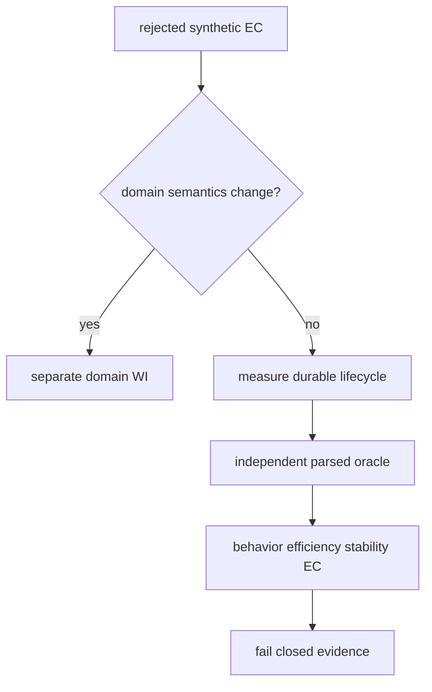
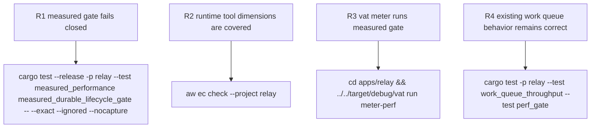

## Logic
<!-- type: logic lang: mermaid -->



## Changes
<!-- type: changes lang: yaml -->

```yaml
changes:
  - path: apps/relay/tests/measured_performance.rs
    action: create
    section: unit-test
    impl_mode: hand-written
    description: Produce a release-mode fsync-always durable publish and lease/ack report in a child test process, then parse it in an independent parent oracle that rejects missing or zero samples and enforces pinned workload floors.
  - path: apps/relay/vat.toml
    action: modify
    section: config
    impl_mode: hand-written
    description: Build and execute the measured release-mode integration test through the meter-perf vat runner.
  - path: apps/relay/external-contracts/competitor-performance/efficiency/perf-gate.md
    action: modify
    section: e2e-test
    impl_mode: hand-written
    description: Replace the synthetic efficiency-only case with executable behavior, measured efficiency, and bounded stability cases.
  - path: apps/relay/README.md
    action: modify
    section: logic
    impl_mode: hand-written
    description: Declare the measured performance envelope and all RuntimeTool-required EC dimensions without promoting advisory competitor wins.
  - path: apps/relay/docs/perf-gate.md
    action: modify
    section: logic
    impl_mode: hand-written
    description: Record the exact local workload, pinned floors, and current release calibration separately from advisory external-broker results.
  - path: apps/relay/aw.toml
    action: modify
    section: e2e-test
    impl_mode: codegen
    description: Regenerate EC bindings for the three revised competitor-performance cases.
```

## Unit Test
<!-- type: unit-test lang: mermaid -->


