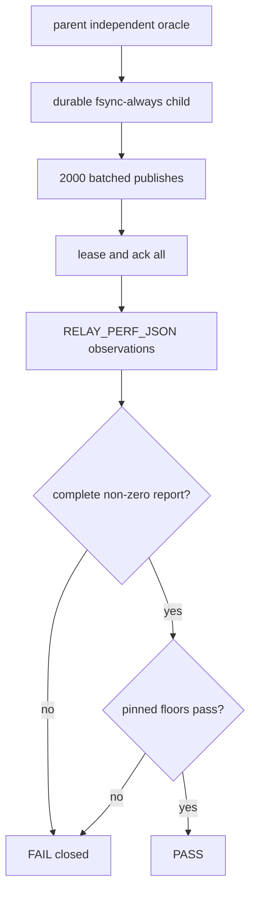

## Logic
<!-- type: logic lang: mermaid -->


## Changes
<!-- type: changes lang: yaml -->

```yaml
changes:
  - path: apps/relay/tests/measured_performance.rs
    action: create
    section: unit-test
    impl_mode: hand-written
    description: Define a serde report for workload relay-durable-publish-lease-ack-v1; a report-only ignored child measures 2000 128-byte messages in 100-message batches on temporary FsyncPolicy Always storage, while the ignored parent parses the child stdout and requires both phases to have at least 20 samples, zero errors, complete counts, at least 500 messages per second, and batch p95 no greater than 500000 microseconds.
  - path: apps/relay/vat.toml
    action: modify
    section: config
    impl_mode: hand-written
    description: Build measured_performance in release mode and make meter-perf run only its exact independent parent gate with ignored tests enabled.
  - path: apps/relay/external-contracts/competitor-performance/efficiency/perf-gate.md
    action: modify
    section: e2e-test
    impl_mode: hand-written
    description: Declare behavior through work_queue_throughput and perf_gate, efficiency through the exact release measured parent, and stability through the existing bounded autostart soak; retain the meter tool contract.
  - path: apps/relay/README.md
    action: modify
    section: logic
    impl_mode: hand-written
    description: List behavior, efficiency, and stability commands and state that external broker wins remain advisory.
  - path: apps/relay/docs/perf-gate.md
    action: modify
    section: logic
    impl_mode: hand-written
    description: Publish the v1 workload and fixed floor semantics plus the latest measured result after calibration.
  - path: apps/relay/aw.toml
    action: modify
    section: e2e-test
    impl_mode: codegen
    description: Regenerate digest-bound EC inventory and claim bindings after independent acceptance.
```
## Unit Test

```mermaid
---
id: relay-measured-performance-contract-verification
requirements:
  behavior_contract_stays_intact:
    id: R3
    text: "Existing work-queue cursor, batching, acknowledgement, exactly-once drain, and synthetic decision-model tests remain green."
    kind: regression
    risk: medium
    verify: cargo test -p relay --test work_queue_throughput --test perf_gate -- --nocapture
  ec_dimensions_and_generation_close:
    id: R4
    text: "AW accepts behavior, efficiency, and stability cases, independently reviews their specificity and false-green resistance, generates bindings, and verifies every case."
    kind: integration
    risk: high
    verify: aw ec check --project relay && aw ec gen --project relay --verify && aw ec verify --project relay
  oracle_rejects_false_green_reports:
    id: R1
    text: "The independent report validator rejects missing observations, zero samples, incomplete publish or acknowledgement counts, non-zero errors, throughput below either pinned floor, and p95 above the pinned ceiling."
    kind: negative
    risk: high
    verify: cargo test -p relay --test measured_performance -- --nocapture
  release_durable_measurement_passes:
    id: R2
    text: "The exact ignored release gate parses a child-produced report for 2000 fsync-always durable messages and passes only when all workload-specific observations satisfy the fixed envelope."
    kind: performance
    risk: high
    verify: cargo test --release -p relay --test measured_performance measured_durable_lifecycle_gate -- --exact --ignored --nocapture
  vat_meter_dispatch_is_real:
    id: R5
    text: "Relay's vat-isolated meter runner invokes the exact release measured gate and yields non-zero runtime evidence."
    kind: integration
    risk: high
    verify: cd apps/relay && ../../target/debug/vat run meter-perf
---
flowchart TD
    r1[R1 oracle rejects false green reports] --> cargo_test_p_relay_test_measured_performance_nocapture[cargo test -p relay --test measured_performance -- --nocapture]
    r2[R2 release durable measurement passes] --> cargo_test_release_p_relay_test_measured_performance_measured_durable_lifecycle_gate_exact_ignored_nocapture[cargo test --release -p relay --test measured_performance measured_durable_lifecycle_gate -- --exact --ignored --nocapture]
    r3[R3 behavior contract stays intact] --> cargo_test_p_relay_test_work_queue_throughput_test_perf_gate_nocapture[cargo test -p relay --test work_queue_throughput --test perf_gate -- --nocapture]
    r4[R4 ec dimensions and generation close] --> aw_ec_check_project_relay_aw_ec_gen_project_relay_verify_aw_ec_verify_project_relay[aw ec check --project relay && aw ec gen --project relay --verify && aw ec verify --project relay]
    r5[R5 vat meter dispatch is real] --> cd_apps_relay_target_debug_vat_run_meter_perf[cd apps/relay && ../../target/debug/vat run meter-perf]
```

<!-- type: unit-test lang: mermaid -->


