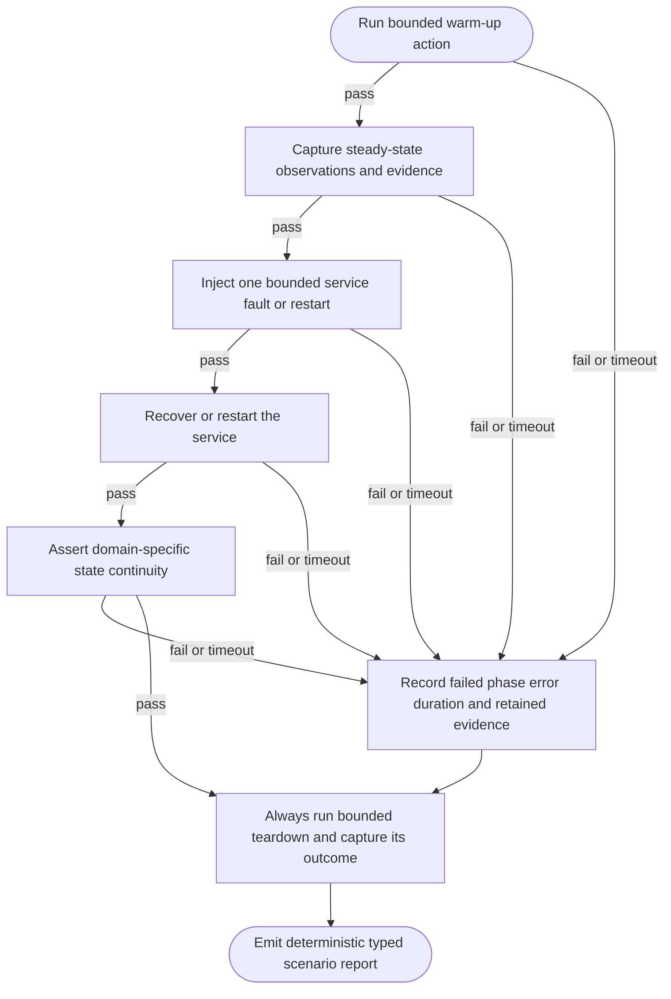

## Logic
<!-- type: logic lang: mermaid -->



## Changes
<!-- type: changes lang: yaml -->

```yaml
changes:
  - path: apps/rig/src/engine/stateful.rs
    action: create
    section: logic
    impl_mode: hand-written
    description: "Add the reusable typed warmup/observe/fault/recover/verify/teardown runner with bounded actions, retained evidence, and deterministic reports. generator gap: missing-generator:stateful-harness (#1645)."
  - path: apps/rig/src/engine/mod.rs
    action: modify
    section: logic
    impl_mode: hand-written
    description: "Export the reusable stateful runner. generator gap: missing-generator:engine-module-export (#1645)."
  - path: apps/rig/tech-design/semantic/source/projects-rig-src-engine-mod-rs.md
    action: modify
    section: logic
    impl_mode: hand-written
    description: "Keep the semantic source mirror aligned with the engine module export. generator gap: missing-generator:semantic-source-sync (#1645)."
  - path: apps/rig/README.md
    action: modify
    section: logic
    impl_mode: hand-written
    description: "Declare the reusable stateful service scenario contract and its shared-consumer boundary. generator gap: missing-generator:capability-doc (#1645)."
  - path: apps/rig/tests/stateful_service_harness.rs
    action: create
    section: unit-test
    impl_mode: hand-written
    description: "Exercise the runner against a real bounded local HTTP stateful fixture and prove failure evidence plus teardown behavior. generator gap: missing-generator:stateful-harness-test (#1645)."
  - path: apps/lumen/Cargo.toml
    action: modify
    section: changes
    impl_mode: hand-written
    description: "Add Rig as a dev-only shared scenario runner dependency. generator gap: missing-generator:workspace-dev-dependency (#1645)."
  - path: apps/lumen/tests/rig_stateful_adapter.rs
    action: create
    section: e2e-test
    impl_mode: hand-written
    description: "Bind Lumen search continuity assertions to the shared Rig stateful lifecycle. generator gap: missing-generator:lumen-stateful-adapter (#1645)."
  - path: apps/tape/Cargo.toml
    action: modify
    section: changes
    impl_mode: hand-written
    description: "Add Rig as a dev-only shared scenario runner dependency. generator gap: missing-generator:workspace-dev-dependency (#1645)."
  - path: apps/tape/tests/rig_stateful_adapter.rs
    action: create
    section: e2e-test
    impl_mode: hand-written
    description: "Bind Tape replay and checkpoint continuity assertions to the shared Rig stateful lifecycle. generator gap: missing-generator:tape-stateful-adapter (#1645)."
```
