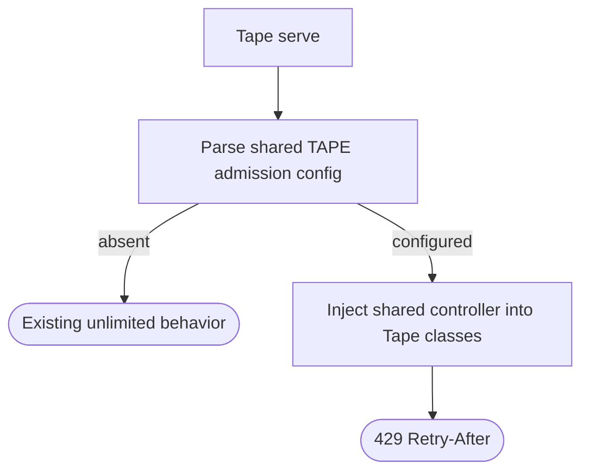

## Logic
<!-- type: logic lang: mermaid -->



## Changes
<!-- type: changes lang: yaml -->

```yaml
changes:
  - path: apps/tape/src/server.rs
    action: modify
    section: logic
    impl_mode: hand-written
    anchor: router_without_raft_routes
    description: "Accept optional shared admission for both public router shapes. generator gap: missing-generator:tape-admission-adoption (#1827)."
  - path: apps/tape/src/bin/tape.rs
    action: modify
    section: logic
    impl_mode: hand-written
    anchor: serve_main
    description: "Resolve TAPE admission config at startup and inject the shared controller. generator gap: missing-generator:tape-admission-adoption (#1827)."
  - path: apps/tape/tests/service_admission.rs
    action: modify
    section: unit-test
    impl_mode: hand-written
    anchor: tape_default_router_keeps_admission_disabled
    description: "Prove configured write admission returns shared 429 without limiting probes. generator gap: missing-generator:tape-admission-adoption (#1827)."
```

## Unit Test

```mermaid
---
id: tape-shared-admission-adoption-verification
requirements:
  configured_write_limit:
    id: R1
    text: "A configured Tape write policy rejects excess append requests with the shared rate_limited 429 and Retry-After while /healthz bypasses admission."
    kind: security
    risk: high
    verify: apps/tape/tests/service_admission.rs::configured_write_admission_rejects_excess_without_limiting_probes
  disabled_default:
    id: R2
    text: "Absent Tape admission configuration preserves the existing unlimited router behavior."
    kind: regression
    risk: medium
    verify: apps/tape/tests/service_admission.rs::tape_default_router_keeps_admission_disabled
---
flowchart TD
    r1[R1 configured write limit] --> apps_tape_tests_service_admission_rs_configured_write_admission_rejects_excess_without_limiting_probes[apps/tape/tests/service_admission.rs::configured_write_admission_rejects_excess_without_limiting_probes]
    r2[R2 disabled default] --> apps_tape_tests_service_admission_rs_tape_default_router_keeps_admission_disabled[apps/tape/tests/service_admission.rs::tape_default_router_keeps_admission_disabled]
```

<!-- type: unit-test lang: mermaid -->


