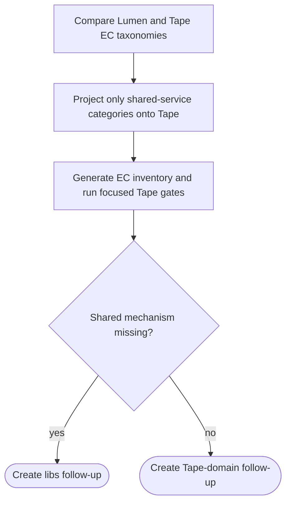

## Logic
<!-- type: logic lang: mermaid -->



## Changes
<!-- type: changes lang: yaml -->

```yaml
changes:
  - path: apps/tape/external-contracts/cli-interface/behavior/cli-interface.md
    action: create
    section: logic
    impl_mode: hand-written
    description: "Add Tape-owned CLI, offline OpenAPI, generated-client, h2c, and llm contract cases adapted from the Lumen EC taxonomy. generator gap: missing-generator:tape-ec-lumen-baseline (#1815)."
  - path: apps/tape/external-contracts/topology/behavior/shard-topology.md
    action: create
    section: logic
    impl_mode: hand-written
    description: "State Tape shard and replica topology, durable replay, backup seed, and operator ownership rules with Tape raft and operator tests. generator gap: missing-generator:tape-ec-lumen-baseline (#1815)."
  - path: apps/tape/external-contracts/long-running-stability/behavior/devops-render.md
    action: create
    section: logic
    impl_mode: hand-written
    description: "Add the Tape operator render contract for shared StatefulSet, Services, PDB, backup, and policy resources. generator gap: missing-generator:tape-ec-lumen-baseline (#1815)."
  - path: apps/tape/external-contracts/long-running-stability/behavior/meta-api.md
    action: create
    section: logic
    impl_mode: hand-written
    description: "Add Tape standard liveness, readiness, metrics, version, and OpenAPI operational-surface contract. generator gap: missing-generator:tape-ec-lumen-baseline (#1815)."
  - path: apps/tape/external-contracts/long-running-stability/stability/replay-resilience.md
    action: create
    section: logic
    impl_mode: hand-written
    description: "Add Tape replay admission, restart, and recovery stability contract without importing search latency assertions. generator gap: missing-generator:tape-ec-lumen-baseline (#1815)."
  - path: apps/tape/external-contracts/long-running-stability/stability/resilience-survival.md
    action: create
    section: logic
    impl_mode: hand-written
    description: "Add Tape leader-loss and durable replay survival contract using Tape raft-focused gates. generator gap: missing-generator:tape-ec-lumen-baseline (#1815)."
  - path: apps/tape/external-contracts/security-hardening/security/access-control.md
    action: create
    section: logic
    impl_mode: hand-written
    description: "Add Tape topic and subscription authorization, admission-limit, and malformed-request security contract. generator gap: missing-generator:tape-ec-lumen-baseline (#1815)."
  - path: apps/tape/external-contracts/security-hardening/security/auth-bearer-rbac.md
    action: create
    section: logic
    impl_mode: hand-written
    description: "Add shared bearer-token authentication and route-role authorization contract for Tape. generator gap: missing-generator:tape-ec-lumen-baseline (#1815)."
```
