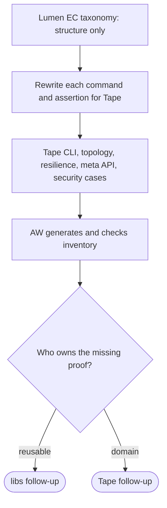

## Logic
<!-- type: logic lang: mermaid -->


## Changes
<!-- type: changes lang: yaml -->

```yaml
changes:
  - path: apps/tape/external-contracts/cli-interface/behavior/cli-interface.md
    action: create
    section: logic
    impl_mode: hand-written
    description: "Tape-owned CLI, offline OpenAPI, generated-client, h2c, and llm contract cases adapted from Lumen's taxonomy. generator gap: missing-generator:tape-ec-lumen-baseline (#1815)."
  - path: apps/tape/external-contracts/topology/behavior/shard-topology.md
    action: create
    section: logic
    impl_mode: hand-written
    description: "Tape shard/replica, durable replay, backup seed, and operator topology contract. generator gap: missing-generator:tape-ec-lumen-baseline (#1815)."
  - path: apps/tape/external-contracts/long-running-stability/behavior/devops-render.md
    action: create
    section: logic
    impl_mode: hand-written
    description: "Tape shared StatefulSet deployment render contract. generator gap: missing-generator:tape-ec-lumen-baseline (#1815)."
  - path: apps/tape/external-contracts/long-running-stability/behavior/meta-api.md
    action: create
    section: logic
    impl_mode: hand-written
    description: "Tape standard operational endpoint contract. generator gap: missing-generator:tape-ec-lumen-baseline (#1815)."
  - path: apps/tape/external-contracts/long-running-stability/stability/replay-resilience.md
    action: create
    section: logic
    impl_mode: hand-written
    description: "Tape restart/recovery and admission stability contract. generator gap: missing-generator:tape-ec-lumen-baseline (#1815)."
  - path: apps/tape/external-contracts/long-running-stability/stability/resilience-survival.md
    action: create
    section: logic
    impl_mode: hand-written
    description: "Tape leader-loss and durable replay survival contract. generator gap: missing-generator:tape-ec-lumen-baseline (#1815)."
  - path: apps/tape/external-contracts/security-hardening/security/access-control.md
    action: create
    section: logic
    impl_mode: hand-written
    description: "Tape topic/subscription authorization, admission-limit, and malformed-request security contract. generator gap: missing-generator:tape-ec-lumen-baseline (#1815)."
  - path: apps/tape/external-contracts/security-hardening/security/auth-bearer-rbac.md
    action: create
    section: logic
    impl_mode: hand-written
    description: "Tape shared bearer-token and route-role authorization contract. generator gap: missing-generator:tape-ec-lumen-baseline (#1815)."
```
## Unit Test
<!-- type: unit-test lang: mermaid -->


