## Logic
<!-- type: logic lang: mermaid -->

```mermaid
(fill)
```
## Unit Test

```mermaid
---
id: tape-service-http-shell-verification
requirements:
  domain_round_trip:
    id: R7
    text: "POST /topics/{topic}/append, GET /topics/{topic}/replay, and GET/PUT /topics/{topic}/consumers/{consumer}/checkpoint wrap the unchanged TapeJournal API (src/lib.rs) end to end over HTTP, with no new domain behavior."
    kind: regression
    risk: medium
    verify: tests/http_transport.rs::append_replay_checkpoint_round_trip_over_http
  drain_readyz:
    id: R3
    text: "AppState implements service_http::ReadinessHook over a draining AtomicBool; start_drain() flips /readyz from 200 ok to 503 draining (the SIGTERM path calls it via shutdown_with_drain)."
    kind: functional
    risk: medium
    verify: tests/http_transport.rs::readyz_flips_to_503_on_drain
  error_envelope:
    id: R6
    text: "Handler error paths return the shared {error, message} ErrorEnvelope JSON (service_http::ApiErr) — bad JSON bodies 400 bad_request, stale/beyond-end checkpoint writes 409 conflict — while success JSON encodings are untouched."
    kind: functional
    risk: medium
    verify: tests/http_transport.rs::errors_render_the_shared_envelope
  grace_flag:
    id: R1
    text: "The tape CLI gains a `serve` subcommand with --bind (TAPE_BIND, default 127.0.0.1:7137), --store (TAPE_STORE), and --grace-secs (TAPE_GRACE_SECS, default 10) feeding shutdown_with_drain's grace window; existing append/replay/checkpoint/spec/llm/upgrade/issue commands keep parsing unchanged."
    kind: functional
    risk: low
    verify: src/bin/tape.rs::tests::cli_parse_surface
  h2c_and_h1_one_port:
    id: R2
    text: "service_http::serve serves HTTP/2 prior-knowledge (h2c) AND HTTP/1.1 requests on the same port for the tape server, replacing a hand-rolled axum::serve (which is HTTP/1.1-only)."
    kind: functional
    risk: high
    verify: tests/http_transport.rs::h2c_and_http11_share_the_serve_port
  metrics_counters:
    id: R5
    text: "TapeMetrics (service-metrics Latency primitives, recorded by the metrics::track route_layer) renders per-op tape request counters + latency into the Prometheus text /metrics serves after append/replay/checkpoint traffic."
    kind: functional
    risk: medium
    verify: tests/http_transport.rs::metrics_report_tape_request_counters_after_traffic
  probe_surface:
    id: R4
    text: "GET /healthz /readyz /metrics /openapi.json /docs all answer on the one serve port via service_http::standard_probe_routes merged with the topic data plane."
    kind: functional
    risk: medium
    verify: tests/http_transport.rs::probe_surface_answers_on_serve_port
---
flowchart TD
    r1[R1 grace flag] --> src_bin_tape_rs_tests_cli_parse_surface[src/bin/tape.rs::tests::cli_parse_surface]
    r2[R2 h2c and h1 one port] --> tests_http_transport_rs_h2c_and_http11_share_the_serve_port[tests/http_transport.rs::h2c_and_http11_share_the_serve_port]
    r3[R3 drain readyz] --> tests_http_transport_rs_readyz_flips_to_503_on_drain[tests/http_transport.rs::readyz_flips_to_503_on_drain]
    r4[R4 probe surface] --> tests_http_transport_rs_probe_surface_answers_on_serve_port[tests/http_transport.rs::probe_surface_answers_on_serve_port]
    r5[R5 metrics counters] --> tests_http_transport_rs_metrics_report_tape_request_counters_after_traffic[tests/http_transport.rs::metrics_report_tape_request_counters_after_traffic]
    r6[R6 error envelope] --> tests_http_transport_rs_errors_render_the_shared_envelope[tests/http_transport.rs::errors_render_the_shared_envelope]
    r7[R7 domain round trip] --> tests_http_transport_rs_append_replay_checkpoint_round_trip_over_http[tests/http_transport.rs::append_replay_checkpoint_round_trip_over_http]
```

<!-- type: unit-test lang: mermaid -->


## Changes
<!-- type: changes lang: yaml -->

```yaml
changes:
  - path: apps/tape/Cargo.toml
    action: modify
    section: logic
    impl_mode: hand-written
    description: "Add service-http + service-metrics path deps, axum/tower/utoipa/tracing/tracing-subscriber (env-filter) workspace deps, and a tape-bin serve subcommand's http-body-util/reqwest dev-deps for the shared shell and serve-path tracing init."
  - path: apps/tape/src/lib.rs
    action: modify
    section: logic
    impl_mode: hand-written
    description: "Additive-only: derive utoipa::ToSchema on TapeEvent and ConsumerCheckpoint so the generated OpenAPI document can reference them; no change to append/replay/put_checkpoint/checkpoint semantics. Register pub mod metrics and pub mod server in the crate root module wiring."
  - path: apps/tape/src/metrics.rs
    action: create
    section: logic
    impl_mode: hand-written
    description: "TapeMetrics on libs/service-metrics primitives (Latency = count + sum, render): append / replay / checkpoint_get / checkpoint_put / other request counts + latency ms, plus the track route_layer middleware that maps the matched route pattern to its op family (mirrors relay/keep's metrics::track)."
  - path: apps/tape/src/openapi.rs
    action: create
    section: logic
    impl_mode: hand-written
    description: "#[derive(utoipa::OpenApi)] ApiDoc collecting the append/replay/checkpoint handler paths + TapeEvent/ConsumerCheckpoint schemas; pub fn openapi() -> utoipa::openapi::OpenApi accessor service_http::standard_probe_routes consumes. Independent of the existing hand-rolled apps/tape/src/spec.rs JSON contract used by `tape spec`, which is untouched."
  - path: apps/tape/src/server.rs
    action: create
    section: logic
    impl_mode: hand-written
    description: "AppState { journal: Arc<Mutex<TapeJournal>>, metrics: Arc<TapeMetrics>, draining: Arc<AtomicBool>, store: Option<PathBuf> }; implements service_http::ReadinessHook and service_http::MetricsProvider. Thin handlers: append (POST /topics/{topic}/append), replay (GET /topics/{topic}/replay), checkpoint_get/checkpoint_put (GET/PUT /topics/{topic}/consumers/{consumer}/checkpoint) call straight into TapeJournal, persisting to --store on mutation when configured, encoding service_http::ApiErr on decode/domain errors. router() merges service_http::standard_probe_routes(state, Some(metrics), crate::openapi::openapi) with the topics data plane (route_layer metrics::track) under an outer service_http::trace_layer()."
  - path: apps/tape/src/bin/tape.rs
    action: modify
    section: logic
    impl_mode: hand-written
    description: "Add Command::Serve(ServeArgs) with --bind (env TAPE_BIND, default 127.0.0.1:7137), --store (env TAPE_STORE), --grace-secs (env TAPE_GRACE_SECS, default 10); serve_main loads the journal from --store (or empty), builds AppState + tape::server::router, binds a TcpListener, and serves via service_http::serve(listener, app, shutdown_with_drain(|| state.start_drain(), grace)) with EnvFilter tracing init (RUST_LOG wins, else info). Existing append/replay/checkpoint/spec/llm/upgrade/issue commands are unchanged."
  - path: apps/tape/tests/http_transport.rs
    action: create
    section: unit-test
    impl_mode: hand-written
    description: "New integration test file: probe_surface_answers_on_serve_port, readyz_flips_to_503_on_drain, h2c_and_http11_share_the_serve_port (libs/h2c h2c_client + plain HTTP/1.1 reqwest), metrics_report_tape_request_counters_after_traffic, errors_render_the_shared_envelope, and append_replay_checkpoint_round_trip_over_http driving the full HTTP data plane against tape::server::router."
```
