## Logic

```mermaid
---
id: tape-service-auth-flow
entry: boot
nodes:
  boot:
    kind: start
    label: "serve_main: ServeArgs gains --auth (TAPE_AUTH, off|required, default off) and --token-registry-file (TAPE_TOKEN_REGISTRY_FILE) -- serve flags with env fallback, like --bind/--store/--grace-secs"
  resolve:
    kind: decision
    label: "tape::auth::AuthConfig::resolve(mode, registry_file, legacy_inline): parse off|disabled|required; when required, load the token registry via service_auth::load_registry -- JSON { token: { subject, roles { topic-or-* : read|write|admin } } }, naming TAPE_TOKEN_REGISTRY_FILE and the TAPE_TOKENS legacy/dev inline fallback"
  failfast:
    kind: terminal
    label: "Startup fail-fast: TAPE_AUTH=required with a missing/unparseable/empty registry file exits nonzero naming TAPE_TOKEN_REGISTRY_FILE -- a server that can never authenticate anyone is a misconfiguration, not a per-request 401"
  verifier:
    kind: process
    label: "StaticRoleMapVerifier::new(required, tokens) when required; StaticRoleMapVerifier::open() when off (tokenless dev default). AppState carries Arc<StaticRoleMapVerifier>; AppState::new stays open (tests/existing callers unchanged), AppState::with_auth(journal, store, auth) takes the resolved AuthConfig"
  build:
    kind: process
    label: "router(): service_auth::auth_middleware is route_layer'd on the /topics data-plane router ONLY (BEFORE metrics::track so rejected requests are still counted); the probe surface (standard_probe_routes, merged separately) never gets the layer and stays tokenless"
  req:
    kind: decision
    label: "Request arrives: probe route or /topics data plane?"
  probes:
    kind: process
    label: "/healthz /readyz /metrics /openapi.json /docs answer tokenless and always-on regardless of TAPE_AUTH"
  authn:
    kind: decision
    label: "auth_middleware: bearer_token(headers) -> verifier.authenticate -> RoleMapPrincipal injected as an Extension (Open when off-mode without a token). Missing or unknown token under required -> 401 {error: unauthenticated} (shared service-auth shape)"
  authz:
    kind: decision
    label: "Per-handler authorization on the {topic} path param (the resource) via tape::auth::authorize(principal, topic, needed): append needs Role::Write (producer side); replay, checkpoint_get, and checkpoint_put all need Role::Read -- a consumer advancing its own replay checkpoint mutates only consumer-local cursor state, the same shape as relay's ack/heartbeat/lease-batch/ack-batch, which sit in relay's READ group rather than a third tier. Wildcard * grants cover every topic; hierarchy admin >= write >= read per role_map::Role::covers"
  forbidden:
    kind: terminal
    label: "Deny -> RoleMapDenied mapped to AuthError::Forbidden: 403 {error: forbidden, message: topic lacks role on topic} -- consistent with the service_http::ApiErr {error, message} envelope family"
  handler:
    kind: process
    label: "Authorized request runs the existing append/replay/checkpoint_get/checkpoint_put handler unchanged (TapeJournal API, persistence to --store) -- no new domain behavior, per the #1325 shell boundary"
  done:
    kind: terminal
    label: "Response returned; TAPE_AUTH=off keeps today's tokenless behavior end to end (regression)"
edges:
  - { from: boot, to: resolve }
  - { from: resolve, to: failfast, label: "required + bad/missing registry" }
  - { from: resolve, to: verifier, label: "ok" }
  - { from: verifier, to: build }
  - { from: build, to: req, label: "request accepted" }
  - { from: req, to: probes, label: "probe route" }
  - { from: req, to: authn, label: "/topics/{topic}/* route" }
  - { from: authn, to: authz, label: "principal injected" }
  - { from: authn, to: done, label: "401 unauthenticated" }
  - { from: authz, to: forbidden, label: "grant missing" }
  - { from: authz, to: handler, label: "grant covers needed role" }
  - { from: probes, to: done }
  - { from: handler, to: done }
---
flowchart TD
    boot([serve_main: auth flags + env fallback]) --> resolve{AuthConfig resolve: mode + registry load}
    resolve -->|required + bad registry| failfast([exit nonzero naming TAPE_TOKEN_REGISTRY_FILE])
    resolve -->|ok| verifier[StaticRoleMapVerifier: registry when required, open when off; Arc in AppState]
    verifier --> build[router: auth_middleware route_layer on /topics data plane only]
    build --> req{Probe or data plane?}
    req -->|probe| probes[healthz readyz metrics openapi.json docs -- tokenless, always-on]
    req -->|topics| authn{auth_middleware: bearer to principal Extension}
    authn -->|missing or unknown token| done401([401 unauthenticated shared shape])
    authn -->|principal| authz{authorize on topic: append=write, replay/checkpoint-get/checkpoint-put=read}
    authz -->|denied| forbidden([403 forbidden shared shape])
    authz -->|covered| handler[existing TapeJournal-backed handler unchanged]
    probes --> done([response])
    handler --> done
```

<!-- type: logic lang: mermaid -->


## Unit Test

```mermaid
---
id: tape-service-auth-verification
requirements:
  append_requires_write_grant:
    id: R1
    text: "The auth_middleware is layered on the /topics data-plane router: under TAPE_AUTH=required, POST /topics/{topic}/append with no token or an unknown token is rejected 401 before the handler runs, a read-only grant on the topic is 403, and a matching write grant (or wildcard admin) appends 200."
    kind: functional
    risk: high
    verify: tests/service_auth.rs::append_requires_write_grant_on_topic
  off_mode_regression:
    id: R3
    text: "TAPE_AUTH=off (the default, StaticRoleMapVerifier::open) keeps today's tokenless behavior: append/replay/checkpoint all answer 200 through the same layered router with no Authorization header, and the pre-existing tests/http_transport.rs suite stays green unchanged."
    kind: regression
    risk: medium
    verify: tests/service_auth.rs::off_mode_keeps_tape_tokenless
  probes_auth_exempt:
    id: R4
    text: "With TAPE_AUTH=required, the probe surface (/healthz /readyz /metrics /openapi.json /docs) answers 200 WITHOUT a token -- the auth layer is attached to the /topics data-plane router only, never the standard_probe_routes router."
    kind: functional
    risk: medium
    verify: tests/service_auth.rs::probes_stay_tokenless_under_required_auth
  read_side_requires_read_grant:
    id: R2
    text: "GET /topics/{topic}/replay, GET /topics/{topic}/consumers/{consumer}/checkpoint, and PUT /topics/{topic}/consumers/{consumer}/checkpoint all require a read grant on the topic: a read token passes, a grant scoped to a different topic is 403, a write grant covers read (Role::covers), and a wildcard * admin grant covers every topic."
    kind: functional
    risk: high
    verify: tests/service_auth.rs::replay_and_checkpoint_require_read_grant_on_topic
  serve_flags:
    id: R6
    text: "The tape CLI gains --auth (env TAPE_AUTH, default off) and --token-registry-file (env TAPE_TOKEN_REGISTRY_FILE) as serve flags with env fallback; existing serve/append/replay/checkpoint flags keep parsing unchanged."
    kind: functional
    risk: low
    verify: src/bin/tape.rs::tests::cli_parse_surface
  shared_error_shape:
    id: R5
    text: "Auth rejections render the shared service-auth JSON shape consistent with the ApiErr envelope family: 401 body {\"error\":\"unauthenticated\",...} and 403 body {\"error\":\"forbidden\",\"message\":\"...lacks...on...\"}."
    kind: functional
    risk: medium
    verify: tests/service_auth.rs::error_bodies_use_shared_service_auth_shape
  verifier_fail_fast:
    id: R7
    text: "AuthConfig::resolve builds StaticRoleMapVerifier from the registry file when required and fails fast (error naming TAPE_TOKEN_REGISTRY_FILE) when the file is missing, unparseable, or the resolved registry is empty; an unknown TAPE_AUTH mode is also rejected; the off default resolves open with an empty registry."
    kind: functional
    risk: medium
    verify: tests/service_auth.rs::resolve_fails_fast_on_missing_or_bad_registry
---
flowchart TD
    r1[R1 append requires write grant] --> tests_service_auth_rs_append_requires_write_grant_on_topic[tests/service_auth.rs::append_requires_write_grant_on_topic]
    r2[R2 read side requires read grant] --> tests_service_auth_rs_replay_and_checkpoint_require_read_grant_on_topic[tests/service_auth.rs::replay_and_checkpoint_require_read_grant_on_topic]
    r3[R3 off mode regression] --> tests_service_auth_rs_off_mode_keeps_tape_tokenless[tests/service_auth.rs::off_mode_keeps_tape_tokenless]
    r4[R4 probes auth exempt] --> tests_service_auth_rs_probes_stay_tokenless_under_required_auth[tests/service_auth.rs::probes_stay_tokenless_under_required_auth]
    r5[R5 shared error shape] --> tests_service_auth_rs_error_bodies_use_shared_service_auth_shape[tests/service_auth.rs::error_bodies_use_shared_service_auth_shape]
    r6[R6 serve flags] --> src_bin_tape_rs_tests_cli_parse_surface[src/bin/tape.rs::tests::cli_parse_surface]
    r7[R7 verifier fail fast] --> tests_service_auth_rs_resolve_fails_fast_on_missing_or_bad_registry[tests/service_auth.rs::resolve_fails_fast_on_missing_or_bad_registry]
```

<!-- type: unit-test lang: mermaid -->



## Changes
<!-- type: changes lang: yaml -->

```yaml
changes:
  - path: apps/tape/Cargo.toml
    action: modify
    section: logic
    impl_mode: hand-written
    description: "Add the service-auth path dependency (shared bearer middleware, role_map StaticRoleMapVerifier, registry loader, shared 401/403 error shape)."
  - path: apps/tape/src/auth.rs
    action: create
    section: logic
    impl_mode: hand-written
    description: "tape's service-auth adapter: AuthConfig (TAPE_AUTH off|disabled|required mode parse + token-registry load via service_auth::load_registry with startup fail-fast naming TAPE_TOKEN_REGISTRY_FILE and the TAPE_TOKENS legacy/dev inline fallback), StaticRoleMapVerifier construction (registry when required, open() when off), and the per-handler authorize(principal, topic, needed) helper mapping RoleMapDenied to the shared 403 forbidden shape."
  - path: apps/tape/src/lib.rs
    action: modify
    section: logic
    impl_mode: hand-written
    description: "Register pub mod auth in the crate root module wiring."
  - path: apps/tape/src/server.rs
    action: modify
    section: logic
    impl_mode: hand-written
    description: "AppState carries Arc<StaticRoleMapVerifier> (AppState::new stays open for tokenless dev/tests; AppState::with_auth(journal, store, auth) takes the resolved AuthConfig); router() route_layers service_auth::auth_middleware on the /topics data-plane router ONLY, added before metrics::track so auth rejections are still counted, with probes staying exempt via the separately-merged standard_probe_routes; every data-plane handler (append, replay, checkpoint_get, checkpoint_put) gains the Extension<RoleMapPrincipal> and enforces write (append) or read (replay, checkpoint_get, checkpoint_put) on the {topic} path param via auth::authorize."
  - path: apps/tape/src/bin/tape.rs
    action: modify
    section: logic
    impl_mode: hand-written
    description: "ServeArgs gains --auth (env TAPE_AUTH, off|required, default off) and --token-registry-file (env TAPE_TOKEN_REGISTRY_FILE) with env fallback like --bind/--store; serve_main resolves AuthConfig (fail fast: nonzero exit on a bad/missing registry under required) and builds AppState through the auth-carrying constructor; cli_parse_surface extends to cover the new flags' defaults."
  - path: apps/tape/tests/service_auth.rs
    action: create
    section: unit-test
    impl_mode: hand-written
    description: "Integration tests over a real ephemeral server (tape::server::router/AppState) with a temp registry JSON file: append 200/401/403 (write grant), replay/checkpoint-get/checkpoint-put 200/403 with role hierarchy + wildcard grants, shared error bodies, tokenless probes under required auth, off-mode tokenless regression, and AuthConfig::resolve fail-fast (missing/unparseable/empty registry, unknown mode)."
```
