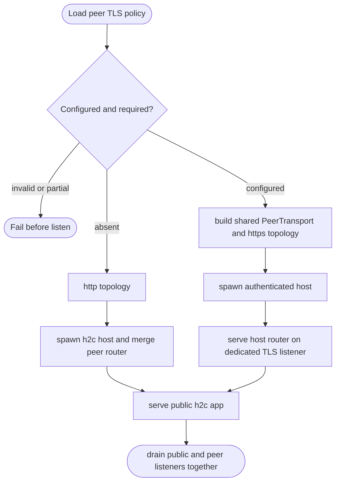

## Logic
<!-- type: logic lang: mermaid -->

The Tape adapter owns only configuration selection, topology scheme and listener lifecycle. `peer-tls` continues to own certificate material and `raft-runtime` continues to own mTLS handshakes, HTTPS peer RPCs and Raft routing. With no configured peer TLS, the current single-port h2c behavior remains byte-for-byte compatible. With configured peer mTLS, the public service port never exposes the Raft router; only the dedicated authenticated listener does.
