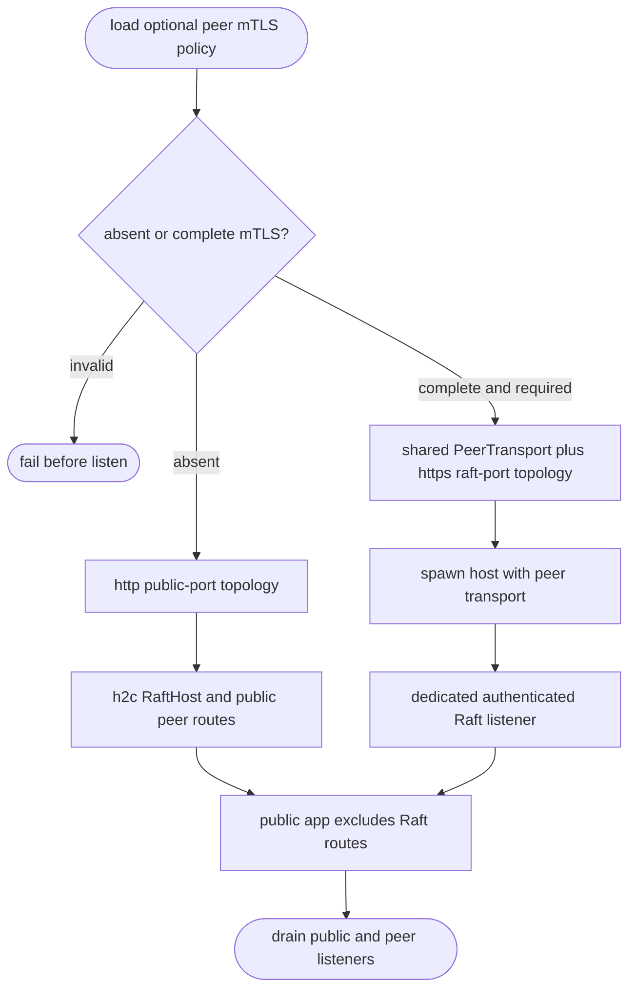

## Logic
<!-- type: logic lang: mermaid -->



Tape owns only selection and lifecycle at the service boundary. `peer-tls` owns environment validation, PEM parsing, client/server Rustls configuration, and the required-mTLS posture. `raft-runtime` owns HTTPS peer dialing, mutual-auth handshakes, Raft RPC routing, and reloadable transport state. Tape must not copy either implementation.

No configured peer TLS retains the existing public-port h2c topology and router composition. A complete configuration must also set `TAPE_PEER_MTLS=on`; otherwise `PeerTransport::from_config` fails before either listener starts. In secure mode Tape derives peer URLs with `ClusterTopology::from_env_with_scheme(..., "https")`, uses the dedicated `--raft-port` / `TAPE_RAFT_PORT` (7138 by default), creates TapeRaft with the shared transport, and hands only `TapeRaft::router()` to `PeerTransport::serve`. The public `service-http` app continues to serve data, probes, and HTTP h2c but deliberately excludes `/raft/*` and `/raftz`.

The operator follows Lumen's port separation: its StatefulSet declares named `http` and `raft` ports, its headless Service resolves both ports for pod peers, and it injects `TAPE_RAFT_PORT`. It neither parses certificates nor introduces a Tape-specific certificate controller; the established `TAPE_PEER_*` environment contract remains the common integration seam.
## Changes
<!-- type: changes lang: yaml -->

```yaml
changes:
  - path: apps/tape/src/bin/tape.rs
    action: modify
    section: serve-peer-transport
    impl_mode: hand-written
  - path: apps/tape/src/raft.rs
    action: modify
    section: raft-transport-adapter
    impl_mode: hand-written
  - path: apps/tape/src/server.rs
    action: modify
    section: public-peer-route-isolation
    impl_mode: hand-written
  - path: apps/tape/src/operator/render.rs
    action: modify
    section: kubernetes-peer-port
    impl_mode: hand-written
  - path: apps/tape/Cargo.toml
    action: modify
    section: peer-transport-integration-test-dependencies
    impl_mode: hand-written
  - path: apps/tape/tests/raft_peer_mtls.rs
    action: create
    section: peer-transport-integration-test
    impl_mode: hand-written
  - path: apps/tape/tests/operator.rs
    action: modify
    section: kubernetes-peer-port-test
    impl_mode: hand-written
```

## Unit Test

```mermaid
---
id: 1805-verification
requirements:
  compatibility:
    id: R3
    text: "With no peer TLS configuration, Tape keeps the existing public-port h2c Raft topology and peer route behavior."
    kind: regression
    risk: medium
    verify: raft_cluster::three_node_group_elects_replicates_forwards_and_fails_over
  kubernetes_port:
    id: R5
    text: "The Tape operator exposes a dedicated Raft container and headless-service port and injects TAPE_RAFT_PORT while preserving the client service on 7137."
    kind: integration
    risk: medium
    verify: operator::render_emits_expected_child_objects
  peer_rejection:
    id: R2
    text: "A client whose certificate is not trusted by the Tape peer CA cannot dispatch a Raft request to the authenticated listener."
    kind: security
    risk: high
    verify: raft_peer_mtls::untrusted_peer_is_rejected_before_tape_raft_router
  public_isolation:
    id: R4
    text: "When peer TLS is active, Tape's public application router excludes Raft peer routes while the dedicated peer listener owns them."
    kind: security
    risk: high
    verify: server::secure_peer_mode_does_not_expose_raft_routes_on_public_router
  secure_replication:
    id: R1
    text: "When complete Tape peer TLS material is configured, Tape constructs the shared PeerTransport, projects Raft peers as https URLs, and spawns the Raft host with that transport."
    kind: functional
    risk: high
    verify: raft_peer_mtls::trusted_tape_raft_peers_replicate_over_mtls
---
flowchart TD
    r1[R1 secure replication] --> raft_peer_mtls_trusted_tape_raft_peers_replicate_over_mtls[raft_peer_mtls::trusted_tape_raft_peers_replicate_over_mtls]
    r2[R2 peer rejection] --> raft_peer_mtls_untrusted_peer_is_rejected_before_tape_raft_router[raft_peer_mtls::untrusted_peer_is_rejected_before_tape_raft_router]
    r3[R3 compatibility] --> raft_cluster_three_node_group_elects_replicates_forwards_and_fails_over[raft_cluster::three_node_group_elects_replicates_forwards_and_fails_over]
    r4[R4 public isolation] --> server_secure_peer_mode_does_not_expose_raft_routes_on_public_router[server::secure_peer_mode_does_not_expose_raft_routes_on_public_router]
    r5[R5 kubernetes port] --> operator_render_emits_expected_child_objects[operator::render_emits_expected_child_objects]
```

<!-- type: unit-test lang: mermaid -->


