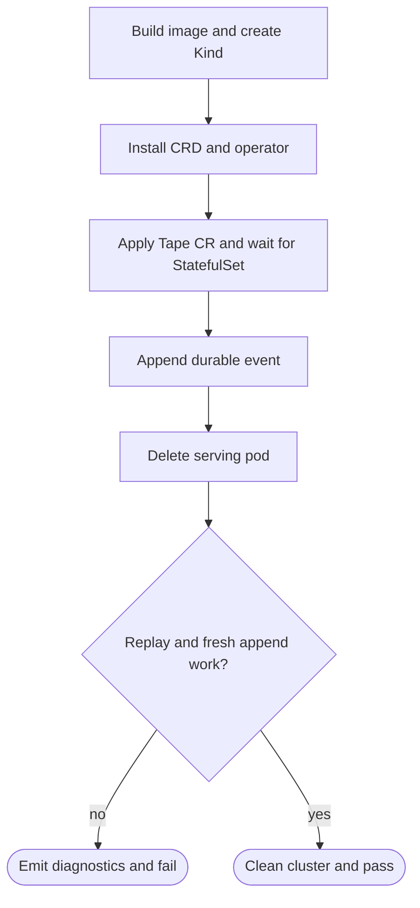

## Logic
<!-- type: logic lang: mermaid -->


## Changes
<!-- type: changes lang: yaml -->

```yaml
changes:
  - path: apps/tape/src/operator/mod.rs
    action: modify
    section: logic
    impl_mode: hand-written
    description: "Preserve YAML 1.1-ambiguous string defaults when serializing the generated Tape CRD so Kubernetes receives auth.default as a string rather than a boolean. generator gap: missing-generator:kubernetes-crd-yaml-scalar-quoting (#1590)."
  - path: apps/tape/k8s/operator/crd.yaml
    action: modify
    section: manifest
    impl_mode: codegen
    description: "Regenerate the checked-in CRD from Tape's corrected operator serializer."
  - path: apps/tape/tests/operator.rs
    action: modify
    section: unit-test
    impl_mode: hand-written
    description: "Assert the generated auth default remains a YAML string, the checked-in CRD matches the renderer, and the shared rustls provider install is idempotent. generator gap: missing-generator:operator-crd-sync-test (#1590)."
  - path: apps/tape/src/bin/tape.rs
    action: modify
    section: logic
    impl_mode: hand-written
    description: "Install the shared process-level rustls provider before CLI dispatch so the operator's kube TLS client cannot panic when multiple providers are linked, and resolve the single-node operator PVC's TAPE_DATA_DIR to journal.json while preserving explicit --store precedence and Raft-only HA durability. generator gaps: missing-generator:service-tls-bootstrap, missing-generator:single-node-pvc-store-resolution (#1590)."
  - path: apps/tape/Dockerfile
    action: modify
    section: runtime-image
    impl_mode: hand-written
    description: "Build the shared serving/operator image with Tape's operator feature so the checked-in operator Deployment can execute its declared controller command. generator gap: missing-generator:service-operator-image-profile (#1590)."
  - path: apps/tape/scripts/kind-e2e.sh
    action: create
    section: e2e-test
    impl_mode: hand-written
    description: "Build the checked-in Tape image, create a disposable Kind cluster, install the real CRD/operator, exercise append/replay across one pod replacement, and clean up by default. generator gap: missing-generator:service-kind-dogfood (#1590)."
  - path: apps/tape/README.md
    action: modify
    section: logic
    impl_mode: hand-written
    description: "Replace the absent-live-Kind caveat with the bounded operator recovery gate and retain explicit non-claims for multi-shard and soak coverage. generator gap: missing-generator:kubernetes-capability-evidence (#1590)."
```
