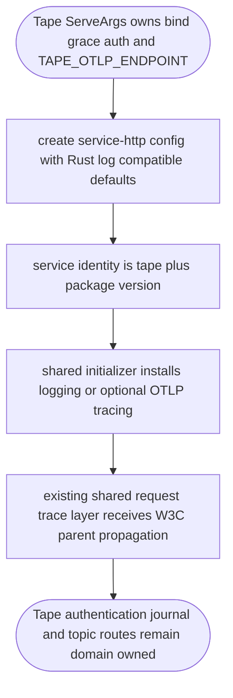
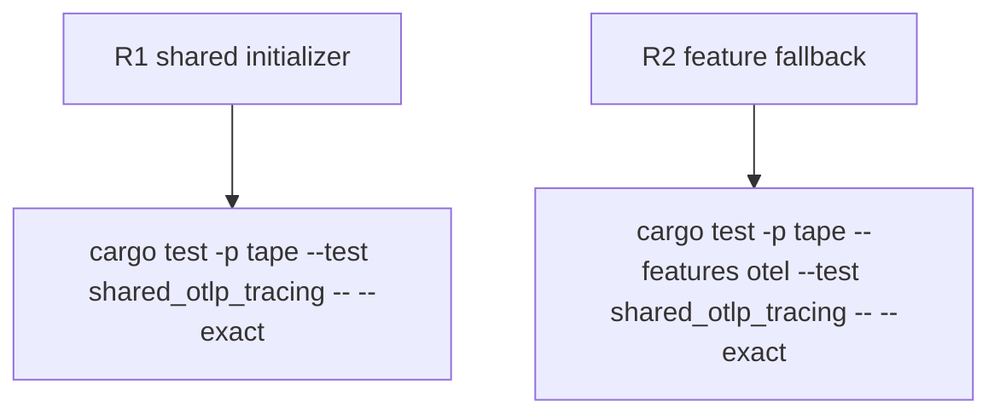

## Logic
<!-- type: logic lang: mermaid -->


## Changes
<!-- type: changes lang: yaml -->

```yaml
changes:
  - path: apps/tape/Cargo.toml
    action: modify
    section: logic
    impl_mode: hand-written
    description: Add a Tape otel feature that enables shared service-http trace export.
  - path: apps/tape/src/bin/tape.rs
    action: modify
    section: logic
    impl_mode: hand-written
    description: Map Tape serve configuration to shared logging and OTLP initialization.
  - path: apps/tape/tests/shared_otlp_tracing.rs
    action: create
    section: unit-test
    impl_mode: hand-written
    description: Lock Tape shared tracing wiring and feature propagation.
  - path: apps/tape/README.md
    action: modify
    section: contract
    impl_mode: hand-written
    description: Record shared OTLP trace export in Tape observability capability evidence.
  - path: apps/tape/tech-design/semantic/source/apps-tape-src-bin-tape-rs.md
    action: modify
    section: source
    impl_mode: hand-written
    description: Capture the shared trace initializer and retained Tape domain boundary.
```
## Unit Test
<!-- type: unit-test lang: mermaid -->


