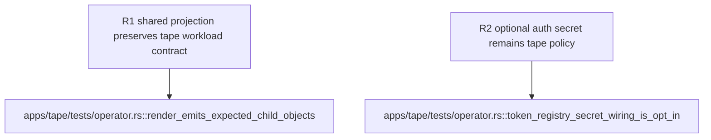

## Logic
<!-- type: logic lang: mermaid -->


## Changes
<!-- type: changes lang: yaml -->

```yaml
changes:
  - path: apps/tape/src/operator/render.rs
    action: modify
    section: logic
    impl_mode: hand-written
    description: Replace the ShardedStatefulSet-plus-harden JSON mutation path with one ServiceStatefulSet input that declares Tape-owned values and shared workload fields.
  - path: apps/tape/tests/operator.rs
    action: modify
    section: logic
    impl_mode: hand-written
    description: Extend structural render evidence for the typed common workload fields while preserving Tape port, PVC, probe, security, and token-registry behavior.
```

## Unit Test
<!-- type: unit-test lang: mermaid -->


