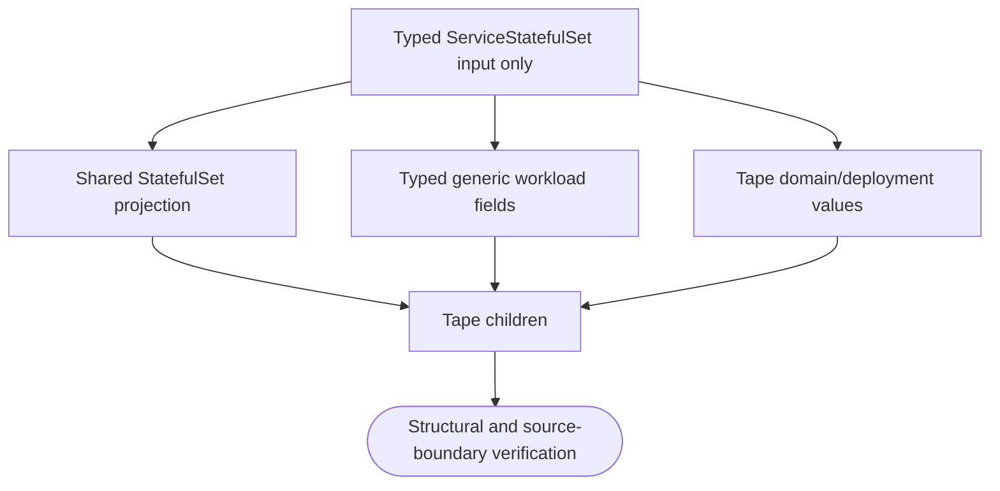
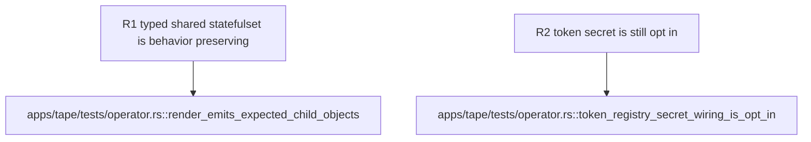

## Logic
<!-- type: logic lang: mermaid -->


## Changes
<!-- type: changes lang: yaml -->

```yaml
changes:
  - path: apps/tape/src/operator/render.rs
    action: modify
    section: logic
    impl_mode: hand-written
    anchor: statefulset
    description: "Compose render::ServiceStatefulSet directly with typed Tape ports, environment, PVC, security, probe, annotation, rollout, volume, and affinity values; delete harden and ShardedStatefulSet usage. generator gap: missing-generator:kubernetes-statefulset-adoption (#1809)."
  - path: apps/tape/tests/operator.rs
    action: modify
    section: unit-test
    impl_mode: hand-written
    anchor: render_emits_expected_child_objects
    description: "Assert the shared typed projection preserves Tape's StatefulSet fields, including rollout metadata, pod security, tmp volume, and existing auth-secret behavior. generator gap: missing-generator:kubernetes-statefulset-adoption-test (#1809)."
```
## Unit Test
<!-- type: unit-test lang: mermaid -->


