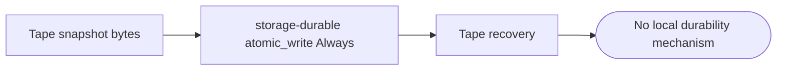

## Logic
<!-- type: logic lang: mermaid -->



## Changes
<!-- type: changes lang: yaml -->

```yaml
changes:
  - path: apps/tape/Cargo.toml
    action: modify
    section: logic
    impl_mode: hand-written
    description: "Add the explicit storage-durable dependency required by Tape's domain snapshot adapter."
  - path: apps/tape/src/raft.rs
    action: modify
    section: logic
    impl_mode: hand-written
    anchor: prepare_bootstrap_seed
    description: "Replace Tape-local atomic file persistence with storage_durable::atomic_write while retaining the JournalSnapshot codec and recovery ordering."
```
