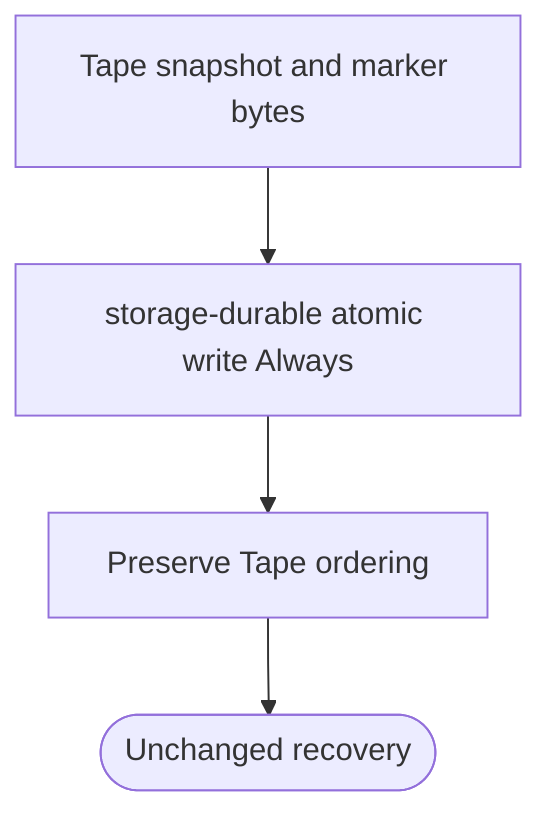
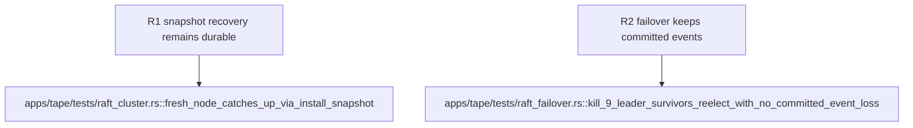

## Logic
<!-- type: logic lang: mermaid -->


## Changes
<!-- type: changes lang: yaml -->

```yaml
changes:
  - path: apps/tape/Cargo.toml
    action: modify
    section: logic
    impl_mode: hand-written
    description: "Declare storage-durable as Tape's direct shared durability dependency."
  - path: apps/tape/src/raft.rs
    action: modify
    section: logic
    impl_mode: hand-written
    anchor: prepare_bootstrap_seed
    description: "Delegate bootstrap, applied-marker, and journal-snapshot atomic writes to storage_durable::atomic_write with FsyncPolicy Always. generator gap: missing-generator:storage-durable-adoption (#1812)."
```
## Unit Test
<!-- type: unit-test lang: mermaid -->


