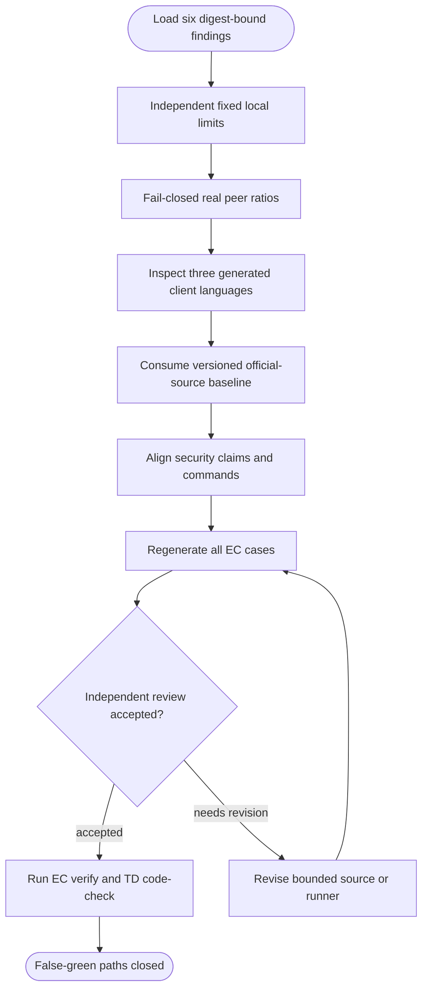

## Logic
<!-- type: logic lang: mermaid -->



## Changes
<!-- type: changes lang: yaml -->

```yaml
changes:
  - path: apps/tape/tests/tape_perf_gate.rs
    action: modify
    section: unit-test
    impl_mode: hand-written
    anchor: local_replay_perf_gate_passes_without_external_win_claims
    description: "Replace Tape-owned verdict delegation with fixed EC-owned workload and threshold assertions. generator gap: missing-generator:test:independent-perf-oracle (#2159)."
  - path: apps/tape/tests/tape_vs_nats_jetstream.rs
    action: modify
    section: unit-test
    impl_mode: hand-written
    anchor: tape_beats_nats_jetstream_on_local_backlog_replay
    description: "Fail closed and independently compute the NATS/Tape p50 ratio. generator gap: missing-generator:test:real-peer-performance-oracle (#2159)."
  - path: apps/tape/tests/tape_vs_kafka.rs
    action: modify
    section: unit-test
    impl_mode: hand-written
    anchor: tape_beats_kafka_on_local_backlog_replay
    description: "Fail closed on every Kafka prerequisite and independently compute the Kafka/Tape ratio. generator gap: missing-generator:test:real-peer-performance-oracle (#2159)."
  - path: apps/tape/tests/spec_generated_clients.rs
    action: create
    section: unit-test
    impl_mode: hand-written
    description: "Execute tape spec gen for TypeScript, Python, and Rust and inspect emitted route scope. generator gap: missing-generator:test:generated-client-journey (#2159)."
  - path: apps/tape/tests/fixtures/competitor_feature_baseline.json
    action: create
    section: unit-test
    impl_mode: hand-written
    description: "Pin versioned official-source provenance and the reviewed replay-log/topic-exchange feature baseline. generator gap: missing-generator:fixture:external-competitor-baseline (#2159)."
  - path: apps/tape/tests/competitor_feature_parity.rs
    action: modify
    section: unit-test
    impl_mode: hand-written
    anchor: matrix
    description: "Deserialize the external baseline fixture and compare Tape behavior against it instead of self-asserting rows. generator gap: missing-generator:test:external-competitor-baseline (#2159)."
  - path: apps/tape/external-contracts/cli-interface/behavior/cli-interface.md
    action: modify
    section: logic
    impl_mode: hand-written
    description: "Point generated-client production evidence at the dedicated non-zero journey. generator gap: missing-generator:ec:runner-reconciliation (#2159)."
  - path: apps/tape/external-contracts/competitor-feature-parity/behavior/topic-exchange-functional.md
    action: modify
    section: logic
    impl_mode: hand-written
    description: "Declare the versioned official-source fixture as the competitor oracle. generator gap: missing-generator:ec:runner-reconciliation (#2159)."
  - path: apps/tape/external-contracts/security-hardening/security/access-control.md
    action: modify
    section: logic
    impl_mode: hand-written
    description: "Align access-control assertions with the dynamic Tape and shared service-auth journeys actually executed. generator gap: missing-generator:ec:runner-reconciliation (#2159)."
  - path: apps/tape/external-contracts/security-hardening/security/security-evidence.md
    action: modify
    section: logic
    impl_mode: hand-written
    description: "Require meter evidence from service_auth rather than unrelated CLI cases. generator gap: missing-generator:ec:runner-reconciliation (#2159)."
  - path: apps/tape/vat.toml
    action: modify
    section: logic
    impl_mode: hand-written
    description: "Compile and meter the real Tape bearer-auth integration journey in the guard runner. generator gap: missing-generator:vat:ec-runner-reconciliation (#2159)."
```
