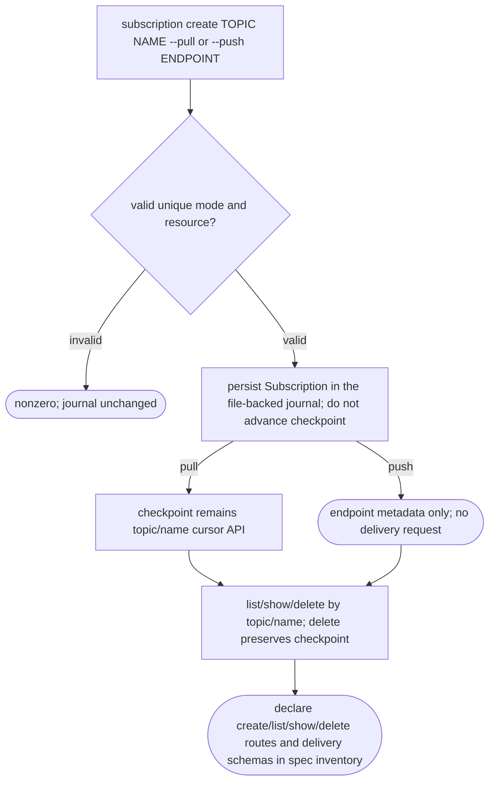

## Logic
<!-- type: logic lang: mermaid -->



## Unit Test

```mermaid
---
id: tape-subscription-resource-verification
requirements:
  pull_checkpoint_compatibility:
    id: R3
    text: "Creating or deleting a pull subscription does not advance or remove the existing topic/name consumer checkpoint; checkpoint get/put remains the durable pull cursor interface."
    kind: regression
    risk: high
    verify: cargo test -p tape pull_subscription_preserves_checkpoint_compatibility --lib -- --exact
  push_scope_boundary:
    id: R5
    text: "Push creation only stores its configured endpoint; this work item starts no delivery worker and makes no outbound HTTP request."
    kind: negative
    risk: medium
    verify: cargo test -p tape --test cli_contract subscription_resource_roundtrip -- --exact
  spec_inventory:
    id: R4
    text: "The offline routes, OpenAPI, and JSON Schema inventories declare the topic-scoped subscription collection/item routes and delivery configuration schemas."
    kind: contract
    risk: medium
    verify: cargo test -p tape --test cli_contract subscription_spec_inventory -- --exact
  subscription_cli_surface:
    id: R1
    text: "tape --help and tape subscription create --help expose subscription creation, inspection, deletion, and the mutually exclusive pull/push delivery forms."
    kind: functional
    risk: medium
    verify: cargo test -p tape --test cli_contract subscription_cli_surface -- --exact
  subscription_local_lifecycle:
    id: R2
    text: "A pull and a push subscription can be created, listed, shown, and deleted in one file-backed journal without changing unrelated entries."
    kind: functional
    risk: high
    verify: cargo test -p tape --test cli_contract subscription_resource_roundtrip -- --exact
---
flowchart TD
    r1[R1 subscription cli surface] --> cargo_test_p_tape_test_cli_contract_subscription_cli_surface_exact[cargo test -p tape --test cli_contract subscription_cli_surface -- --exact]
    r2[R2 subscription local lifecycle] --> cargo_test_p_tape_test_cli_contract_subscription_resource_roundtrip_exact[cargo test -p tape --test cli_contract subscription_resource_roundtrip -- --exact]
    r5[R5 push scope boundary] --> cargo_test_p_tape_test_cli_contract_subscription_resource_roundtrip_exact
    r3[R3 pull checkpoint compatibility] --> cargo_test_p_tape_pull_subscription_preserves_checkpoint_compatibility_lib_exact[cargo test -p tape pull_subscription_preserves_checkpoint_compatibility --lib -- --exact]
    r4[R4 spec inventory] --> cargo_test_p_tape_test_cli_contract_subscription_spec_inventory_exact[cargo test -p tape --test cli_contract subscription_spec_inventory -- --exact]
```

<!-- type: unit-test lang: mermaid -->



## Changes
<!-- type: changes lang: yaml -->

```yaml
changes:
  - path: apps/tape/src/lib.rs
    action: modify
    section: logic
    impl_mode: hand-written
    description: "Add the file-backed Subscription model, pull/push delivery enum, keyed CRUD on TapeJournal, duplicate/not-found errors, and a regression test proving pull resource lifecycle leaves the existing topic/name checkpoint untouched. Keep this within the existing journal ownership boundary; generator gap: missing-generator:logic:tape-subscription-resource (#1254)."
  - path: apps/tape/src/bin/tape.rs
    action: modify
    section: logic
    impl_mode: hand-written
    description: "Add `tape subscription create|list|show|delete`. Create requires exactly one of `--pull` or `--push <endpoint>`; commands load/save the existing `--store` journal and emit JSON plus a runnable `next:` marker. generator gap: missing-generator:cli:tape-subscription-resource (#1254)."
  - path: apps/tape/src/spec.rs
    action: modify
    section: schema
    impl_mode: hand-written
    description: "Declare the topic-scoped subscription collection and item routes in routes_json/OpenAPI, define Subscription and delivery configuration schemas, and update agent API wording. This is offline API inventory only: do not add server.rs h2c handlers or claim runtime delivery. generator gap: missing-generator:openapi:tape-subscription-resource (#1254)."
  - path: apps/tape/tests/cli_contract.rs
    action: modify
    section: unit-test
    impl_mode: hand-written
    description: "Add CLI-level deterministic coverage for help, pull/push create/list/show/delete round-trip, invalid mode rejection, and routes/OpenAPI/schema inventory. Assert push is stored as metadata without exercising an HTTP delivery path. generator gap: missing-generator:test:tape-subscription-resource (#1254)."
  - path: apps/tape/README.md
    action: modify
    section: logic
    impl_mode: hand-written
    description: "Document subscription resources as a Tape core capability with pull checkpoint compatibility and push contract-only scope; do not claim a push worker, retry/redelivery, live h2c subscription handler, or raft-backed subscription state."
  - path: apps/tape/tech-design/semantic/source/apps-tape-src-lib-rs.md
    action: modify
    section: source
    impl_mode: hand-written
    description: "Refresh the source snapshot from apps/tape/src/lib.rs after the subscription journal model changes."
  - path: apps/tape/tech-design/semantic/source/apps-tape-src-bin-tape-rs.md
    action: modify
    section: source
    impl_mode: hand-written
    description: "Refresh the source snapshot from apps/tape/src/bin/tape.rs after CLI changes."
  - path: apps/tape/tech-design/semantic/source/apps-tape-src-spec-rs.md
    action: modify
    section: source
    impl_mode: hand-written
    description: "Refresh the source snapshot from apps/tape/src/spec.rs after contract inventory changes."
  - path: apps/tape/tech-design/semantic/source/apps-tape-tests-cli-contract-rs.md
    action: modify
    section: source
    impl_mode: hand-written
    description: "Refresh the source snapshot from apps/tape/tests/cli_contract.rs after subscription contract tests."
```
