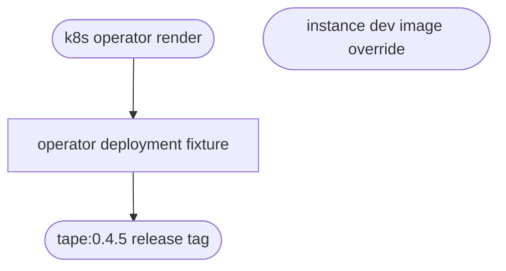

## Logic
<!-- type: logic lang: mermaid -->

The operator control-plane fixture is the renderer-owned production artifact. Its image must use the current concrete Tape release tag rather than `latest`, so the checked-in manifest and rendered output are reproducible and pass K8003. Namespace replacement remains image-neutral. The explicit image argument for instance rendering, including the dev profile's local image default, is a separate data-plane contract and remains unchanged.
