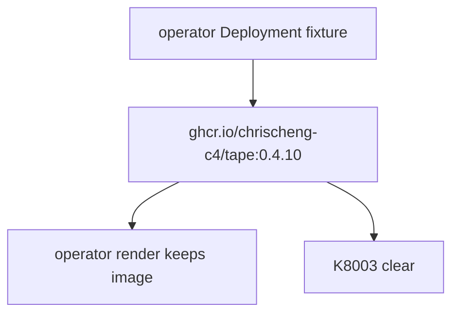
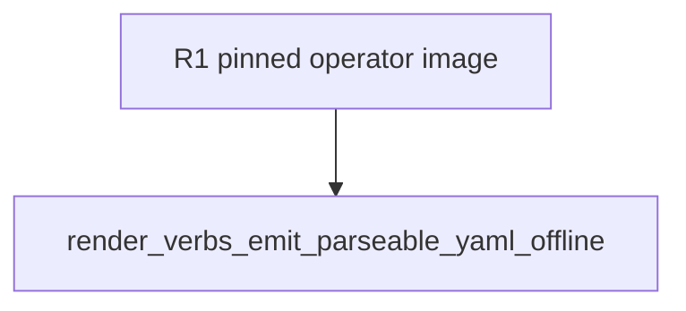

## Logic
<!-- type: logic lang: mermaid -->



`apps/tape/k8s/operator/deployment.yaml` is the exact Deployment fragment consumed by `render_operator_yaml`. Its operator image is pinned to the workspace's concrete Tape release tag (`ghcr.io/chrischeng-c4/tape:0.4.10`). Rendering may replace only `tape-system` namespace fields and therefore cannot downgrade that image reference. The data-plane instance renderer remains separately configurable through its existing `--image` option; this change does not turn a local dev override into a production operator default.
## Changes
<!-- type: changes lang: yaml -->

```yaml
changes:
  - path: apps/tape/k8s/operator/deployment.yaml
    action: modify
    section: logic
    impl_mode: hand-written
  - path: apps/tape/tests/deploy_cli.rs
    action: modify
    section: unit-test
    impl_mode: hand-written
```
## Unit Test
<!-- type: unit-test lang: mermaid -->


