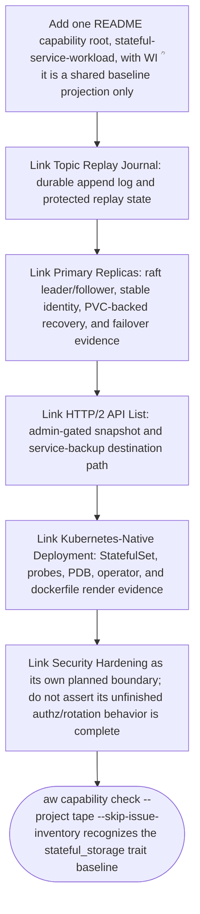

## Logic
<!-- type: logic lang: mermaid -->



## Changes
<!-- type: changes lang: yaml -->

```yaml
changes:
  - path: apps/tape/README.md
    action: modify
    section: logic
    impl_mode: hand-written
    description: "Add the stateful-service-workload capability index row and canonical root for WI #1554. The root links the existing Topic Replay Journal, Primary Replicas, HTTP/2 API List, Kubernetes-Native Deployment, and Security Hardening evidence; it must not claim unfinished retention, kind dogfood, peer-mTLS termination, or security hardening as implemented. generator gap: missing-generator:capability:stateful-service-workload (#1554)."
```
