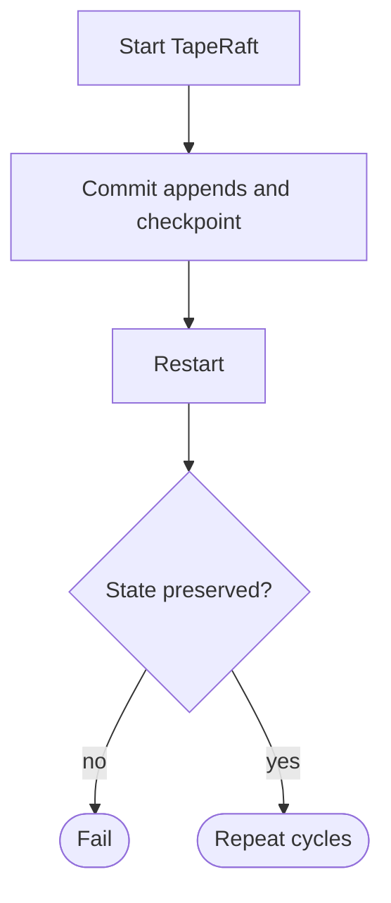

## Logic
<!-- type: logic lang: mermaid -->



## Changes
<!-- type: changes lang: yaml -->

```yaml
changes:
  - path: apps/tape/tests/long_running_stability.rs
    action: create
    section: unit-test
    impl_mode: hand-written
    description: "Run several real TapeRaft restart cycles against one durable directory, advancing append batches and checkpoints, then assert full replay and durable checkpoint state after every reopen. generator gap: missing-generator:raft-endurance-test (#1589)."
  - path: apps/tape/README.md
    action: modify
    section: logic
    impl_mode: hand-written
    description: "Record the bounded repeated-restart conformance gate under Long-Running Stability without claiming retention or unbounded soak. generator gap: missing-generator:stability-capability (#1589)."
```
