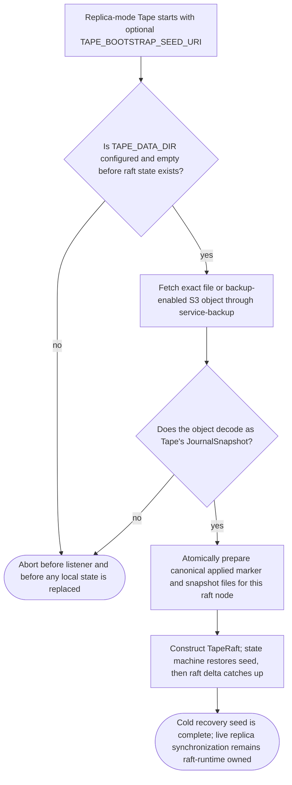

## Logic
<!-- type: logic lang: mermaid -->



## Changes
<!-- type: changes lang: yaml -->

```yaml
changes:
  - path: apps/tape/src/raft.rs
    action: modify
    section: logic
    impl_mode: hand-written
    description: "Add the canonical cold-seed preparation helper for a JournalSnapshot: decode exact snapshot bytes, require an empty data directory, and atomically write the per-node applied marker plus sibling snapshot file that TapeStateMachine::new already restores. Do not add a live restore RPC. generator gap: missing-generator:raft-bootstrap-seed (#1585)."
  - path: apps/tape/src/bin/tape.rs
    action: modify
    section: logic
    impl_mode: hand-written
    description: "Add --bootstrap-seed-uri / TAPE_BOOTSTRAP_SEED_URI to tape serve. In replica mode it fetches through service_backup::fetch_backup_object and prepares durable seed state before TapeRaft::from_topology; reject seed configuration outside a fresh durable replica. generator gap: missing-generator:service-bootstrap-cli (#1585)."
  - path: apps/tape/src/operator/crd.rs
    action: modify
    section: logic
    impl_mode: hand-written
    description: "Expose optional bootstrapSeedUri in TapeSpec so declarative empty-PVC recovery can use the same CLI contract without a second snapshot format. generator gap: missing-generator:operator-bootstrap-field (#1585)."
  - path: apps/tape/src/operator/render.rs
    action: modify
    section: logic
    impl_mode: hand-written
    description: "Render TAPE_BOOTSTRAP_SEED_URI only when TapeSpec supplies bootstrapSeedUri; default instances retain no seed and normal PVC restart behavior. generator gap: missing-generator:operator-bootstrap-env (#1585)."
  - path: apps/tape/tests/bootstrap.rs
    action: create
    section: unit-test
    impl_mode: hand-written
    description: "Exercise exact file backup seeding, canonical marker/snapshot recovery, empty-directory enforcement, and malformed-seed rejection without a live restore endpoint. generator gap: missing-generator:bootstrap-integration-test (#1585)."
  - path: apps/tape/tests/operator.rs
    action: modify
    section: unit-test
    impl_mode: hand-written
    description: "Assert an opt-in CR bootstrapSeedUri renders exactly one matching environment variable and an omitted field renders none. generator gap: missing-generator:operator-bootstrap-render-test (#1585)."
  - path: apps/tape/README.md
    action: modify
    section: logic
    impl_mode: hand-written
    description: "Add the backup-restore and replica-sync-bootstrap capability contracts with an honest cold-seed boundary: external backups seed fresh PVCs before raft catch-up and never replace live replica synchronization. generator gap: missing-generator:capability-backup-restore (#1585)."
```
