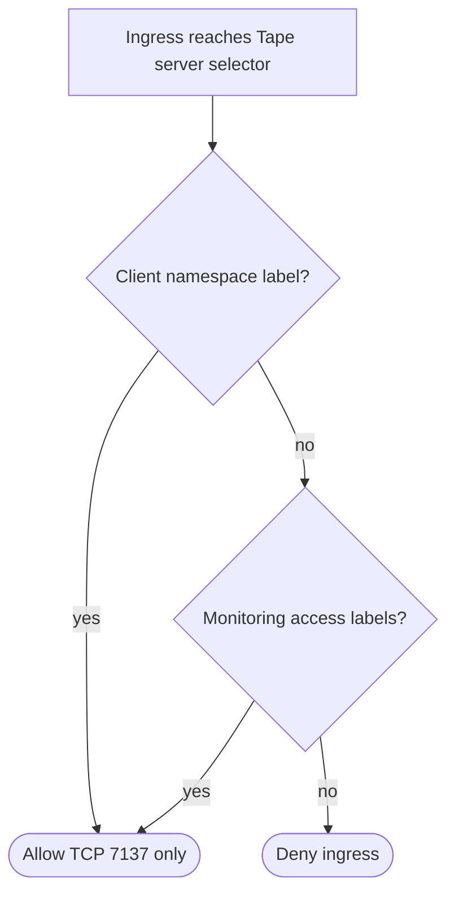

## Logic
<!-- type: logic lang: mermaid -->



## Changes
<!-- type: changes lang: yaml -->

```yaml
changes:
  - path: apps/tape/k8s/components/network-policy/kustomization.yaml
    action: create
    section: manifest
    impl_mode: hand-written
    description: "Declare the opt-in NetworkPolicy component without automatically composing it into an instance profile. generator gap: missing-generator:kustomize-component-manifest (#1593)."
  - path: apps/tape/k8s/components/network-policy/networkpolicy.yaml
    action: create
    section: manifest
    impl_mode: hand-written
    description: "Default-deny ingress to only Tape server pods, with explicit labeled client and monitoring namespace peers restricted to TCP 7137. generator gap: missing-generator:kubernetes-network-policy (#1593)."
  - path: apps/tape/tests/network_policy_assets.rs
    action: create
    section: unit-test
    impl_mode: hand-written
    description: "Parse the static component and assert its server selector, namespace-label peers, and TCP-only ingress boundary. generator gap: missing-generator:kubernetes-network-policy-test (#1593)."
  - path: apps/tape/README.md
    action: modify
    section: logic
    impl_mode: hand-written
    description: "Record the shared NetworkPolicy boundary, CNI-enforcement caveat, and explicit non-claim of Lumen search RBAC parity. generator gap: missing-generator:security-capability-evidence (#1593)."
```
