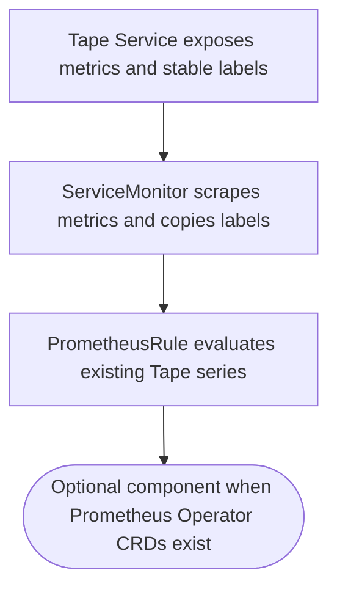

## Logic
<!-- type: logic lang: mermaid -->



## Changes
<!-- type: changes lang: yaml -->

```yaml
changes:
  - path: apps/tape/k8s/components/observability/kustomization.yaml
    action: create
    section: logic
    impl_mode: hand-written
    description: "Define an opt-in Prometheus Operator component containing the Tape ServiceMonitor and PrometheusRule; avoid base inclusion so vanilla clusters do not need monitoring CRDs. generator gap: missing-generator:k8s-observability-component (#1588)."
  - path: apps/tape/k8s/components/observability/servicemonitor.yaml
    action: create
    section: logic
    impl_mode: hand-written
    description: "Select the Tape server Service, scrape port http at /metrics, and propagate app/role service labels into metric targets. generator gap: missing-generator:servicemonitor (#1588)."
  - path: apps/tape/k8s/components/observability/prometheusrule.yaml
    action: create
    section: logic
    impl_mode: hand-written
    description: "Alert on real Tape append/replay average-latency series and Kubernetes restart loops without inventing domain lag metrics. generator gap: missing-generator:prometheus-rule (#1588)."
  - path: apps/tape/tests/observability_assets.rs
    action: create
    section: unit-test
    impl_mode: hand-written
    description: "Parse the monitoring manifests and assert scrape target labels and metric-series references. generator gap: missing-generator:observability-asset-test (#1588)."
  - path: apps/tape/README.md
    action: modify
    section: logic
    impl_mode: hand-written
    description: "Register the observability capability and explicitly leave OTLP exporter ownership to a future shared library rather than copying Lumen code. generator gap: missing-generator:capability-observability (#1588)."
```
