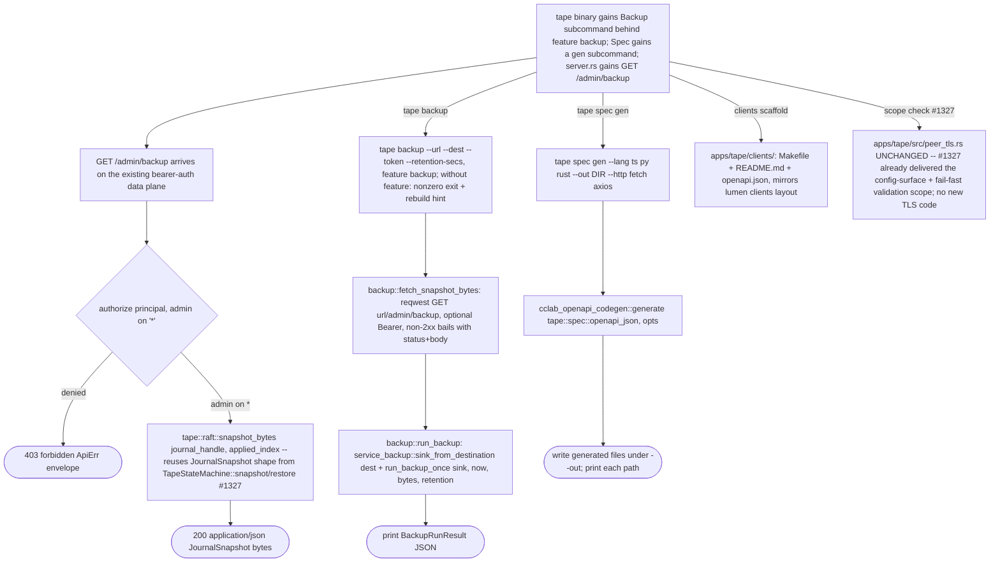

## Logic
<!-- type: logic lang: mermaid -->


## Unit Test
<!-- type: unit-test lang: mermaid -->

```mermaid
---
id: tape-backup-service-tls-spec-gen-clients-verification
requirements:
  admin_backup_route:
    id: R1
    text: "GET /admin/backup requires admin role on '*' and streams tape::raft::snapshot_bytes JSON"
    kind: functional
    risk: medium
    verify: server::tests::admin_backup_requires_admin_and_streams_snapshot
  backup_cli_parses:
    id: R3
    text: "tape backup CLI subcommand parses --url/--dest/--token/--retention-secs behind the backup feature"
    kind: functional
    risk: low
    verify: bin/tape.rs::tests::backup_verb_parses
  backup_cli_snapshot_fetch:
    id: R2
    text: "tape backup fetches /admin/backup bytes and ships them unmodified to a service-backup destination sink"
    kind: functional
    risk: medium
    verify: backup::tests::run_backup_ships_fetched_bytes_to_sink
  clients_scaffold_present:
    id: R5
    text: "apps/tape/clients/ ships Makefile, README.md, and a generated openapi.json mirroring lumen's clients/ layout"
    kind: regression
    risk: low
    verify: manual: apps/tape/clients/{Makefile,README.md,openapi.json} exist
  peer_tls_unchanged:
    id: R6
    text: "peer_tls.rs config-surface + fail-fast validation from WI #1327 is left unchanged; no new TLS termination code is added"
    kind: regression
    risk: low
    verify: peer_tls::tests (existing, unmodified) still pass
  spec_gen_client_codegen:
    id: R4
    text: "tape spec gen --lang ts|py|rust --out DIR writes a typed client from tape's own OpenAPI document via libs/openapi-codegen"
    kind: functional
    risk: medium
    verify: bin/tape.rs::tests::spec_gen_verbs_parse_and_generate
---
flowchart TD
    r1[R1 admin backup route] --> server_tests_admin_backup_requires_admin_and_streams_snapshot[server::tests::admin_backup_requires_admin_and_streams_snapshot]
    r2[R2 backup cli snapshot fetch] --> backup_tests_run_backup_ships_fetched_bytes_to_sink[backup::tests::run_backup_ships_fetched_bytes_to_sink]
    r3[R3 backup cli parses] --> bin_tape_rs_tests_backup_verb_parses[bin/tape.rs::tests::backup_verb_parses]
    r4[R4 spec gen client codegen] --> bin_tape_rs_tests_spec_gen_verbs_parse_and_generate[bin/tape.rs::tests::spec_gen_verbs_parse_and_generate]
    r5[R5 clients scaffold present] --> manual_apps_tape_clients_makefile_readme_md_openapi_json_exist[manual: apps/tape/clients/{Makefile,README.md,openapi.json} exist]
    r6[R6 peer tls unchanged] --> peer_tls_tests_existing_unmodified_still_pass[peer_tls::tests (existing, unmodified) still pass]
```
## Changes
<!-- type: changes lang: yaml -->

```yaml
changes:
  - path: apps/tape/Cargo.toml
    action: modify
    section: logic
    impl_mode: hand-written
    description: "Add unconditional cclab-openapi-codegen and service-backup deps (schema/local-sink types are cheap); add an optional reqwest dep for the backup feature's HTTP fetch (already a dev-dependency); add a `backup = [\"dep:reqwest\", \"service-backup/s3\"]` feature entry, mirroring relay's Cargo.toml block."
  - path: apps/tape/src/raft.rs
    action: modify
    section: logic
    impl_mode: hand-written
    description: "Add a free fn snapshot_bytes(journal: &Arc<Mutex<TapeJournal>>, up_to: Index) -> Result<Vec<u8>> that serializes the SAME (now pub(crate)) JournalSnapshot { up_to, journal } shape TapeStateMachine::snapshot/restore already round-trip, callable without a live raft group (single-node serving has no TapeStateMachine instance)."
  - path: apps/tape/src/server.rs
    action: modify
    section: logic
    impl_mode: hand-written
    description: "Add GET /admin/backup on the auth-guarded data-plane router (admin on \"*\" via crate::auth::authorize), returning tape::raft::snapshot_bytes(journal_handle, applied_index) as application/json (applied_index from state.raft() when set in HA mode, else 0 in single-node mode)."
  - path: apps/tape/src/backup.rs
    action: create
    section: logic
    impl_mode: hand-written
    description: "New module (feature backup): fetch_snapshot_bytes(base_url, token) GETs {base_url}/admin/backup via reqwest (Bearer when set, non-2xx bails with status+body); run_backup(base_url, token, dest, retention) hands the exact bytes to service_backup::run_backup_once against sink_from_destination -- relay's src/backup.rs pattern verbatim (transport + shipping only, no snapshot logic)."
  - path: apps/tape/src/lib.rs
    action: modify
    section: logic
    impl_mode: hand-written
    description: "Register #[cfg(feature = \"backup\")] pub mod backup;"
  - path: apps/tape/src/bin/tape.rs
    action: modify
    section: logic
    impl_mode: hand-written
    description: "Add Backup(BackupArgs) top-level subcommand (feature-gated dispatch, nonzero-exit rebuild hint without the feature, mirroring K8s operator run's pattern); add a Gen(GenArgs) subcommand under Spec (spec gen --lang ts|py|rust --out DIR --http fetch|axios) calling cclab_openapi_codegen::generate(tape::spec::openapi_json(), opts) and writing files to --out."
  - path: apps/tape/clients/Makefile
    action: create
    section: logic
    impl_mode: hand-written
    description: "make gen-ts/gen-py/gen-rust targets wrapping `cargo run -p tape --features self-update -- spec gen --lang <lang> --out clients/<lang>`, plus a refresh-openapi target regenerating clients/openapi.json, mirroring lumen's apps/lumen/clients/Makefile layout."
  - path: apps/tape/clients/README.md
    action: create
    section: logic
    impl_mode: hand-written
    description: "Usage doc for the clients/ scaffold: what openapi.json is, how to regenerate it and the per-language clients via the Makefile, mirroring lumen's clients/README.md."
  - path: apps/tape/clients/openapi.json
    action: create
    section: logic
    impl_mode: hand-written
    description: "Checked-in snapshot of tape spec --format openapi (the same document GET /openapi.json serves) for offline client generation without a running server."
  - path: apps/tape/tests/backup.rs
    action: create
    section: unit-test
    impl_mode: hand-written
    description: "Feature-gated (backup) integration test: admin_backup route denies non-admin principals and returns 200 JSON for an admin token; fetch_snapshot_bytes/run_backup round-trip against an in-process axum server, shipping to a file:// destination sink."
  - path: apps/tape/README.md
    action: modify
    section: changes
    impl_mode: hand-written
    description: "Update the HTTP/2 API List capability's spec-gen sub-claim (tape spec gen now real, not just documented) and note the /admin/backup + tape backup surface where the existing capability rows reference backup/DR, without touching unrelated rows."
```
